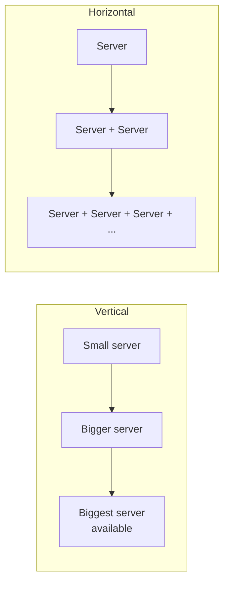
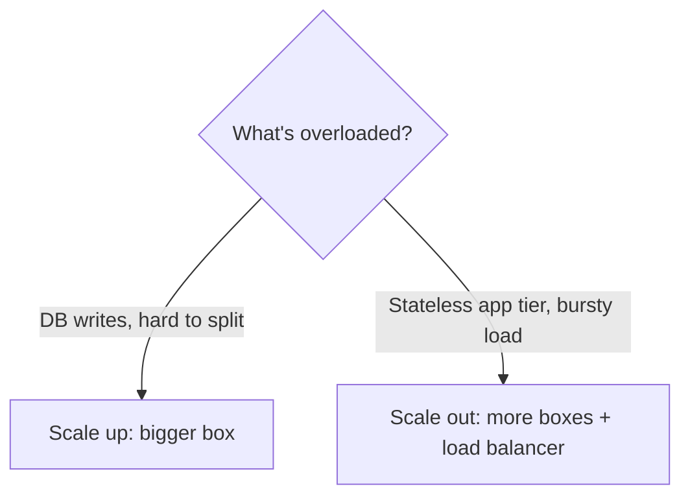
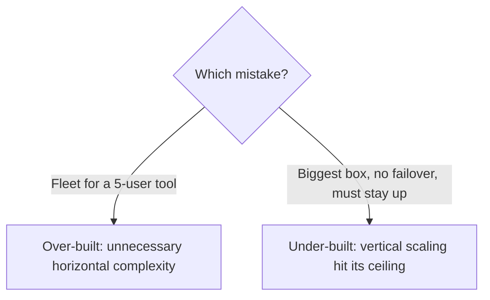
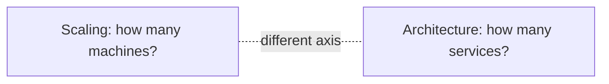
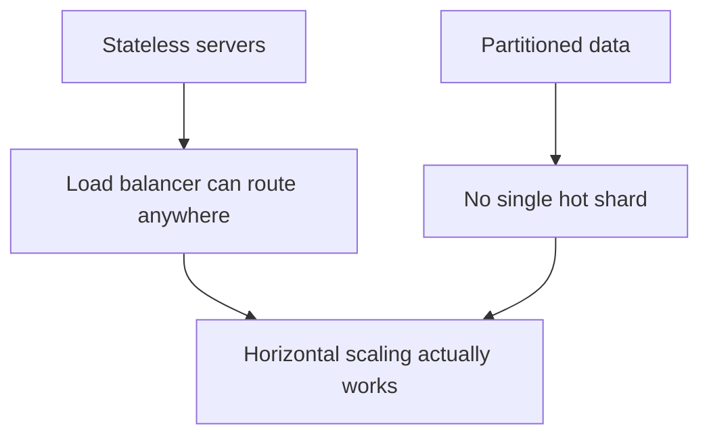

# Chapter 1 — Horizontal vs. Vertical Scaling

> **One-line summary:** Scaling is how a system keeps up with more load than it was
> built for. You have exactly two moves: make one machine **bigger** (vertical) or run
> **more** machines and split the work (horizontal). Almost every later chapter assumes
> you already know which one you're reaching for.
>
> **Interview bar by company:** *Startup* — "start on one bigger box; scale out once
> that stops working." *Mid-size* — know vertical scaling's ceiling, and that
> horizontal scaling requires stateless servers. *Big-tech* — expect probing on data
> partitioning, the operational cost of running a fleet, and justifying each step with
> real numbers, not reflex.
>
> **Running example:** FoodDash's single Postgres box and single app server both
> eventually hit a wall. This chapter is where you decide, piece by piece, whether to
> make each one bigger or make more of it.

---

## §1 — Why the platform exists

**The scenario.** FoodDash launches on one modest server running both the app and the
database. It's fine for a while — then the city rollout triples traffic, and requests
start queuing. You have exactly two moves.

**Vertical scaling (scale up):** swap the box for one with more CPU, RAM, or faster
disks. Nothing about your code changes; the bigger machine just does more.

**Horizontal scaling (scale out):** add more machines and split the work across them.
This is more powerful in the long run, but it isn't free — the moment there's more than
one machine, something has to route requests to the right one (Load Balancers, Chapter
11) and your servers can no longer keep state in local memory (a diner's session can't
live only on the one box that happened to handle their login).

| | Vertical (scale up) | Horizontal (scale out) |
|---|---|---|
| How | Bigger machine | More machines |
| Code changes | Usually none | Often required (statelessness, partitioning) |
| Ceiling | Hard — biggest machine money can buy | Very high — add another box |
| Single point of failure | Yes, it's still one machine | No, if done right |
| Downtime to scale | Often a restart / resize | Usually zero — just add capacity |
| Cost curve | Cheap, then steep at the top end | Roughly linear |



Every scaling story in this guide is one of these two moves, applied to a specific
piece of the system — a database, a cache, an app tier.

> **Say this in the interview:** *"I have two levers for any part of the system that's
> overloaded: make that piece bigger, or run more copies of it. I'd start by naming
> which one applies here and why."*

---

## §2 — When to use it

**The scenario.** FoodDash's database is starting to strain under order volume. Which
lever first?

**Reach for vertical scaling when:**
- You're early-stage and the load is still within reach of a bigger box — it's the
  fastest, simplest fix, with zero code changes.
- The component is inherently hard to split — a single relational database's writes,
  for instance, are far easier to scale up than to shard.
- You need a quick, low-risk fix under time pressure.

**Reach for horizontal scaling when:**
- You've hit (or can see) the ceiling of the biggest available machine.
- You need **high availability** — one machine dying can't take the product down.
- Load is bursty or elastic (FoodDash's 7–9pm dinner rush) and you want to pay for
  capacity only when you need it.
- The workload is naturally splittable — stateless app servers, partitionable data.

**Worked example.** FoodDash's database goes from a small instance to the largest
single-box option available (vertical) — cheap and immediate. The app tier, hit by a
bursty dinner-rush spike, instead gets a fleet of small stateless servers behind a load
balancer that grows and shrinks with traffic (horizontal) — because the load is bursty
and the servers are trivially splittable.



> **Say this in the interview:** *"I'd default to vertical scaling first — it's free of
> code changes and buys real headroom. I'd only move to horizontal once I hit that
> ceiling, need high availability, or the load is bursty enough that elastic capacity
> pays for itself."*

---

## §3 — When *not* to use it

**The scenario.** A candidate designing FoodDash's admin dashboard — five internal
users — proposes an autoscaling Kubernetes fleet across three regions. That's the wrong
lever entirely.

**Don't reach for horizontal scaling when:**
- The load is small and a single, slightly bigger machine handles it with room to
  spare — you've added a fleet, a load balancer, and a partitioning scheme for no
  measurable benefit.
- The workload genuinely can't be split cheaply (a single writer needing strict
  ordering) — you'll fight the architecture instead of the traffic.

**Don't reach for vertical scaling when:**
- You're already near the largest instance size available — you're one bad traffic
  spike from having nowhere left to go.
- Availability matters and the component is a single point of failure — a bigger box
  is still one box; it can still die.



> **Say this in the interview:** *"I wouldn't scale out a small, low-stakes service —
> one right-sized machine is simpler and cheaper. And I wouldn't keep scaling up a
> component that needs to stay available — a single machine, however big, is still a
> single point of failure."*

---

## §4 — Popular products

**The scenario.** "How would you actually do this on AWS?" Name the real levers.

| Mechanism | Type | Know it for |
|---|---|---|
| **EC2 instance resize / RDS instance class** | Vertical | Move to a bigger instance type; usually a short restart. |
| **AWS Auto Scaling Groups / GCP Managed Instance Groups** | Horizontal | Add/remove stateless VM instances automatically on a metric (CPU, queue depth). |
| **Kubernetes HPA (Horizontal Pod Autoscaler)** | Horizontal | Add/remove container replicas based on load. |
| **RDS / Aurora read replicas** | Horizontal (reads only) | Scale read capacity by adding DB copies; writes still go to one primary. |
| **Database sharding (application-level or built-in, e.g. Vitess, Citus)** | Horizontal (writes) | Split a dataset across many DB nodes when even vertical writes max out. |

> **Say this in the interview:** *"On AWS, I'd resize the RDS instance for quick
> vertical headroom, and use an Auto Scaling Group behind a load balancer for the
> stateless app tier. I'd only reach for sharding or Vitess/Citus once a single
> database's writes are the actual ceiling."*

---

## §5 — Quick product comparison

**Scaling the database, specifically — the question that trips people up:**

| Approach | Scales | Effort | When |
|---|---|---|---|
| **Bigger instance (vertical)** | Reads and writes | Lowest — a resize | First move, almost always |
| **Read replicas** | Reads only | Low-medium | Read-heavy load, writes still fit on one box |
| **Caching** (Chapter 7) | Reads only | Medium | Hot, reusable reads |
| **Sharding** | Reads and writes | Highest — real re-architecture | Writes alone exceed one box, last resort |

This is the same order FoodDash's database recap follows: **bigger machine → read
replicas → cache → shard**, cheapest and simplest option first.

> **Say this in the interview:** *"For a database specifically, I'd climb the ladder in
> order: resize the instance, add read replicas, add a cache, and only shard once
> writes alone exceed what one primary can do — sharding is powerful but it's the most
> expensive option operationally."*

---

## §6 — How it compares to other platforms

**The scenario.** Scaling isn't one platform — it's an axis every other chapter in this
guide touches. Knowing which chapter owns which piece of "scale" is a senior-sounding
move.

| Concept | What it scales | Where it's covered |
|---|---|---|
| **Load balancer** | Distributes requests across a horizontally-scaled app tier | Chapter 11 |
| **Read replica / sharding** | Distributes database reads/writes across machines | Chapter 5 |
| **Cache** | Removes repeated work instead of adding machines | Chapter 7 |
| **Monolith vs microservices** | Scales the *team and codebase*, not just the machines | Chapter 2 |

**The distinction that matters:** horizontal/vertical scaling is about **machines**;
monolith vs microservices (next chapter) is about how many **independently deployable
services** those machines run. You can scale a monolith horizontally (many copies of
the same app) just as easily as you can scale a fleet of microservices — they're
different axes, often confused in interviews.



> **Say this in the interview:** *"Scaling — vertical or horizontal — is about how many
> machines run the work. That's independent of monolith vs microservices, which is
> about how many separately deployable services those machines run. I can scale either
> architecture out horizontally."*

---

## §7 — Factors to consider when designing with it

**The scenario.** FoodDash's app tier needs to scale out. Walk the factors that make
horizontal scaling actually work.

**1. Statelessness — the prerequisite.** Any server must be able to handle any request,
so no user-specific state in local memory. Push sessions to a shared cache (Chapter 7)
so a load balancer can freely route to any instance.

**2. Data partitioning.** Scaling out compute is easy once servers are stateless;
scaling out *data* means deciding how to split it — by user ID, by region, by hash. Get
this wrong and one shard ends up hot while the others sit idle.

**3. Coordination cost.** More machines means more network calls between them, and more
ways for them to disagree. Horizontal scaling trades a single machine's simplicity for
distributed-systems problems (this is exactly where CAP theorem, Chapter 3, applies).

**4. The ceiling of vertical scaling.** Cloud providers cap instance sizes, and cost
rises steeply near the top — know roughly where that ceiling is so you can call it out
before you hit it.

**5. Operational cost of horizontal scaling.** A fleet needs health checks, deployment
orchestration, and monitoring across many nodes instead of one. It's more resilient,
but it isn't free to run.



> **Say this in the interview:** *"For this to scale out cleanly, the servers need to
> be stateless with shared session storage, and if there's data behind them, I need a
> partitioning key that spreads load evenly. In exchange I get elastic capacity and no
> single point of failure — at the cost of running and coordinating a fleet instead of
> one box."*

---

## §8 — Avoiding overkill

**The scenario.** A candidate designs FoodDash's five-person internal tool with a
sharded database and an autoscaling fleet across two regions. The interviewer's eyebrow
goes up — this chapter is a prime place to show restraint in either direction.

**Don't over-build:**
- ❌ Horizontal scaling — a fleet, a load balancer, a partitioning scheme — for load a
  single right-sized machine handles comfortably.
- ❌ Sharding a database before read replicas and caching have even been tried.

**Don't under-build:**
- ❌ Staying on "just resize the box" once you're near the largest instance size and
  the product needs to stay up through a single machine's failure.

**Red flags that make interviewers wince** 🚩: reaching for Kubernetes autoscaling on a
5-user tool; sharding as a first move instead of a last resort; scaling out a component
that was never actually the bottleneck; no plan for statelessness before proposing a
fleet.

> **Say this in the interview:** *"I'd climb the ladder in order — bigger machine
> first, since it's free of complexity — and only go horizontal once there's a real
> ceiling, an availability requirement, or bursty load that justifies the added
> operational cost."*

---

## §9 — Hands-on exercise (~20 min)

**Goal:** feel the difference between one worker and many, on your own laptop.

**Step 1 — a CPU-bound endpoint on a single process.**

```javascript
// single.js
import http from "http";
function slowWork() {
  let x = 0;
  for (let i = 0; i < 5e7; i++) x += i;
  return x;
}
http.createServer((req, res) => { slowWork(); res.end("done"); }).listen(3000);
```

**Step 2 — hammer it and time it.**

```bash
time (for i in $(seq 1 8); do curl -s localhost:3000 & done; wait)
# All 8 requests queue behind the single process — notice the total time.
```

**Step 3 — the same work, horizontally, using Node's built-in cluster module.**

```javascript
// cluster.js
import cluster from "cluster";
import os from "os";
import http from "http";
if (cluster.isPrimary) {
  os.cpus().slice(0, 4).forEach(() => cluster.fork());   // 4 "servers"
} else {
  function slowWork() { let x = 0; for (let i = 0; i < 5e7; i++) x += i; return x; }
  http.createServer((req, res) => { slowWork(); res.end("done"); }).listen(3000);
}
```

**Step 4 — hammer it again.** Same `time (for i in ...)` loop against `cluster.js` —
with 4 workers sharing one port, the 8 requests finish in roughly a quarter of the
time. That's horizontal scaling, in miniature, on one machine.

**You understand horizontal vs vertical scaling when you can:**
- [ ] Explain the two levers and what each costs you.
- [ ] Say why horizontal scaling requires stateless servers.
- [ ] Name the scaling ladder for a database: bigger box → replicas → cache → shard.
- [ ] Explain why scaling and monolith-vs-microservices are different axes.

---

## Real-world use cases

- **Stack Overflow (for years):** famously ran its entire site on a handful of
  powerful, vertically-scaled servers rather than a large horizontal fleet — proof
  that "scale up first" can carry a huge product further than people expect.
- **Instagram's early growth:** scaled its app tier horizontally behind load balancers
  while pushing its Postgres database vertically as far as it would go before
  sharding — the exact ladder this chapter describes.
- **Black Friday / dinner-rush retail and delivery traffic:** horizontal autoscaling
  groups add capacity for a few hours a day and shrink back down, something a single
  (however large) vertical box can't do economically.

**Theme:** vertical scaling buys you time cheaply; horizontal scaling is what you reach
for once you need elasticity, availability, or a ceiling vertical scaling can't clear.

---

## Interview questions where scaling is the key decision

1. **"Traffic just tripled — what do you do?"** → Name both levers; default to vertical
   first if it's available, horizontal if you need elasticity or availability.
2. **"How would you scale a single-writer database?"** → The ladder: bigger instance →
   read replicas → cache → shard, in that order.
3. **"Design a system that must stay available through a single machine failure."** →
   Vertical scaling alone can't solve this; you need horizontal redundancy.
4. **"Your app servers can't scale out — why not?"** → Almost always: they're stateful.
   Push state to a shared store first.
5. **"When would you *not* recommend scaling out?"** → Small/low-stakes load, or a
   workload that resists partitioning — the §3/§8 over-engineering trap.
6. **"What's the difference between scaling and going from a monolith to
   microservices?"** → Machines vs. services — different axes (§6).

**How to answer well:** name both levers explicitly, justify which one applies with a
concrete signal (ceiling reached, availability requirement, bursty load), and flag the
prerequisite (statelessness) before proposing a fleet.

---

## 60-second recap

- Two levers: **vertical** (bigger machine, free of code changes, hard ceiling) and
  **horizontal** (more machines, elastic, requires statelessness).
- **Default to vertical first** — it's the cheapest, lowest-risk move.
- Go horizontal when you hit the ceiling, need **high availability**, or load is
  **bursty/elastic**.
- Horizontal scaling's prerequisite: **stateless servers** with shared session storage.
- The database scaling ladder: **bigger box → read replicas → cache → shard (last
  resort)**.
- Scaling (machines) and monolith-vs-microservices (services) are **different axes** —
  don't conflate them.
