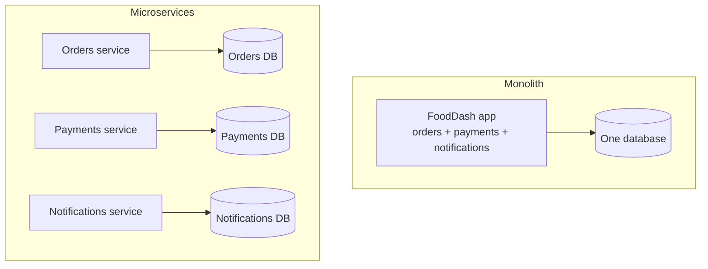
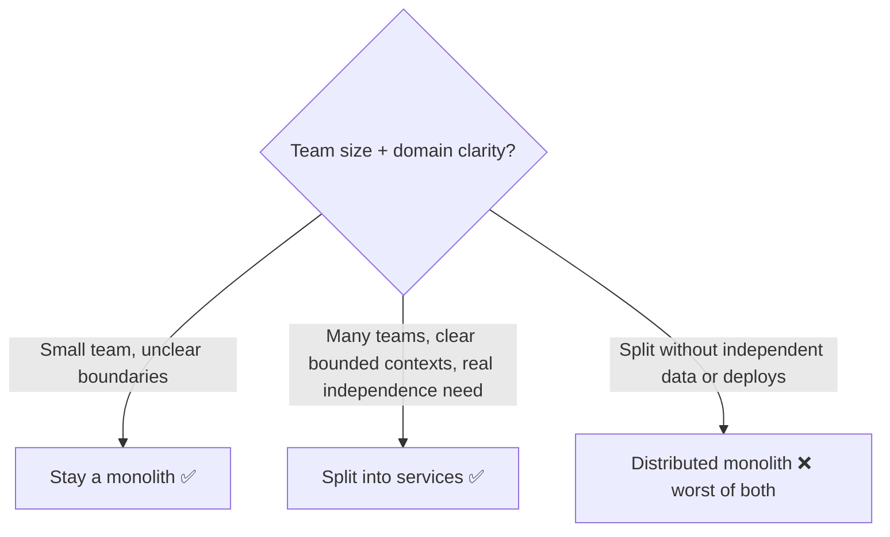
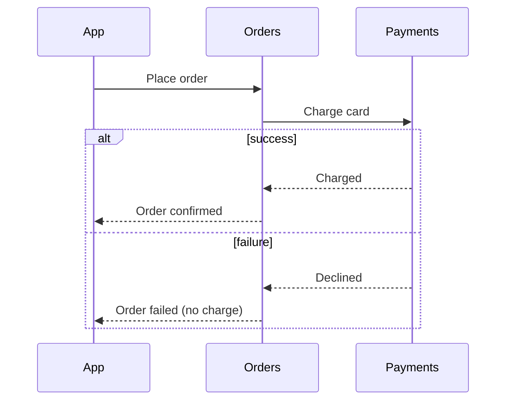

# Chapter 2 — Monolith vs. Microservices

> **One-line summary:** A **monolith** ships one deployable application; **microservices**
> split the system into many independently deployable services, each owning its own
> data. The choice trades simplicity for team and scaling independence — it's an
> organizational decision as much as a technical one.
>
> **Interview bar by company:** *Startup* — "start as a monolith, it's faster to build
> and ship." *Mid-size* — know the concrete signals that justify splitting a service
> out. *Big-tech* — expect probing on service boundaries, data ownership, distributed
> transactions, and the real operational cost of running many services.
>
> **Running example:** FoodDash ships as one codebase at launch. This chapter is where
> you decide which pieces, if any, deserve to become their own service as the team and
> the product grow.

---

## §1 — Why the platform exists

**The scenario.** FoodDash launches with three engineers and one codebase — orders,
restaurants, payments, notifications, all in one app, one deploy. It's fast to build
and easy to reason about. Eighteen months later, FoodDash has 50 engineers across ten
feature teams, all committing to the same repo. A bug in the "reviews" feature blocks
the deploy pipeline for "payments." Nobody can ship independently.

A **monolith** is one deployable unit — simple to develop, test, and deploy, because
everything lives and ships together. **Microservices** split the system along business
boundaries — orders, payments, notifications each become their own small service with
its own codebase, its own deploy pipeline, and its own database — so teams can ship
independently and a failure or slow deploy in one service doesn't block another.

| | Monolith | Microservices |
|---|---|---|
| Deploys | One unit, all together | Each service, independently |
| Data | One shared database | Each service owns its own |
| Team scaling | Everyone shares one codebase | Each team owns a service |
| Failure isolation | One crash can take down everything | A failure is contained to one service |
| Operational cost | Low — one thing to run | High — many things to run, monitor, secure |
| Cross-feature changes | Easy — it's all one codebase | Hard — coordinate across services |



Microservices exist to let independent teams ship independently — nothing more,
nothing less. Every benefit and every cost in this chapter follows from that one idea.

> **Say this in the interview:** *"A monolith optimizes for development speed with one
> team; microservices trade that simplicity for independent deployability once
> multiple teams are stepping on each other. I'd only split when the org, not just the
> traffic, demands it."*

---

## §2 — When to use it

**The scenario.** FoodDash is growing past its first year. Which parts, if any, are
ready to become their own service?

**Stay a monolith when:**
- You're a small team, or early-stage, and speed of iteration matters more than
  independent deploys.
- Domain boundaries aren't clear yet — splitting too early means you'll draw the lines
  in the wrong place and pay to redraw them.
- One deploy pipeline and one database are still fast enough for everyone.

**Split out a service when:**
- **Different teams need to deploy independently** without blocking each other — the
  clearest, strongest signal.
- **A component has a wildly different scaling profile** — FoodDash's notification
  sender fires bursts of thousands of pushes at 7pm, while the restaurant catalog is
  read constantly and changes rarely; forcing them to scale together wastes resources.
- **A component needs different technology** — a recommendations service that wants
  Python's ML ecosystem doesn't belong in a Node monolith.
- **A bounded, well-understood business capability** — payments — benefits from
  isolation, its own on-call, and its own release cadence.

**Worked example.** FoodDash's payments logic becomes its own service first — it's a
clear bounded context, it needs stricter change control, and a bug there shouldn't be
able to take down restaurant browsing. The rest stays a monolith until a similarly
clear signal shows up.

> **Say this in the interview:** *"I'd split a service out when a specific signal
> demands it — independent deploy cadence, a different scaling profile, or a genuinely
> separate business capability — not on a schedule. Everything else stays in the
> monolith until it earns its own service."*

---

## §3 — When *not* to use it

**The scenario.** A five-person FoodDash startup ships fifteen microservices on day
one — an orders service, a menu service, a pricing service, all calling each other over
the network for what used to be a single function call. This is the most common
architecture mistake newer engineers make in system design interviews.

**Don't split into microservices when:**
- **The team is small.** Fewer people than services means everyone is on-call for
  everything anyway — you've paid the operational cost with none of the org benefit.
- **Domain boundaries are still unclear.** You'll get them wrong, and now a "fix" is a
  cross-service migration instead of a function rename.
- **You can't afford the operational overhead** — service discovery, distributed
  tracing, a service mesh, per-service monitoring and on-call.

**Don't stay a monolith when:**
- Deploys are routinely blocked by unrelated teams' changes, and it's costing real
  velocity.
- One component's load is so different from the rest that scaling the whole monolith to
  serve it is wasteful.

**The trap to name explicitly: the "distributed monolith."** Splitting a system into
services that still share one database, or that must all deploy together to work, gets
you *all* the network latency and operational cost of microservices with *none* of the
independence. This is worse than either extreme.



> **Say this in the interview:** *"I wouldn't split a small team's system into
> microservices — that's paying full operational cost for no organizational benefit.
> And the failure mode I watch for explicitly is a 'distributed monolith': services
> that still share a database or must deploy together, which is strictly worse than
> either a real monolith or real microservices."*

---

## §4 — Popular products

**The scenario.** "How would you actually run this?" Name the real tools each approach
leans on.

| Product | Type | Know it for |
|---|---|---|
| **Docker** | Containerization | Packages a service and its dependencies identically everywhere — the baseline for running many services. |
| **Kubernetes** | Orchestration | Runs, schedules, restarts, and scales many containerized services. |
| **Istio / Linkerd** | Service mesh | Handles service-to-service traffic: retries, timeouts, mTLS, observability — without each service reimplementing it. |
| **API gateway** (Kong, AWS API Gateway) | Entry point | One public entry point that routes to the right internal service, often bundling auth and rate limiting. |
| **gRPC / REST** | Inter-service communication | How services actually talk to each other synchronously. |
| **A monorepo + module boundaries** (Nx, Turborepo) | Modular monolith tooling | Keeps one deployable app internally organized into clean, enforced modules — a common middle ground. |

> **Say this in the interview:** *"For a small team I'd keep a modular monolith with
> enforced internal boundaries — a monorepo tool helps here. If we do split services,
> I'd containerize with Docker, orchestrate with Kubernetes, and put a service mesh in
> once the number of services makes manual retry/observability logic too repetitive."*

---

## §5 — Quick product comparison

**The real spectrum isn't binary — it's a ladder:**

| Approach | Deploy unit | Data | Best for |
|---|---|---|---|
| **Monolith** | One | One shared database | Small teams, early stage, unclear boundaries |
| **Modular monolith** | One | Logically separated, enforced in code | Small-to-mid teams wanting structure without ops overhead |
| **Microservices** | Many, independent | Each service owns its own | Multiple teams needing independent deploys and scaling |
| **Distributed monolith** (anti-pattern) | Many, but coupled | Often still shared | Nobody — pure downside |

**Worked example.** FoodDash goes monolith → modular monolith (as the codebase grows,
enforce module boundaries between orders/payments/notifications in code, without
splitting deploys) → true microservices only once specific teams and scaling signals
demand it. Most systems should stop at "modular monolith" far longer than instinct
suggests.

> **Say this in the interview:** *"I think of this as a ladder, not a binary choice.
> I'd move one rung at a time — monolith to modular monolith to microservices — and
> only when a concrete signal, not a trend, justifies the next step."*

---

## §6 — How it compares to other platforms

**The scenario.** Interviewers often conflate "microservices" with "scaling" — being
able to separate the two cleanly is a senior-sounding move.

| Concept | What it's actually about | Where it's covered |
|---|---|---|
| **Monolith vs microservices** | How many independently deployable *services* make up the system | This chapter |
| **Horizontal vs vertical scaling** | How many *machines* run each piece | Chapter 1 |
| **Message queue** | How services (especially microservices) talk to each other *asynchronously* | Chapter 9 |
| **API gateway / load balancer** | Routing traffic to the right service or server | Chapter 11 |

**The distinction that matters:** you can run a monolith on ten horizontally-scaled
machines, and you can run three microservices each on a single tiny machine. Scaling
(machines) and architecture (services) are independent axes — a system can be "small
number of services, large number of machines" or the reverse.


> **Say this in the interview:** *"Monolith vs microservices is about the number of
> independently deployable services; horizontal vs vertical scaling is about the number
> of machines behind each one. I can scale a monolith horizontally just as easily as I
> can scale a single microservice — they're orthogonal decisions."*

---

## §7 — Factors to consider when designing with it

**The scenario.** FoodDash is splitting payments out. Walk the factors that make it go
well instead of badly.

**1. Service boundaries.** Split along a genuine business capability (a "bounded
context" — orders, payments, notifications), not an arbitrary technical layer. A
boundary that requires two services to change together on every feature is drawn wrong.

**2. Data ownership.** Each service owns its own database; no service reaches into
another's tables directly. Cross-service reads go through that service's API. This is
the single most-violated rule in real distributed monoliths.

**3. Communication style.** Synchronous (REST/gRPC) when the caller needs an answer
right now; asynchronous (a message queue, Chapter 9) when it can happen later — placing
an order shouldn't block on the notification service being up.

**4. Distributed transactions.** A single database transaction across services doesn't
exist. Multi-step operations (charge payment, then create the order) need a **saga** —
a sequence of local transactions with compensating steps if one fails.

**5. Observability.** One request now touches many services. Distributed tracing (a
request ID threaded through every call) is what makes "why was this slow?" answerable
at all.



> **Say this in the interview:** *"I'd draw service boundaries around real business
> capabilities, give each service its own database, and use async messaging wherever
> the caller doesn't need an immediate answer. For any operation spanning services, I'd
> use a saga with compensating actions instead of assuming a distributed transaction."*

---

## §8 — Avoiding overkill

**The scenario.** A candidate designs FoodDash from scratch as twelve microservices for
a product with no users yet. The interviewer's eyebrow goes up — this is one of the
most common over-engineering patterns in system design interviews.

**Don't over-build:**
- ❌ Microservices for a small team or a pre-product-market-fit startup — you'll spend
  more time on service discovery and deploy pipelines than on the product.
- ❌ A service per database table or per CRUD endpoint — that's not a bounded context,
  it's a monolith cut into confetti.

**Don't create a distributed monolith:**
- ❌ "Microservices" that share one database, or that must all deploy together to work.
  You paid for the downsides and got none of the upside.

**Don't under-split when the signal is real:**
- ❌ Keeping a component that has genuinely different scaling needs, or that's blocking
  other teams' deploys, jammed inside the monolith out of inertia.

**Red flags that make interviewers wince** 🚩: microservices before there's a team large
enough to need them; no clear owner per service; a shared database across "independent"
services; splitting services before domain boundaries are understood.

> **Say this in the interview:** *"I'd start as a monolith — or a modular monolith once
> the codebase grows — and split out a service only when a specific team or scaling
> signal demands it. I'd rather under-split and fix it later than pay microservices'
> operational cost with no team to benefit from it."*

---

## §9 — Hello-world exercise (~30 min)

**Goal:** feel the actual cost of splitting a function call into a network call.

**Step 1 — the monolith version: one function call.**

```javascript
// monolith.js
function chargeCard(amount) { return { status: "charged", amount }; }
function placeOrder(cart) {
  const payment = chargeCard(cart.total);   // just a function call
  return { orderId: "o_123", payment };
}
console.log(placeOrder({ total: 450 }));
```

**Step 2 — split it into two tiny services.**

```javascript
// payments-service.js — run on :4001
import http from "http";
http.createServer((req, res) => {
  res.writeHead(200, { "Content-Type": "application/json" });
  res.end(JSON.stringify({ status: "charged" }));
}).listen(4001);
```

```javascript
// orders-service.js — run on :4000
import http from "http";
http.createServer(async (req, res) => {
  try {
    const payment = await fetch("http://localhost:4001").then(r => r.json());
    res.end(JSON.stringify({ orderId: "o_123", payment }));
  } catch (e) {
    res.writeHead(502);
    res.end(JSON.stringify({ error: "payments service unavailable" }));  // NEW failure mode
  }
}).listen(4000);
```

**Step 3 — see the new failure mode.** Kill `payments-service.js` and hit
`localhost:4000` again. In the monolith, this failure couldn't exist — it was one
process. As two services, "the dependency is down" is now a real case your code has to
handle, and it didn't have to before.

**You understand monolith vs microservices when you can:**
- [ ] Explain what changed when a function call became a network call.
- [ ] Name the "distributed monolith" trap and why it's worse than either extreme.
- [ ] Explain why each service should own its own database.
- [ ] Describe a saga and why distributed transactions don't really exist.

---

## Real-world use cases

- **Amazon's internal service mandate (early 2000s):** Amazon's shift from one
  monolithic codebase to services owning their own data, each with an API, is the
  origin story most microservices advice traces back to — driven by team scaling, not
  traffic.
- **Netflix:** split into hundreds of microservices to let independent teams ship
  streaming features at their own pace and scale each one to wildly different load
  profiles.
- **Shopify's "modular monolith":** deliberately stayed a monolith at massive scale,
  enforcing strict internal module boundaries instead of splitting into services — proof
  the ladder in §5 doesn't always need to reach the top rung.
- **Segment's public microservices-to-monolith migration:** Segment split into
  microservices, found the operational cost outweighed the benefit at their team size,
  and migrated back to a monolith — a widely cited real-world overkill cautionary tale.

**Theme:** the decision follows the **team and the domain**, not the traffic — the
companies above split (or didn't) for organizational reasons first.

---

## Interview questions where this architecture choice is the key decision

1. **"Would you start FoodDash as a monolith or microservices?"** → Monolith (or
   modular monolith) by default; name the concrete signal that would change your mind.
2. **"How do you handle a checkout that involves both orders and payments as separate
   services?"** → A saga with compensating actions; no real cross-service transaction.
3. **"What's a 'distributed monolith' and why is it bad?"** → Services split without
   independent data or deploys — all the cost, none of the benefit (§3).
4. **"How do independent teams avoid stepping on each other?"** → Service ownership:
   each team owns a service, its data, its deploys, its on-call.
5. **"When would you deliberately *not* split a service out?"** → Small team, unclear
   boundaries, or no independent-deploy need — the §3/§8 overkill trap.
6. **"How do services find and call each other reliably?"** → Service discovery, an API
   gateway for external entry, and a service mesh once the retry/observability logic
   repeats across many services.

**How to answer well:** default to the simplest option (monolith or modular monolith),
name the specific organizational or scaling signal that would justify splitting, and
proactively flag the distributed-monolith trap and data-ownership rule.

---

## 60-second recap

- A **monolith** ships as one deployable unit; **microservices** split the system into
  independently deployable services, each owning its own data.
- **Default to a monolith** (or modular monolith) — split only when a specific team or
  scaling signal demands it, not on a schedule.
- The trap to name: the **distributed monolith** — split services that still share a
  database or must deploy together. Worse than either extreme.
- Services communicate **synchronously** (REST/gRPC) when the caller needs an answer
  now, **asynchronously** (a queue) otherwise.
- Cross-service multi-step operations need a **saga**, not a distributed transaction.
- This is a **different axis from scaling** (Chapter 1) — machines vs. services.
