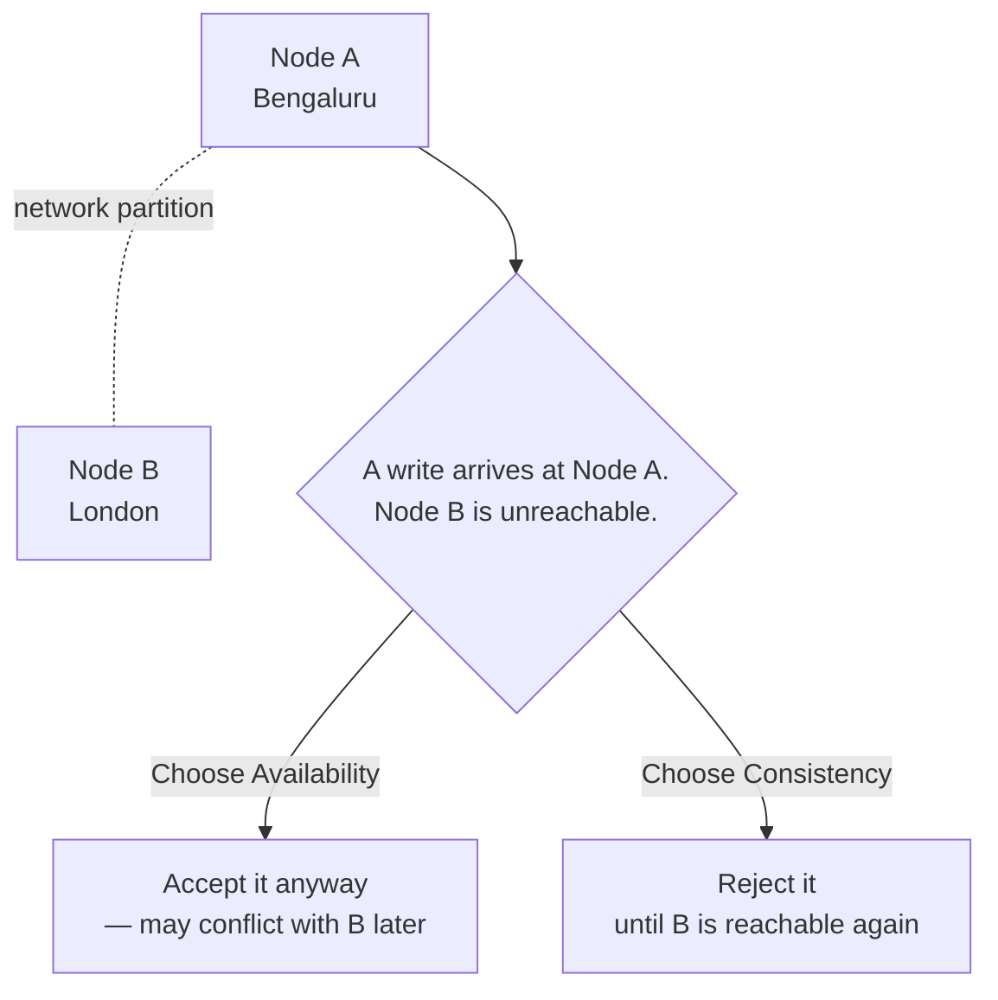
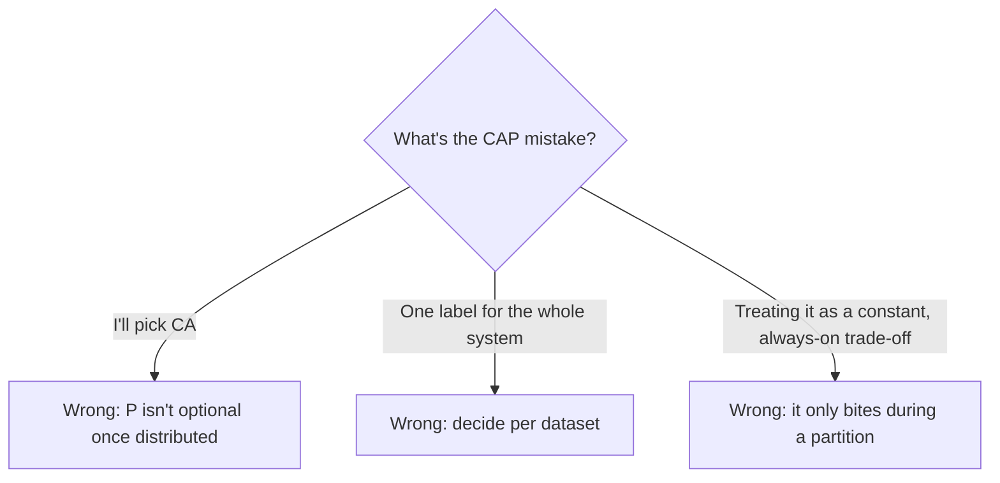
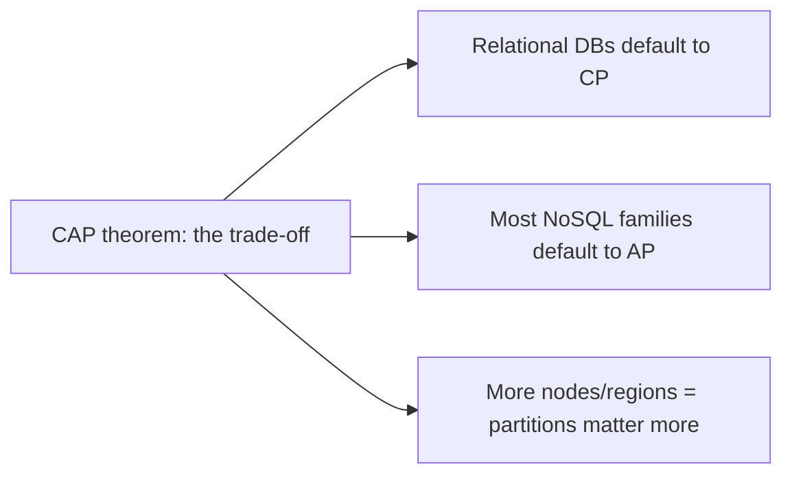
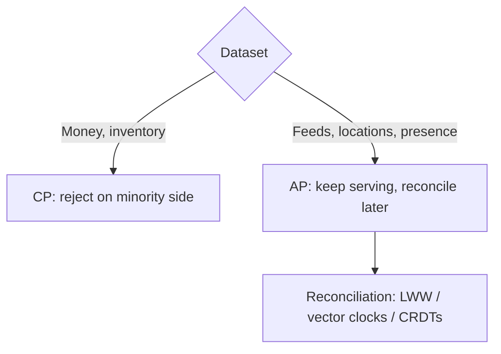

# Chapter 3 — The CAP Theorem

> **One-line summary:** In a distributed system, when a network partition happens, you
> must choose between **Consistency** (everyone sees the same, latest value) and
> **Availability** (the system keeps answering). You can't have perfect versions of
> both at the same time. Every data store you'll ever pick has already made this choice
> for you — your job is to know which one, and whether it's the right one for your data.
>
> **Interview bar by company:** *Startup* — "know the three letters and that partitions
> force a choice." *Mid-size* — explain, for your specific data, what happens during a
> partition and why you'd pick CP or AP. *Big-tech* — expect probing on PACELC (the
> latency/consistency trade-off that exists even *without* a partition), per-operation
> (not per-system) consistency choices, and tunable systems like DynamoDB and Cassandra.
>
> **Running example:** FoodDash's live driver-location feed can tolerate a few stale
> seconds. FoodDash's payment ledger cannot. This chapter is where you learn to make
> that call on purpose, per dataset, instead of by accident.

---

## §1 — Why the platform exists

**The scenario.** FoodDash replicates driver-location data across two data centers so
reads are fast in both regions. One night, the network link between the two data
centers blips for three seconds — a **partition**. Each side can still talk to its own
users; they just can't talk to each other. What do you do for those three seconds?

**Option A:** keep answering requests on both sides, even though they might briefly
disagree with each other. You chose **Availability** over Consistency.

**Option B:** stop answering requests (or refuse writes) until the two sides can talk
again and agree. You chose **Consistency** over Availability.

That's the whole theorem. Formally, CAP says a distributed system can give you at most
two of:

- **Consistency (C)** — every read sees the most recent write, everywhere.
- **Availability (A)** — every request gets a (non-error) response.
- **Partition tolerance (P)** — the system keeps working even when the network between
  nodes drops messages or splits.

**The catch that makes this simple in practice:** in any real distributed system,
partitions *will* happen — a network cable fails, a router misbehaves, a data center
loses connectivity. Partition tolerance isn't really optional; it's a fact of
distributed life. So the real, practical choice CAP hands you is **C vs. A, during a
partition** — nothing more mysterious than that.



> **Say this in the interview:** *"CAP says that when a network partition happens — and
> it will — I have to choose between consistency and availability for that moment.
> Partition tolerance isn't optional in a real distributed system, so the actual
> decision is: during a partition, do I stay up with possibly-stale data, or refuse to
> answer until I can guarantee correctness?"*

---

## §2 — When to use it

**The scenario.** FoodDash has many kinds of data. Which ones should favor Availability
(**AP**) and which should favor Consistency (**CP**)?

**Favor Availability (AP) when:**
- Brief staleness is harmless — a driver's location being 2 seconds old doesn't break
  anything.
- Staying up matters more than staying perfectly correct — a restaurant listing or
  "top dishes" feed being slightly stale beats showing an error page.
- The data self-corrects quickly once the partition heals (locations, view counts,
  presence indicators).

**Favor Consistency (CP) when:**
- Being wrong is worse than being unavailable — a payment ledger, an account balance,
  or "is this seat still available" for the last unit of stock.
- Two conflicting values can't both be true at once, and reconciling them after the
  fact is expensive or impossible (you can't un-charge a card that shouldn't have been
  charged twice).

**Worked example.** FoodDash's driver-GPS feed and its "top restaurants" list are
AP — Cassandra-style wide-column storage (Chapter 6) that keeps answering through a
partition. FoodDash's payments and order totals are CP — a relational database (Chapter
5) with a single primary that would rather reject a write than risk a wrong balance.

> **Say this in the interview:** *"I don't make this choice once for the whole system —
> I make it per dataset. Driver locations and feeds can favor availability; money and
> inventory counts favor consistency, because being wrong there costs more than being
> briefly unavailable."*

---

## §3 — When *not* to use it

**The scenario.** A candidate says, "I'll just pick CA and skip partition tolerance."
That's the single most common CAP mistake in interviews — and a request to treat the
whole system as either always-AP or always-CP is the second most common one.

**Don't try to "choose CA":**
- A single, non-distributed node trivially gives you both consistency and
  availability — but it isn't distributed, so it isn't the interesting case CAP
  describes. The moment you have more than one node, a partition *will* eventually
  happen, whether you planned for it or not. Pretending you can opt out of P just means
  you haven't decided what happens when it occurs.

**Don't apply one CAP label to the whole system:**
- FoodDash isn't "an AP system" or "a CP system" — its driver feed is AP and its
  payments are CP, in the same product. Naming one label for the entire design is a
  sign you haven't actually looked at the data.

**Don't forget this only bites during a partition:**
- Most of the time, there is no partition, and a well-built system gives you both
  consistency and availability simultaneously. CAP describes what happens in the rare
  window when nodes can't talk to each other — it isn't a reason to fear distributed
  systems, just a reason to have an explicit answer for that window.



> **Say this in the interview:** *"I wouldn't say 'I'm choosing CA' — partition
> tolerance isn't optional once you're distributed. And I wouldn't label the whole
> system AP or CP — I'd make the call per dataset, and remember this trade-off only
> actually shows up during the partition window, not all the time."*

---

## §4 — Popular products

**The scenario.** "Which databases are CP and which are AP?" You need real names and
where they land.

| Product | Family | CAP leaning |
|---|---|---|
| **DynamoDB** | Key-value / wide-column | AP by default; tunable to strongly consistent reads per-request |
| **Cassandra** | Wide-column | AP by default; tunable consistency level per query |
| **MongoDB** | Document | CP-leaning — single primary, majority-acknowledged writes |
| **PostgreSQL / MySQL** (single primary) | Relational | Effectively CP — one source of truth; add replicas and the trade-off appears |
| **Google Spanner** | Distributed relational | CP, using synchronized clocks (TrueTime) to get strong consistency at global scale |
| **ZooKeeper / etcd** | Coordination service | CP by design — used specifically because consensus must never be wrong |

> **Say this in the interview:** *"For FoodDash's money-critical data I'd pick a CP
> store — Postgres or Spanner-style strong consistency. For the driver feed and
> high-write, high-availability data, I'd pick Cassandra or DynamoDB and tune the
> consistency level per query rather than accepting one default for everything."*

---

## §5 — Quick product comparison

**CP vs AP, concretely:**

| Dimension | CP system | AP system |
|---|---|---|
| During a partition | Minority side stops accepting writes (or reads) | All sides keep serving, possibly stale/conflicting |
| Typical use | Payments, inventory, coordination/consensus | Feeds, presence, caches, analytics |
| Recovery | No conflicts to resolve — writes were blocked | Conflicting writes need reconciliation (last-write-wins, vector clocks, CRDTs) |
| Example | PostgreSQL, MongoDB, Spanner, ZooKeeper | Cassandra, DynamoDB (default), Riak |

**One level deeper — PACELC.** CAP only describes behavior *during* a partition. **PACELC**
extends it: **if Partitioned, choose A or C; Else (normal operation), choose Latency or
Consistency.** Even with no partition at all, synchronous replication for strong
consistency costs latency. This is why even "CP" systems like Spanner spend real
engineering effort (atomic clocks) to keep that cost small.

> **Say this in the interview:** *"Beyond CAP, I'd also mention PACELC — even without a
> partition, strong consistency costs latency, because you're waiting on replicas to
> agree. That's a trade-off I'm making on every write, not just during rare partition
> events."*

---

## §6 — How it compares to other platforms

**The scenario.** CAP isn't a platform you install — it's the theory that explains
choices made in chapters you've already read or will read next.

| Chapter | How CAP shows up there |
|---|---|
| **Relational databases** (Ch. 5) | A single-primary RDBMS is a CP default — strong consistency, one source of truth. |
| **NoSQL databases** (Ch. 6) | Most NoSQL families exist specifically because they chose AP — the theorem *explains* NoSQL's core trade-off. |
| **Horizontal scaling** (Ch. 1) | The more nodes and regions you add, the more partitions matter — CAP's relevance grows with horizontal scale. |



> **Say this in the interview:** *"CAP is the theory underneath why I'd pick a
> relational database for the money core and a NoSQL store for the high-scale,
> staleness-tolerant feed — that's a CAP decision wearing a product name."*

---

## §7 — Factors to consider when designing with it

**The scenario.** You've said FoodDash's driver feed is AP. Now defend the details.

**1. Decide per dataset, not per system.** Ask "what happens if this specific piece of
data is briefly wrong or briefly unavailable?" for each dataset separately.

**2. How is a partition actually detected?** Timeouts and missed heartbeats between
nodes — there's no perfect, instant signal that a partition (vs. just a slow node) is
happening, which is itself a real design problem.

**3. What does each choice actually do during the partition?**
- **CP:** the minority side (the side that can't reach quorum) stops accepting writes,
  or reads, until it reconnects.
- **AP:** every side keeps accepting writes, and conflicts get reconciled once the
  partition heals — via **last-write-wins**, **vector clocks**, or **CRDTs**, depending
  on how much correctness the reconciliation needs.

**4. Eventual consistency is a promise, not a guarantee of *when*.** "Eventually"
consistent data will converge — but design for how stale it can get, and whether the
application can tolerate that window.

**5. Remember PACELC even when there's no partition.** Synchronous replication for
strong consistency adds latency to every write, all the time — that's a cost you're
paying constantly, not just during rare failures.



> **Say this in the interview:** *"For each dataset I'd name what a partition does to
> it concretely — reject writes on one side, or keep serving and reconcile later with a
> specific strategy like last-write-wins. And I'd account for the latency cost of
> strong consistency even outside of partition events."*

---

## §8 — Avoiding overkill

**The scenario.** A candidate designs vector-clock conflict resolution and multi-region
active-active writes for FoodDash's restaurant "favorite" button. The interviewer's
eyebrow goes up — CAP-flavored over-engineering is a real and common failure mode.

**Don't over-build:**
- ❌ Building AP-style conflict resolution (vector clocks, CRDTs) for data that a plain
  single-primary database with a sane failover handles fine.
- ❌ Multi-region active-active writes for data that has no real availability
  requirement in the first place.

**Don't hand-wave:**
- ❌ Saying "CAP theorem" as a buzzword without stating, for your actual data, what
  happens during a partition. Interviewers listen for the concrete answer, not the
  vocabulary.

**Don't forget the obvious:**
- ❌ Treating the whole system as one CAP label instead of making the call per dataset
  (§3's most common trap).

**Red flags that make interviewers wince** 🚩: "I'll just pick CA"; one CAP label for
an entire multi-dataset system; conflict-resolution machinery for data nobody needed
to keep available during a three-second blip; never mentioning what actually happens
during the partition.

> **Say this in the interview:** *"I'd default to a plain CP database unless a specific
> dataset has a real availability requirement that justifies the added complexity of
> conflict resolution. I'm not reaching for vector clocks until staleness is actually a
> problem I need to solve."*

---

## §9 — Hands-on exercise (~30 min)

**Goal:** watch a CP node and an AP node behave differently during a simulated
partition, in plain code.

```javascript
// cap-demo.js
let partitioned = false;
const nodeA = { value: "menu:v1", quorumReachable: () => !partitioned };
const nodeB = { value: "menu:v1" };

function cpWrite(node, newValue) {
  if (!node.quorumReachable()) {
    return { ok: false, reason: "rejected — can't reach quorum during partition (CP)" };
  }
  node.value = newValue;
  nodeB.value = newValue;              // replicate immediately, only possible if not partitioned
  return { ok: true, value: node.value };
}

function apWrite(node, newValue) {
  node.value = newValue;               // always accepted locally (AP)
  if (!partitioned) nodeB.value = newValue;   // replicate only if reachable
  return { ok: true, value: node.value, replicated: !partitioned };
}

console.log("Normal operation:");
console.log(" CP write:", cpWrite(nodeA, "menu:v2"));
console.log(" AP write:", apWrite(nodeA, "menu:v3"));

partitioned = true;
console.log("\nDuring a partition:");
console.log(" CP write:", cpWrite(nodeA, "menu:v4"));                 // rejected
console.log(" AP write:", apWrite(nodeA, "menu:v5 (local only)"));    // accepted, diverges from B
console.log(" Node A now says:", nodeA.value, "| Node B still says:", nodeB.value);
```

Run it and watch: the CP write refuses to proceed the moment quorum is unreachable,
while the AP write happily diverges from node B — exactly the trade-off §1 describes,
made concrete.

**You understand the CAP theorem when you can:**
- [ ] State the three letters and explain why P isn't really optional.
- [ ] Say what "during a partition" means for the real, practical trade-off.
- [ ] Pick CP or AP for a specific dataset and justify it.
- [ ] Explain PACELC's extra trade-off that applies even without a partition.

---

## Real-world use cases

- **Amazon's Dynamo (the paper behind DynamoDB):** explicitly chose availability over
  consistency for the shopping cart — a duplicate or briefly stale cart item is a far
  smaller problem at Black-Friday scale than a cart that refuses to accept an add.
- **Cassandra at Facebook:** built for inbox search, chose AP for the same reason —
  massive write volume, high availability, and staleness that resolves itself quickly.
- **Banking and payment processors:** consistently choose CP — a system that's
  occasionally unavailable for a few seconds is far preferable to one that shows the
  wrong account balance.
- **Google Spanner:** a notable exception that pushes for both — synchronized atomic
  clocks (TrueTime) let it offer strong (CP) consistency at global scale, at the cost of
  serious engineering investment most companies can't justify.

**Theme:** the trade-off isn't abstract — it's the reason the biggest distributed
systems in the world look the way they do.

---

## Interview questions where CAP is the key decision

1. **"Explain the CAP theorem."** → Consistency, Availability, Partition tolerance —
   pick two, but P isn't optional in a real distributed system, so the real choice is
   C vs. A during a partition.
2. **"Would you choose CP or AP for FoodDash's driver-location feed?"** → AP — staleness
   is cheap, unavailability isn't.
3. **"Would you choose CP or AP for FoodDash's payment ledger?"** → CP — a wrong
   balance is worse than a rejected request.
4. **"What happens to a CP system during a network partition?"** → The side that can't
   reach quorum stops accepting writes (or reads) until it reconnects.
5. **"How does an AP system stay correct after a partition heals?"** → Reconciliation:
   last-write-wins, vector clocks, or CRDTs, depending on the data.
6. **"What's PACELC, and why does it matter even without a partition?"** → Even in
   normal operation, strong consistency costs latency — a trade-off made on every
   write, not just during failures.

**How to answer well:** never label the whole system CP or AP — pick per dataset,
state what happens during a partition concretely, and mention PACELC's always-on
latency/consistency trade-off for the bonus point.

---

## 60-second recap

- CAP: **Consistency, Availability, Partition tolerance** — pick two, but partitions
  are a fact of distributed life, so the real choice is **C vs. A during a partition.**
- **Decide per dataset, not per system** — FoodDash's driver feed is AP; its payments
  are CP, in the same product.
- **CP** rejects writes/reads on the unreachable side; **AP** keeps serving and
  reconciles later (last-write-wins, vector clocks, CRDTs).
- **PACELC** extends this: even with no partition, strong consistency costs latency,
  all the time.
- Don't say "I'll pick CA" — a non-distributed system isn't the interesting case, and a
  real distributed one can't opt out of partitions.
- The winning instinct: **name the trade-off per dataset, and say exactly what happens
  during a partition.**

---

## Additional references

- [**"Availability & Consistency" — Dr. Werner Vogels (VP & CTO, Amazon.com), InfoQ**](https://www.infoq.com/presentations/availability-consistency/)
  — a talk on the tension between availability and consistency in large-scale
  distributed systems, from the architect behind Amazon's Dynamo (§4, §9). Good
  background watch alongside this chapter.
