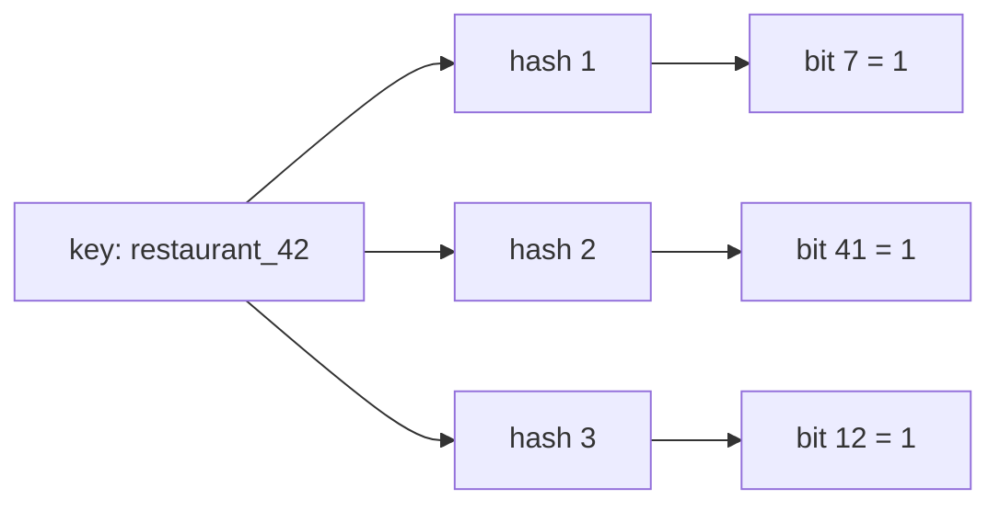
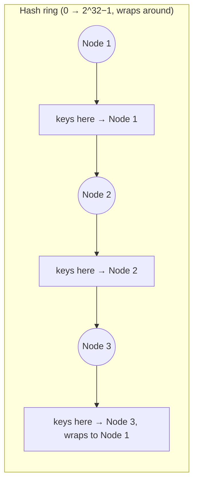

# Chapter 4 — Algorithms for Scale: Bloom Filters, HyperLogLog, Roaring Bitmaps & Consistent Hashing

> **One-line summary:** Four small, clever tools that let huge systems answer "have I
> seen this before," "how many distinct things happened," "which of these millions
> match," and "who owns this piece of data" — cheaply, using approximation and clever
> encoding instead of brute force.
>
> **Interview bar by company:** *Startup* — rarely load-bearing, but consistent hashing
> is worth knowing the moment you sketch a cache or shard cluster. *Mid-size* — know
> what problem each tool solves and when it beats the "obvious" exact approach.
> *Big-tech* — expect probing on the accuracy/memory trade-off of each structure, and
> consistent hashing's virtual nodes and rebalancing behavior specifically.
>
> **Running example:** FoodDash reaches for one of these four exactly when the obvious,
> exact approach — a full `Set`, an exact `COUNT DISTINCT`, `hash(key) % N` — stops
> being cheap enough.

> **A note on this chapter's shape.** Unlike other chapters, this one isn't about a
> single platform — it's four specific techniques, grouped because they share a theme:
> trading a small, controlled amount of accuracy or simplicity for a huge win in memory
> or stability at scale. Each gets its own compact walkthrough below instead of the
> full nine-section template.

---

## A. Bloom Filters — "have I possibly seen this before?"

**The problem.** FoodDash wants to avoid querying the database for a `restaurant_id`
that doesn't exist — exactly the **cache penetration** problem from the Caching
chapter (Ch. 7). Storing every valid ID in a `Set` to check against works, but at tens
of millions of IDs that's a lot of memory to keep just for "does this exist, yes or no."

**How it works.** A Bloom filter is a fixed-size bit array plus *k* hash functions.
Adding an item hashes it *k* ways and sets those *k* bits to 1. Checking an item hashes
it the same *k* ways and looks at those bits:

- **Any bit is 0** → the item was **definitely never added**.
- **All bits are 1** → the item was **probably added** (a small, tunable chance of a
  **false positive** from hash collisions — but *never* a false negative).



| | Exact `Set` | Bloom filter |
|---|---|---|
| Memory for 50M IDs | Tens of GB | A few MB (tunable error rate) |
| False positives | None | Small, tunable % |
| False negatives | None | **Never** |
| Can you remove items? | Yes | Not with a standard Bloom filter |

**When to use it:** membership checks at huge scale where a rare false positive is
cheap to absorb (you just do the expensive lookup anyway) and false negatives would be
a real bug. **Skip it** when the set is small enough to just store directly, or when
false positives are unacceptable.

**Popular implementations:** RedisBloom (Bloom filter as a Redis data type — Ch. 7's
default cache, extended), Guava's `BloomFilter` (Java), Cassandra's internal per-file
Bloom filters (skips disk reads for keys that can't be in that file), and the
best-known real example — browsers checking URLs against Google Safe Browsing's
malicious-site list without downloading the whole list.

**Worked example.** Before FoodDash's app queries Postgres for a `restaurant_id`, it
checks a Bloom filter of all valid IDs held in memory. A made-up or deleted ID is
rejected instantly, for free; a real ID proceeds to the database as normal — the
database is only ever hit for IDs that are actually real (or, rarely, a false
positive that fails the real lookup harmlessly).

> **Say this in the interview:** *"For a cheap 'does this key exist' check ahead of an
> expensive lookup, I'd use a Bloom filter — a few megabytes covers tens of millions of
> keys, it never gives a false negative, and an occasional false positive just costs one
> wasted lookup instead of a correctness bug."*

---

## B. HyperLogLog — "about how many distinct things happened?"

**The problem.** "How many unique diners viewed Spice Villa's menu today?" With a huge
day of traffic, keeping an exact `Set` of diner IDs to count distinct viewers costs
memory proportional to the number of viewers — potentially gigabytes, for a number you
mostly need as a rough dashboard metric.

**How it works (the intuition, not the math).** HyperLogLog hashes each item and looks
at the pattern of leading zeros in the hash. Seeing a long run of leading zeros is
statistically rare — the *longer* the longest run you've seen, the *more distinct
items* you've probably hashed. It splits the stream into many small buckets, tracks the
longest run per bucket, and combines them statistically into a single estimate — all in
a **fixed ~12KB**, whether you've counted a thousand items or a billion.

| | Exact count (`Set`/`COUNT DISTINCT`) | HyperLogLog |
|---|---|---|
| Memory | Grows with the number of distinct items | Fixed (~12KB), regardless of scale |
| Accuracy | Exact | ~2% typical error |
| Can you list the items? | Yes | No — count only |
| Mergeable across servers? | Awkward | Yes, cheaply (`PFMERGE`) |

**When to use it:** approximate unique counts at massive scale — daily active users,
unique page views, distinct search terms — where "about 41,000, ±2%" is exactly as
useful as "41,317." **Skip it** when you need an exact number (billing, a legal count)
or need to know *which* items were seen, not just how many.

**Popular implementations:** Redis has it built in natively (`PFADD`, `PFCOUNT`,
`PFMERGE`) — the same Redis you'd already reach for as FoodDash's default cache (Ch.
7). Also used inside Presto, Druid, and BigQuery's `APPROX_COUNT_DISTINCT`.

**Worked example.** FoodDash logs every menu view with `PFADD views:spice_villa
diner_id`. `PFCOUNT views:spice_villa` returns an estimate of unique viewers, in a few
KB, whether Spice Villa got 500 views or 50 million — no giant set required.

> **Say this in the interview:** *"For an approximate unique count at scale, I'd reach
> for HyperLogLog — it's a fixed few kilobytes no matter how large the stream gets,
> with about 2% error, which is fine for a dashboard metric but wrong for a billing
> number."*

---

## C. Roaring Bitmaps — "which of these millions match — fast?"

**The problem.** FoodDash's search wants "restaurants that are vegetarian **AND** open
now **AND** within 3km" — a fast intersection across three large sets of restaurant
IDs, computed on the fly for every search.

**How it works.** A plain bitmap (one bit per possible ID) makes set intersection a
trivially fast bitwise `AND` — but wastes huge amounts of memory when the set is sparse
(a 10-million-ID space with only 5,000 members still needs the full 10 million bits). A
**Roaring Bitmap** splits the ID space into chunks of 65,536 and picks the cheapest
representation *per chunk* — a plain bitmap where IDs are dense, a short sorted array
where they're sparse — giving you both the compactness of a sparse structure and the
speed of bitwise operations most of the time.

| Representation | Memory for a sparse set | Set-operation speed |
|---|---|---|
| Sorted integer array | Small | Slow for large intersections |
| Plain bitmap | Large, regardless of sparsity | Very fast |
| **Roaring Bitmap** | Small (best-of-both, per chunk) | Fast |

**When to use it:** fast intersection/union/difference over large sets of integer IDs —
faceted search filters, analytics segment overlaps, permission checks across millions
of users. **Skip it** for small sets (a plain array is simpler and just as fast) or data
that isn't naturally integer IDs.

**Popular implementations:** built into Apache Lucene and Elasticsearch (Ch. 10) for
filtering and faceting, Apache Druid, ClickHouse, and Pilosa (a bitmap-native analytics
database).

**Worked example.** FoodDash keeps a Roaring Bitmap per facet — `vegetarian`,
`open_now`, `near_koramangala` — each holding the matching restaurant IDs. A search for
all three intersects the three bitmaps in milliseconds, even with millions of
restaurants city-wide.

> **Say this in the interview:** *"For fast filtering across large ID sets, I'd use
> Roaring Bitmaps instead of a plain bitmap or a sorted array — they get the memory
> efficiency of a sparse structure and the speed of bitwise set operations, which is
> exactly what faceted search filtering needs."*

---

## D. Hashing & Consistent Hashing — "who owns this piece of data?"

**The problem.** FoodDash's Redis cache runs on 4 nodes. The obvious way to pick which
node owns a key is `node = hash(key) % 4`. Dinner rush hits and you add a 5th node —
now `hash(key) % 5` sends almost *every* key to a different node than before. The whole
cache goes cold at once, and every one of those keys' next read becomes a database hit
simultaneously — a self-inflicted stampede, caused by scaling out (Ch. 1) the very
cluster meant to help.

**How consistent hashing works.** Instead of mod-N, place both **nodes** and **keys**
on a fixed ring of hash values (imagine 0 to 2³²−1, wrapping back to 0). A key belongs
to the **first node clockwise** from its position on the ring. Add or remove one node,
and only the keys between it and its nearest neighbor move — a small fraction of the
total, not everything.



Real systems also use **virtual nodes** — placing each physical node at many points
around the ring — so load balances evenly instead of one lucky node owning a huge arc.

| | `hash(key) % N` | Consistent hashing |
|---|---|---|
| Add/remove a node | Nearly *all* keys remap | Only ~`1/N` of keys remap |
| Load balance | Even, if N is stable | Even, *with* virtual nodes |
| Complexity | Trivial | Moderate (ring + virtual nodes) |

**When to use it:** any system where the number of nodes changes over time and you want
to minimize reshuffling — cache clusters, database shard assignment, CDN edge
selection. **Skip it** for a fixed, rarely-changing node count, where plain mod-N
hashing is simpler and just as correct.

**Popular implementations:** Cassandra and DynamoDB use consistent hashing internally
to assign data to partitions (Ch. 6); Memcached client libraries (e.g. `libketama`)
shard cache keys across a cluster with it; NGINX and HAProxy offer hash-based
balancing algorithms (Ch. 11 §7) that build on the same idea.

**Worked example.** FoodDash's Redis cluster grows from 4 to 5 nodes for the dinner
rush. With consistent hashing and virtual nodes, only about a fifth of cached menus
remap to the new node — the rest stay exactly where they were, and the database never
sees the stampede a naive mod-N reshuffle would have caused.

> **Say this in the interview:** *"For a cluster whose node count changes — scaling a
> cache or sharding a database — I'd use consistent hashing with virtual nodes instead
> of `hash % N`, so adding or removing a node only remaps a small fraction of keys
> instead of nearly all of them."*

---

## Avoiding overkill

**The scenario.** A candidate reaches for Roaring Bitmaps to filter a restaurant list
of 200 rows, and HyperLogLog to count the 12 people using FoodDash's internal admin
tool. Neither problem is at the scale where these tools pay for themselves — this
chapter's tools are specifically for when the *exact, obvious* approach stops being
affordable, not a default.

**Don't over-build:**
- ❌ A Bloom filter for a lookup table small enough to just hold in a `Set` or query
  directly.
- ❌ HyperLogLog when you need an exact count and have the memory to just keep one —
  don't trade correctness for savings you don't need.
- ❌ Roaring Bitmaps for small sets — a plain sorted array is simpler and fast enough.
- ❌ Consistent hashing for a fixed, small, rarely-changing cluster — plain mod-N
  hashing is simpler and equally correct there.

**Red flags that make interviewers wince** 🚩: reaching for a probabilistic structure
before establishing the exact approach is actually too expensive; forgetting a Bloom
filter can't delete items; treating a HyperLogLog estimate as an exact number; not
mentioning virtual nodes when proposing consistent hashing (uneven load is the
predictable follow-up question).

> **Say this in the interview:** *"I'd only reach for one of these once I can show the
> exact, obvious approach — a full set, an exact count, plain mod-N hashing — actually
> breaks down at the scale we're designing for. They're a response to a specific
> memory or stability problem, not a default."*

---

## Hello-world exercise (~30 min)

**Goal:** see a Bloom filter's false positives and consistent hashing's small-remap
property with your own eyes.

**Part 1 — a tiny Bloom filter.**

```javascript
// bloom.js — a minimal 3-hash Bloom filter over 64 bits
const SIZE = 64;
const bits = new Array(SIZE).fill(0);
function hashes(key) {
  let h1 = 0, h2 = 0, h3 = 0;
  for (const c of key) { h1 = (h1 * 31 + c.charCodeAt(0)) % SIZE;
                          h2 = (h2 * 17 + c.charCodeAt(0)) % SIZE;
                          h3 = (h3 * 13 + c.charCodeAt(0)) % SIZE; }
  return [h1, h2, h3];
}
function add(key) { hashes(key).forEach(i => bits[i] = 1); }
function mightContain(key) { return hashes(key).every(i => bits[i] === 1); }

add("restaurant_42"); add("restaurant_7");
console.log(mightContain("restaurant_42"));   // true — definitely added
console.log(mightContain("restaurant_999"));  // almost always false
console.log(mightContain("restaurant_1000")); // try a few IDs — occasionally a false positive
```

**Part 2 — consistent hashing's small remap, vs. mod-N's big one.**

```javascript
// consistent-hash.js
const crypto = require("crypto");
const hash = s => parseInt(crypto.createHash("md5").update(s).digest("hex").slice(0, 8), 16);

function modN(key, nodes) { return nodes[hash(key) % nodes.length]; }

function consistentHash(key, ring) {                        // ring: sorted [{pos, node}]
  const h = hash(key);
  return (ring.find(r => r.pos >= h) || ring[0]).node;
}

const keys = Array.from({ length: 1000 }, (_, i) => `menu:${i}`);
const nodesBefore = ["A", "B", "C", "D"];
const nodesAfter = ["A", "B", "C", "D", "E"];

const modBefore = keys.map(k => modN(k, nodesBefore));
const modAfter = keys.map(k => modN(k, nodesAfter));
const modMoved = modBefore.filter((n, i) => n !== modAfter[i]).length;
console.log(`mod-N: ${modMoved}/1000 keys moved when node E was added`);
// → typically ~750-800/1000. Compare against a consistent-hash ring (build one with
// a few virtual nodes per physical node) and you'll see roughly 200/1000 instead.
```

**You understand this chapter's tools when you can:**
- [ ] Explain why a Bloom filter can false-positive but never false-negative.
- [ ] Say why HyperLogLog trades exactness for constant memory.
- [ ] Explain what makes Roaring Bitmaps faster than a sorted array for set operations.
- [ ] Explain why consistent hashing remaps far fewer keys than `hash % N` when a node
      is added or removed.

---

## Real-world use cases

- **Chrome's Safe Browsing:** checks every URL you visit against a Bloom filter of
  known-malicious sites, without downloading or storing the full list on your device.
- **Redis in production analytics:** `PFADD`/`PFCOUNT` (HyperLogLog) is the standard way
  large sites estimate daily unique visitors without a giant set per day.
- **Elasticsearch and Apache Druid:** use Roaring Bitmaps internally to make faceted
  filtering and analytics-segment intersections fast at billions of rows.
- **Cassandra, DynamoDB, and Memcached clusters:** all use consistent hashing to assign
  data to nodes so the cluster can grow or shrink without a full reshuffle.

**Theme:** each tool answers a question that has an *obvious*, exact answer — until the
scale makes that obvious answer too expensive. Then you reach for one of these.

---

## Interview questions where these tools are the key decision

1. **"How would you check if a key exists without hitting the database every time?"**
   → A Bloom filter ahead of the real lookup (§A) — directly solves cache penetration.
2. **"How would you estimate daily unique visitors at massive scale?"** → HyperLogLog —
   fixed memory, ~2% error, mergeable across servers (§B).
3. **"How do you make a multi-facet search filter fast over millions of IDs?"** →
   Roaring Bitmaps and a bitwise intersection per facet (§C).
4. **"You added a cache node and hit rate collapsed — why?"** → Naive `hash % N`
   remapped nearly every key; consistent hashing would have remapped only a fraction
   (§D).
5. **"What's a false positive in a Bloom filter, and why is a false negative worse?"** →
   A false positive just costs one wasted lookup; a false negative would silently skip
   real data — Bloom filters are built to never do that.
6. **"Why do consistent-hashing implementations use virtual nodes?"** → Without them, a
   node can land on an unlucky, oversized arc of the ring and take a disproportionate
   share of load.

**How to answer well:** for each, name the exact/obvious approach first, then the
concrete reason it breaks down at scale, then the tool that fixes it — that ordering is
what shows judgment instead of pattern-matching a buzzword.

---

## 60-second recap

- **Bloom filter:** "have I seen this?" — never a false negative, a rare false
  positive, a few MB instead of a full set. Fixes cache penetration.
- **HyperLogLog:** "about how many distinct things?" — fixed ~12KB, ~2% error,
  mergeable. `PFADD`/`PFCOUNT` in Redis.
- **Roaring Bitmap:** "which of these match, fast?" — sparse-set memory with
  bitmap-speed set operations; powers faceted search filtering.
- **Consistent hashing:** "who owns this key?" — adding/removing a node remaps a small
  fraction of keys instead of nearly all of them; use virtual nodes for even load.
- All four are a response to a **specific cost problem at scale**, not a default —
  reach for the exact/obvious approach first and only swap in one of these once it
  actually breaks down.
