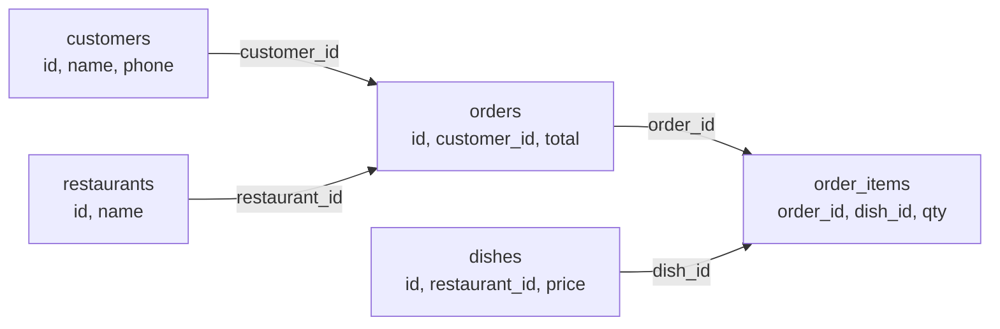
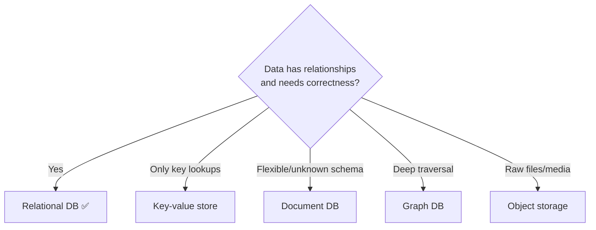
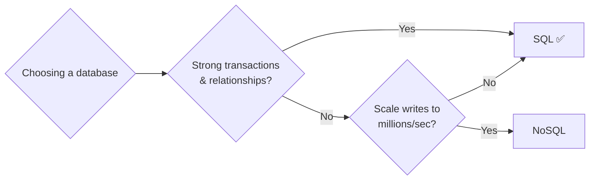
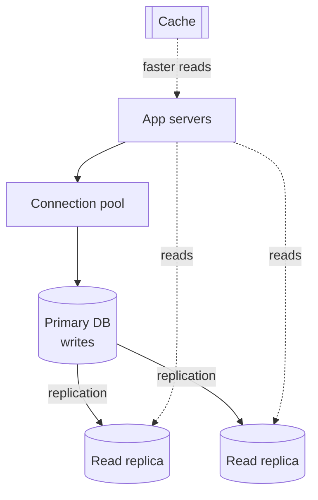

# Chapter 5 — Relational Databases (SQL)

> **One-line summary:** A relational database stores data in **tables of rows and
> columns**, connects tables through **relationships**, and keeps your data **correct**
> even when many users change it at once. It's the safe default for most systems — start
> here.
>
> **Interview bar by company:** *Startup* — "use PostgreSQL, model the tables, done."
> Often the whole answer. *Mid-size* — add indexing, read replicas, and a caching plan.
> *Big-tech* — expect probing on transactions/isolation, the scaling path
> (replicas → cache → sharding), and exactly when you'd reach for NoSQL instead.
>
> **Running example (used throughout this guide):** we're incrementally designing
> **FoodDash**, a food-delivery app. This chapter builds its core: **users, restaurants,
> orders, and payments** — the data that must never be wrong.

---

## §1 — Why the platform exists

**The scenario.** Imagine building FoodDash *without* a database — customers in one JSON
file, orders in another, restaurant menus in a third. A user places an order. You must
write the order, record the payment, and notify the restaurant. What if the power dies
*after* you save the order but *before* you record the payment? Now there's an order
nobody paid for. What if two users grab the last table-for-two reservation at the same
millisecond? Both files say "1 available," both succeed, and you've double-booked.

Relational databases (concept by Edgar Codd, IBM, 1970) exist to make these disasters
impossible. They give you two superpowers:

1. **Relationships without duplication.** Store each customer *once*; orders just point to
   the customer's ID. Update the customer's phone number in one place and every order sees
   it.
2. **ACID transactions** — a group of changes either *all* happen or *none* do, and the
   data is never left half-updated.

**ACID, in practice:**

| Letter | Means | In practice |
|---|---|---|
| **A**tomicity | All-or-nothing | A multi-step operation that can't partially apply |
| **C**onsistency | Rules never break (e.g. balance ≥ 0) | Validation enforced by the *data itself*, not just app code |
| **I**solation | Concurrent changes don't corrupt each other | Two users checking out at once don't clobber each other |
| **D**urability | Once saved, it survives a crash | Committed data is written to disk and never lost |



The lines are **foreign keys** — a column pointing to another table's primary key. That's
the whole "relational" idea: data lives in one place; other tables point to it.

> **Say this in the interview:** *"FoodDash's orders, payments, and users have clear
> relationships and demand correctness, so I'd use a relational database — I get ACID
> transactions so an order and its payment succeed or fail together, and no duplicated
> customer data."*

---

## §2 — When to use it

**The scenario.** For each piece of FoodDash data you ask: "does this need to be correct
and related?" For orders and payments, absolutely — so they go in SQL. Reach for a
relational database when **any** of these hold:

- **Data has clear relationships.** Customers have orders, orders have items, items belong
  to dishes. (Almost every business app looks like this.)
- **Correctness beats raw speed.** Money, orders, inventory, bookings — anything where a
  wrong number is unacceptable.
- **You need transactions.** "Charge the card *and* create the order" must be
  all-or-nothing.
- **You'll query in ways you can't fully predict.** SQL answers *"all orders over ₹500
  from Bengaluru customers last week"* without redesigning storage. Flexible querying is
  SQL's home turf.
- **Data volume is normal** — up to hundreds of millions of rows on one well-tuned machine
  is routine.

> **Say this in the interview:** *"When I'm not sure, I default to a relational database
> like PostgreSQL and justify it — it's rarely the wrong first answer and it signals I
> don't over-engineer."*

---

## §3 — When *not* to use it

**The scenario.** Not *all* of FoodDash fits SQL. Driver GPS pings arrive thousands per
second and don't need relationships or transactions — forcing them into a relational table
would be painful. Avoid (or supplement) relational databases when:

- **Massive write-heavy scale.** Millions of writes/sec (driver locations, event
  firehoses) overwhelm a single relational server.
- **Schema is unknown or wildly varied.** If every record has different fields, rigid
  columns fight you.
- **You only ever look up by one key.** If 100% of access is "give me the value for this
  key" (a session, a cart), a key-value store is simpler and faster (Chapter 6).
- **Huge blobs** — photos of dishes, receipts. Store the *file* in object storage
  (Chapter 8) and keep only the URL in the DB.
- **Deep relationship traversal** — "friends of friends of friends" — is slow in SQL
  (each hop is another JOIN). A graph database is purpose-built for it.



> **Say this in the interview:** *"I'd keep FoodDash's orders and payments in SQL, but put
> high-volume driver-location pings in a NoSQL store — matching each dataset to the right
> tool rather than forcing everything into one."*

---

## §4 — Popular products

**The scenario.** "What database would you actually use for FoodDash?" You need real names.

| Product | Type | Know it for |
|---|---|---|
| **PostgreSQL** | Open-source | The modern default. Rich features, JSON support, extensible, correctness-focused. |
| **MySQL** | Open-source | Extremely popular, fast reads, huge ecosystem; powers much of the web. |
| **SQLite** | Embedded (one file) | No server — the DB is a single file. Great for mobile, prototypes, tests. |
| **Oracle Database** | Commercial | Enterprise heavyweight (banks, telecoms). Powerful, expensive, complex. |
| **Microsoft SQL Server** | Commercial | Dominant in the Microsoft/.NET enterprise world. |
| **Amazon Aurora** | Cloud-managed | AWS's MySQL/PostgreSQL-compatible engine with auto-scaling storage. |
| **Google Cloud Spanner** | Cloud, distributed | Relational *and* horizontally scalable globally — rare, pricey. |

> **Say this in the interview:** *"For FoodDash I'd pick PostgreSQL — a safe, powerful
> default. On AWS I'd run it via Aurora for managed scaling. I'd only reach for Spanner if
> we truly needed global SQL scale, or Oracle if the company already ran it."*

---

## §5 — Quick product comparison

**PostgreSQL vs MySQL vs Oracle** (the comparison you'll be asked most):

| Dimension | PostgreSQL | MySQL | Oracle |
|---|---|---|---|
| Cost | Free, open-source | Free (owned by Oracle) | Commercial, expensive |
| Best at | Complex queries, correctness, JSON, extensibility | Simple fast reads, web apps | Massive enterprise, deep tooling |
| Standards | Very strict | More lenient | Strong + proprietary extras |
| Typical user | Startups → large scale, engineering-led teams | Web startups, LAMP stack | Banks, governments, legacy enterprise |
| Gotcha | Slightly heavier to operate | Some non-standard SQL corners | Cost + vendor lock-in |

**PostgreSQL vs SQLite** — different jobs, not rivals:

| | SQLite | PostgreSQL |
|---|---|---|
| Runs as | A library inside your app (one file) | A separate server |
| Concurrency | One writer at a time | Thousands of concurrent clients |
| Use for | Mobile apps, prototypes, tests | Real multi-user production apps |

> **Say this in the interview:** *"PostgreSQL by default for correctness and rich
> querying; MySQL if the team knows it well or reads dominate; Oracle only if the company
> already runs it and needs its enterprise support."*

---

## §6 — How it compares to other platforms

This is **the** decision interviewers probe: **SQL vs NoSQL** (paired with Chapter 6).

| | Relational (SQL) | NoSQL (Chapter 6) |
|---|---|---|
| Data shape | Tables, fixed schema | Documents / key-value / wide-column / graph |
| Relationships | First-class (JOINs) | You handle them in app code |
| Transactions | Strong ACID | Often limited or eventual |
| Scaling | Vertical first; horizontal is harder | Horizontal scaling is the whole point |
| Query flexibility | Very high (ad-hoc SQL) | Optimized for known access patterns |
| Best when | Correctness + relationships + unknown queries | Extreme scale + simple/known access patterns |



**The honest truth interviewers want:** SQL and NoSQL aren't enemies. FoodDash uses
*both* — SQL for orders and payments, NoSQL for driver pings and the live order feed.
Choosing is about matching the tool to *each* dataset, not picking a side.

> **Say this in the interview:** *"I'd start FoodDash on SQL for the transactional core,
> and introduce NoSQL only for the specific datasets that need extreme scale or a flexible
> schema — a polyglot design."*

---

## §7 — Factors to consider when designing with it

**The scenario.** You've chosen SQL for FoodDash's core. Now show you can *reason* about
it. Walk these, roughly in priority order:

1. **Read vs write ratio.** FoodDash is read-heavy (everyone browses menus; fewer people
   order). Add **read replicas** (copies that serve reads) and a **cache** (Chapter 7).
2. **Indexes.** Like a book's index — fast lookups, but they slow writes and cost space.
   *"I'd index the columns we filter and sort on, like `orders.customer_id`."*
3. **Normalization vs denormalization.** Normalized = no duplication, clean, more JOINs.
   Denormalized = some duplication for speed. Start normalized.
4. **Scaling path (state it in order):** (1) bigger machine → (2) read replicas →
   (3) caching → (4) sharding *as a last resort*. Sharding SQL is genuinely hard — mention
   it, don't reach for it early.
5. **Connection pooling.** Each connection costs memory; high-traffic systems reuse them
   via a pool.
6. **Backups & failover.** *"A primary with a standby replica that can be promoted if the
   primary fails."*



This single picture — primary for writes, replicas for reads, cache in front — answers a
huge share of "how do you scale the database?" questions.

> **Say this in the interview:** *"FoodDash is read-heavy, so I'd scale reads with replicas
> and a cache before anything drastic, keep writes on the primary, and only consider
> sharding if a single primary genuinely can't keep up."*

---

## §8 — Avoiding overkill

**The scenario.** A candidate opens with *"I'll use Cassandra so FoodDash can scale,"* for
an app with a few thousand orders a day. That's the classic over-reach. Show judgment in
both directions.

**Don't under-use SQL:**
- ❌ *"NoSQL because it scales"* — do you actually have scale problems? One PostgreSQL
  instance handles most apps for years.
- ❌ Storing relational data in a key-value store and re-implementing JOINs in app code.

**Don't over-use SQL:**
- ❌ A full Oracle cluster for a weekend project → SQLite or one small Postgres.
- ❌ Sharding on day one "to be ready" → huge complexity for scale you don't have.
- ❌ An index on every column "to be safe" → each index slows every write.

**Red flags that make interviewers wince** 🚩: reaching for a distributed NoSQL cluster
with no scale justification; sharding before replicas and caching; putting image *bytes*
in the database.

> **Say this in the interview:** *"I'd start FoodDash on a single relational database — it
> will handle our load comfortably. If we outgrow it, the path is replicas → cache →
> shard. Starting simple and knowing the upgrade path is the point."*

---

## §9 — Hello-world exercise (~30 min)

**Goal:** create related tables, insert data, run a JOIN, and see a transaction — the core
skills, on FoodDash's own data.

**Setup (zero install):** SQLite in the browser (`sqlime.org`), or
`docker run -e POSTGRES_PASSWORD=pw -p 5432:5432 postgres`.

```sql
-- 1. Two related tables
CREATE TABLE customers (
  id    INTEGER PRIMARY KEY,
  name  TEXT NOT NULL,
  phone TEXT UNIQUE NOT NULL
);
CREATE TABLE orders (
  id          INTEGER PRIMARY KEY,
  customer_id INTEGER NOT NULL REFERENCES customers(id),  -- the relationship
  total       REAL NOT NULL,
  created_at  TEXT DEFAULT CURRENT_TIMESTAMP
);

-- 2. Insert data
INSERT INTO customers (id, name, phone) VALUES
  (1, 'Asha', '900000001'), (2, 'Ravi', '900000002');
INSERT INTO orders (id, customer_id, total) VALUES
  (1, 1, 250.00), (2, 1, 80.00), (3, 2, 500.00);

-- 3. The JOIN: each order WITH the customer's name
SELECT customers.name, orders.id AS order_id, orders.total
FROM orders JOIN customers ON customers.id = orders.customer_id
ORDER BY orders.total DESC;

-- 4. Aggregate: lifetime spend per customer
SELECT customers.name, SUM(orders.total) AS lifetime_value
FROM orders JOIN customers ON customers.id = orders.customer_id
GROUP BY customers.name;

-- 5. Transaction: all-or-nothing (the ACID payoff)
BEGIN;
  INSERT INTO orders (id, customer_id, total) VALUES (4, 2, 120.00);
  UPDATE customers SET phone = '900000999' WHERE id = 2;
COMMIT;   -- both succeed together, or ROLLBACK undoes both
```

**You understand relational DBs when you can:**
- [ ] Explain what the `REFERENCES` (foreign key) line does.
- [ ] Explain why the JOIN in step 3 works.
- [ ] Say what happens if a statement inside the transaction fails before COMMIT.

**Stretch:** add `order_items (order_id, dish_id, qty)` and write a query listing every
dish a given customer ever ordered.

---

## Real-world use cases

- **Shopify** runs enormous commerce volume on **MySQL**, sharded by store — proof that
  "boring" relational tech scales to huge businesses with good engineering.
- **Instagram** was built on **PostgreSQL**, scaled with sharding and replicas to hundreds
  of millions of users — it did *not* start on NoSQL.
- **Banking & payments** everywhere: money movement demands ACID, so core ledgers are
  almost always relational. You can't afford "eventually consistent" money.

**Theme:** relational databases are the **workhorse** — companies scale them far longer
than beginners expect before reaching for anything exotic.

---

## Interview questions where a relational DB is the key decision

1. **Design a URL shortener.** → Where's the short→long mapping? SQL is fine; index the
   short code; add a cache for hot lookups.
2. **Design an e-commerce / food-order checkout.** → The canonical ACID question: order +
   payment must be atomic.
3. **Design a ticket/table booking system.** → Two users, one seat — transactions and
   locking are the whole point.
4. **Design a banking / wallet system.** → Consistency is non-negotiable; explain why
   NoSQL's eventual consistency is dangerous here.
5. **"Reads are 100× writes — how do you scale the DB?"** → Replicas + caching + pooling
   (the §7 diagram).
6. **"When would you choose SQL over NoSQL?"** → The §6 answer, spoken confidently.

**How to answer well:** state your choice, justify it by the data's *shape* and
*correctness needs*, then volunteer the scaling path. Always name the "when not to" case —
it proves judgment.

---

## 60-second recap

- Relational DBs = **tables + relationships + ACID transactions**; the safe default.
- Use when data is **related and must be correct** (FoodDash orders, payments).
- Don't use for **extreme write scale, unknown schemas, pure key lookups, or big files**.
- Default product: **PostgreSQL** (MySQL if reads dominate / team knows it; Oracle only if
  already in place).
- Scaling path, in order: **bigger machine → read replicas → cache → shard (last resort)**.
- SQL and NoSQL are **partners, not rivals** — match the tool to each dataset.
- Biggest interview win here: **start simple, know the upgrade path, don't over-engineer.**
