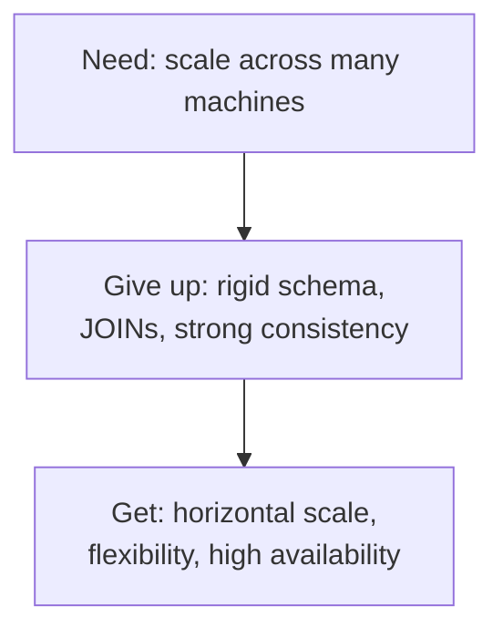
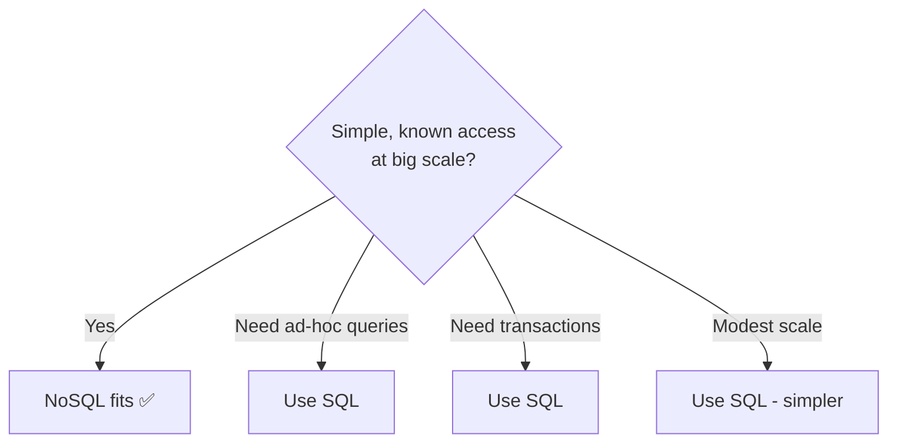
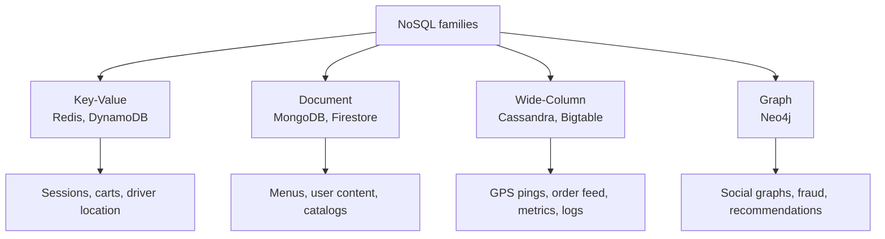
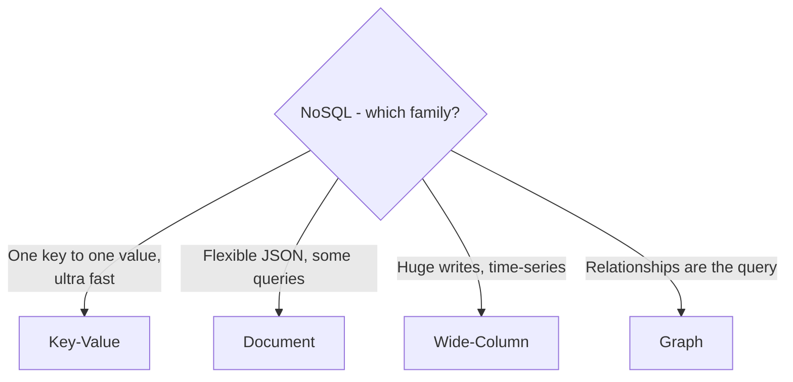
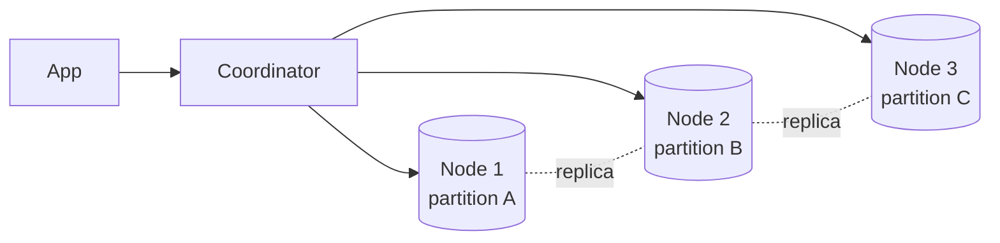

# Chapter 6 — NoSQL Databases

> **One-line summary:** "NoSQL" covers databases that **trade some of SQL's rigidity and
> guarantees for massive scale, flexible schemas, and speed on known access patterns.**
> It's not one thing — it's **four families**. Knowing *which family* to name is what
> impresses interviewers.
>
> **Interview bar by company:** *Startup* — usually you *don't* need it yet; knowing that
> is the smart answer. *Mid-size* — pick the right family for one specific high-scale
> dataset. *Big-tech* — expect probing on partition keys, consistency levels, and CAP
> trade-offs.
>
> **Running example:** FoodDash now needs to handle **driver GPS pings (thousands/sec),
> a live order-status feed, and flexible restaurant menus** — data that fits NoSQL far
> better than the SQL core from Chapter 5.

---

## §1 — Why the platform exists

**The scenario.** FoodDash grows to 50 cities. Every active driver sends a GPS ping every
few seconds — millions of writes per hour, no relationships, no transactions, just "driver
42 is here, now." Forcing that into the relational orders database would crush it. This is
the pressure that created NoSQL.

By the mid-2000s, Google, Amazon, and Facebook hit walls SQL wasn't built for:

- **Scale beyond one machine.** With billions of records you *must* spread data across
  thousands of machines — and classic SQL was painful to split.
- **Flexible, changing data.** A menu item with dozens of optional attributes, a social
  post, a game inventory — awkward to force into fixed columns.
- **Simple, predictable access at insane speed** — "give me this session," "this cart,"
  "this driver's location," a million times a second.

So engineers made a trade. The **CAP theorem** says that when the network between machines
fails (a *partition*, "P"), a distributed database can guarantee **C**onsistency *or*
**A**vailability, not both. SQL traditionally leans consistency; many NoSQL systems chose
**availability** — *"always answer, even if the answer is slightly stale."*



> **Say this in the interview:** *"For FoodDash's driver pings I'd use NoSQL — it scales
> writes horizontally across machines, and a location that's stale by a second is fine, so
> trading strict consistency for availability and scale is the right call here."*

---

## §2 — When to use it

**The scenario.** For each FoodDash dataset, ask: "huge scale + simple/known access +
staleness OK?" Driver pings: yes. Orders: no (Chapter 5). Reach for NoSQL when:

- **You need to scale reads/writes horizontally** from the start (millions of ops/sec,
  billions of items).
- **Access is simple and known.** You almost always fetch by one key (driver_id →
  location, session_id → session).
- **Schema is flexible or varies per record** (menus with different attributes,
  user-generated content, IoT payloads).
- **Eventual consistency is acceptable** for that data (a like count off by one for two
  seconds is fine; a payment is not).
- **Extreme write throughput** — logs, metrics, location streams, activity feeds.

> **Say this in the interview:** *"The trigger words are 'billions,' 'global,'
> 'real-time feed,' 'metrics,' or 'flexible attributes.' When I hear those, NoSQL enters
> the design — usually alongside SQL, not instead of it."*

---

## §3 — When *not* to use it

**The scenario.** Someone suggests moving FoodDash's *orders and payments* to MongoDB "for
consistency of stack." Bad idea — that data needs transactions and relationships. Avoid
NoSQL when:

- **You need multi-record transactions and strong consistency** (money, orders, bookings).
- **You need flexible, ad-hoc queries** you can't predict. NoSQL is fast *only* on the
  access patterns you designed for; ask something else and you're doing slow scans.
- **Data is deeply relational** and you'd re-implement JOINs in app code — that's a sign
  you wanted SQL.
- **Scale is modest.** If one Postgres handles your load (it probably does), NoSQL just
  adds operational complexity. (This is §8 — the big one.)



> **Say this in the interview:** *"I wouldn't put FoodDash's orders in NoSQL — they need
> ACID transactions and relationships. NoSQL is for the driver pings and the activity
> feed, not the money."*

---

## §4 — Popular products (by family)

**The most valuable idea in this chapter: NoSQL has four families. Name the family, then
the product.**

**1. Key-Value** — a giant distributed dictionary. Fastest, simplest.
| Product | Notes |
|---|---|
| **Redis** | In-memory, blazing fast. Also *the* caching tool (Chapter 7). |
| **Amazon DynamoDB** | Managed, massive scale, predictable latency. |

**2. Document** — JSON-like documents; flexible fields per record.
| Product | Notes |
|---|---|
| **MongoDB** | The most popular document DB; natural for JSON data. |
| **Firebase Firestore** | Serverless document DB, great for mobile/web. |

**3. Wide-Column** — rows with billions of dynamic columns; built for write scale.
| Product | Notes |
|---|---|
| **Apache Cassandra** | Extreme write throughput, no single point of failure. |
| **Google Bigtable / HBase** | Petabyte-scale time-series & analytics. |

**4. Graph** — nodes and edges; built for relationship traversal.
| Product | Notes |
|---|---|
| **Neo4j** | Best-known graph DB — "friends of friends," fraud rings, recommendations. |



> **Say this in the interview:** *"For FoodDash: DynamoDB or Redis (key-value) for driver
> location, Cassandra (wide-column) for the high-volume order-status feed, and MongoDB
> (document) if menus need very flexible per-restaurant attributes."*

---

## §5 — Quick product comparison

**MongoDB vs Cassandra vs DynamoDB:**

| Dimension | MongoDB (document) | Cassandra (wide-column) | DynamoDB (key-value) |
|---|---|---|---|
| Best at | Flexible docs, rich queries | Extreme write throughput | Managed scale, steady latency |
| Data model | JSON documents | Wide rows, column families | Key + attributes |
| Ops burden | Medium (or Atlas managed) | Higher (run the cluster) | Near-zero (fully managed) |
| Query flexibility | High for NoSQL | Low — model around queries | Low — model around keys |
| Sweet spot | App backends, catalogs, CMS | Time-series, logs, feeds, IoT | Serverless, huge scale on AWS |
| Watch out | Easy to model badly like SQL | Rigid modeling required | Pricing model, AWS lock-in |

**Redis vs MongoDB** (common confusion): Redis = key-value, in-memory, ultra-fast, small
data (sessions, caches, leaderboards). MongoDB = document, disk-backed, durable, larger
data, richer queries (primary app storage).

> **Say this in the interview:** *"MongoDB for a flexible app backend, Cassandra for
> write-heavy time-series or feeds, DynamoDB when we're on AWS and want zero ops with
> predictable latency."*

---

## §6 — How it compares to other platforms

**SQL vs NoSQL**, from the NoSQL side (pair with Chapter 5 §6):

| Question | Lean SQL | Lean NoSQL |
|---|---|---|
| Records relate heavily? | ✅ | |
| Need multi-item transactions? | ✅ | |
| Query in unpredictable ways? | ✅ | |
| Access is one-key, well-known? | | ✅ |
| Scale writes to millions/sec? | | ✅ |
| Schema flexible / per-record? | | ✅ |
| Eventual consistency OK here? | | ✅ |

**Then which NoSQL family?**



**The mature take:** modern systems are **polyglot** — several databases, each for its
strength. FoodDash: PostgreSQL for orders/payments, Redis for sessions, Cassandra for the
order feed, DynamoDB for driver location.

> **Say this in the interview:** *"I don't pick SQL *or* NoSQL for the whole system — I use
> both. FoodDash's money lives in SQL; its high-scale streams live in NoSQL."*

---

## §7 — Factors to consider when designing with it

**The scenario.** You've chosen Cassandra for FoodDash's order-status feed. Show you can
reason about it:

1. **Model around your queries, not your data.** In SQL you model data then query freely;
   in NoSQL you must know your queries *first* and shape storage to serve them.
2. **Choose the partition (shard) key carefully.** It decides how data spreads across
   machines. A bad key creates "hot partitions" (one machine overloaded). For the feed,
   partition by `order_id`; for pings, by `driver_id` — *not* by date (everything would
   land on one node).
3. **Consistency level.** Many NoSQL DBs let you choose per request: strong (slower,
   correct) vs eventual (faster, maybe stale). Match it to the data's importance.
4. **Denormalization is normal.** You'll store the same data multiple ways to serve
   different queries. Trading storage for speed is expected.
5. **No JOINs.** Duplicate data, or fetch in multiple steps from your app.
6. **Replication for availability.** Typically 3 copies across machines/regions so a
   failure never loses data or takes the system down.



> **Say this in the interview:** *"The key decision is the partition key — I'd partition
> FoodDash's driver pings by driver_id to spread load evenly and avoid a hot partition,
> and pick a consistency level that matches how critical each read is."*

---

## §8 — Avoiding overkill (the most important section)

**The scenario.** A candidate designs FoodDash's *entire* backend on Cassandra "so it
scales" — for 5,000 orders a day. This is the single most common mistake, and interviewers
specifically test for it.

Ask before choosing NoSQL:
- **Do I actually have scale a single relational DB can't handle?** Usually the honest
  answer is *no*.
- **Are my access patterns really fixed forever?** If the product is young and queries
  will change, SQL's flexibility beats NoSQL's unneeded scale.
- **Am I about to re-implement JOINs and transactions in app code?** Then I picked the
  wrong tool.

**Overkill traps:**
- ❌ Cassandra for an app with 10,000 users → one Postgres, easily.
- ❌ MongoDB modeled exactly like relational tables with manual references → NoSQL's
  weaknesses, none of SQL's strengths.
- ❌ A graph DB because there are *some* relationships → graph DBs earn their keep only when
  *deep traversal* is the core query.

**Red flags** 🚩: "NoSQL because it scales" with no numbers; choosing a family without
naming the access pattern; using NoSQL for the money/transactions.

> **Say this in the interview:** *"I'd default FoodDash to a relational database and
> introduce NoSQL only for the parts that need it — driver location, the activity feed —
> once we've proven the need."*

---

## §9 — Hello-world exercise (~30 min)

**Goal:** feel the flexible, query-first, no-JOIN nature of a document store using MongoDB.

**Setup:** MongoDB Atlas (free) + Data Explorer, or `docker run -d -p 27017:27017 mongo`
then `mongosh`.

```javascript
// No CREATE TABLE, no fixed schema — FoodDash menu items with different fields
db.dishes.insertMany([
  { _id: 1, name: "Paneer Tikka", price: 220, veg: true, spice: "medium" },
  { _id: 2, name: "Cold Coffee",  price: 120, size: ["S","M","L"] },   // different fields
  { _id: 3, name: "Thali",        price: 260, includes: { dal:true, rice:true } } // nested
]);

db.dishes.find({ _id: 2 });                    // fast lookup by key
db.dishes.find({ price: { $lt: 200 } });       // cheaper than 200
db.dishes.updateOne({ _id: 2 }, { $set: { inStock: true } });   // add a field to one doc
db.dishes.aggregate([{ $group: { _id: "$veg", count: { $sum: 1 } } }]); // group-by
```

**Feel the difference from SQL:** try answering *"which customers ordered a Thali?"* You
have no JOIN — you'd denormalize (store order info inside documents) or query twice from
your app. **That friction is the lesson.**

**Stretch:** in Redis (`docker run -d -p 6379:6379 redis`, then `redis-cli`), run
`SET driver:42 "12.97,77.59"`, `GET driver:42`, `EXPIRE driver:42 30`. That's a key-value
store storing FoodDash's live driver location.

**You understand NoSQL when you can:**
- [ ] Explain why documents 1–3 having different fields is allowed.
- [ ] Explain why there's no JOIN and what you do instead.
- [ ] Name which *family* MongoDB belongs to (document).

---

## Real-world use cases

- **Netflix + Cassandra:** viewing history and playback state across regions with huge
  write volume and high availability.
- **Discord's messages:** moved to a wide-column store to handle *trillions* of messages —
  a textbook write-heavy, time-ordered workload (just like FoodDash's order feed, bigger).
- **Amazon's cart (origin of Dynamo):** built so the cart is *always* writable, even during
  failures — availability over strict consistency, because a rejected "add to cart" loses a
  sale.

**Theme:** NoSQL shines for **one specific, huge-scale job** in a system that *still* uses
relational databases for the parts that need correctness.

---

## Interview questions where NoSQL is the key decision

1. **Design a social feed (Twitter/Instagram).** → Wide-column timeline, cache for hot
   feeds, eventual consistency of counts.
2. **Design a chat/messaging app.** → Massive writes, ordered messages → wide-column;
   partition by conversation.
3. **Design a rate limiter.** → Redis counters with expiry (key-value classic).
4. **Design a leaderboard.** → Redis sorted sets.
5. **Design an IoT / location / metrics pipeline.** → Time-series, write-heavy →
   Cassandra/Bigtable (FoodDash driver pings).
6. **"When would you pick NoSQL over SQL, and which type?"** → §6 + §4: name the family,
   justify by access pattern.

**How to answer well:** after choosing NoSQL, *always* name the family and partition key,
justify with the access pattern, and say where you'd *still* use SQL. Never say "NoSQL
because it scales" without saying *what shape* and *why this data*.

---

## 60-second recap

- NoSQL trades **rigidity + strong consistency** for **scale + flexibility**; it's **four
  families**: key-value, document, wide-column, graph.
- **CAP:** under a network partition, pick consistency *or* availability — many NoSQL DBs
  pick availability.
- Use for **huge scale + simple/known access + staleness-OK** data (FoodDash pings, feed).
- **Never** for the transactional money core — that stays SQL.
- The winning instinct: **default to SQL, add NoSQL only where a specific dataset demands
  it.** Name the **family** and the **partition key**.

---

## Additional references

- [**"Introduction to NoSQL" — Martin Fowler, GOTO 2012**](https://www.youtube.com/watch?v=qI_g07C_Q5I)
  — the talk that shaped how most engineers still think about NoSQL: why it emerged, the
  major data-model families (§4), and when relational still wins. Good background watch
  before or after this chapter.
