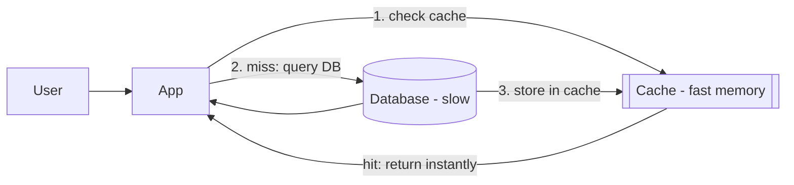
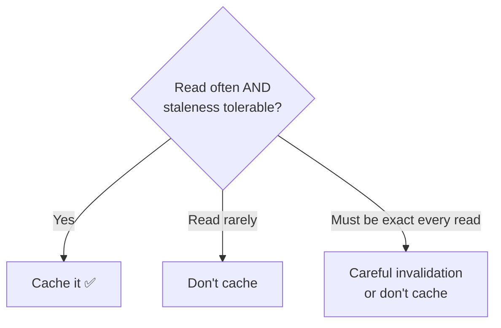
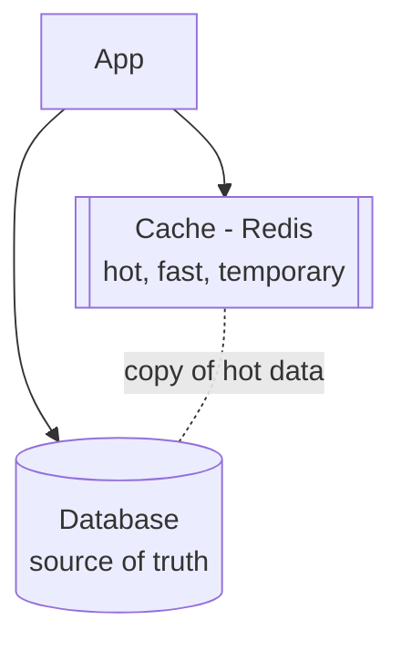
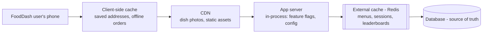
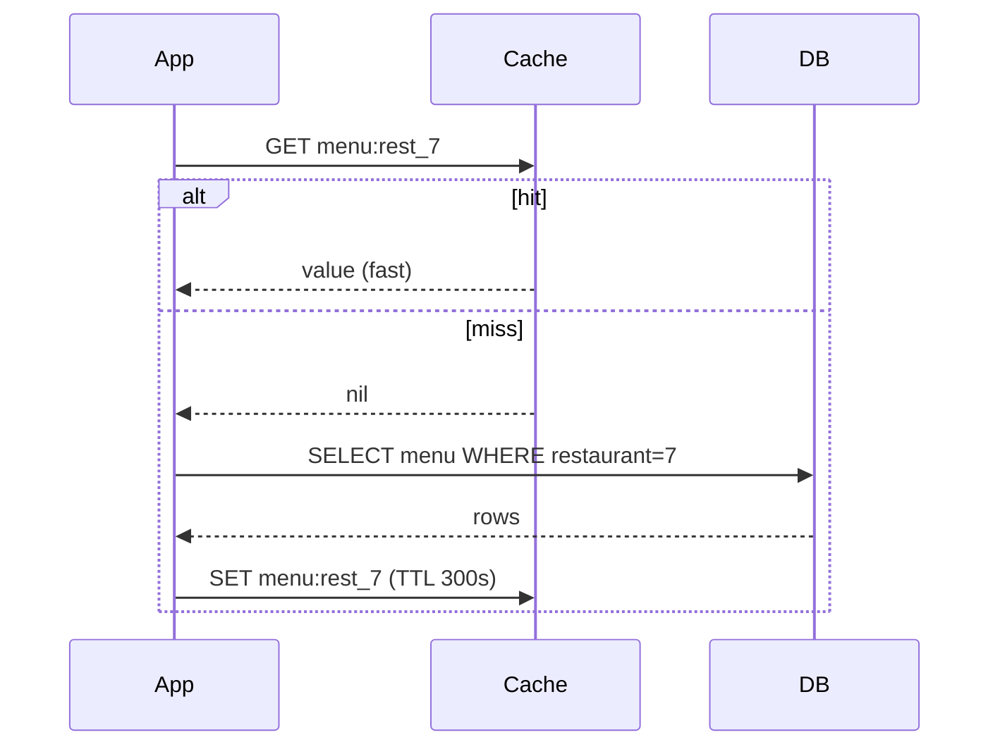

# Chapter 7 — Caching

> **One-line summary:** A cache is a **small, fast store that keeps copies of
> frequently-used data close to where it's needed**, so you avoid repeating slow work (a
> database query, an API call, a computation). It's the highest-leverage performance tool
> in system design.
>
> **Interview bar by company:** *Startup* — "cache the hot reads with a TTL." *Mid-size* —
> pick a strategy (cache-aside) and an invalidation plan. *Big-tech* — expect probing on
> consistency, stampedes/hot keys, and eviction policies.
>
> **Running example:** FoodDash's restaurant menus are read constantly and change rarely —
> a perfect cache target. This chapter also puts FoodDash's **sessions, rate limiting, and
> "top restaurants" list** in a cache.

---

## §1 — Why the platform exists

**The scenario.** At 8pm, 10,000 FoodDash users open the same popular restaurant's page.
Its menu hasn't changed all day, yet you query the database 10,000 times for the identical
data. The database strains, pages slow, and you're paying to compute the same answer over
and over. A cache fixes this: the first request does the work and stores the result; the
next 9,999 get it instantly from memory.

A cache sits **in front of** the slow thing. The speed gap is enormous:

| Fetch from… | Roughly |
|---|---|
| Memory (a cache like Redis) | ~microseconds |
| SSD / database on disk | ~milliseconds (1,000×+ slower) |
| Another data center | ~tens–hundreds of ms |



- **Cache hit** = data was in the cache (fast). **Cache miss** = fetch from DB, then store
  it. **Hit rate** = % served from cache; 90%+ is great.

> **Say this in the interview:** *"FoodDash menus are read thousands of times but change
> rarely, so I'd cache them in Redis. The first request hits the database; the rest are
> served from memory, cutting database load by ~99% for that page."*

---

## §2 — When to use it

**The scenario.** Scan FoodDash for "read often, changes rarely, staleness OK" data — menus,
restaurant listings, the "top 10 near you" list. All great cache candidates. Add a cache
when:

- **The same data is read far more often than it changes** (menus, profiles, config).
- **A query or computation is expensive** and its result is reusable (a "top restaurants"
  ranking).
- **The database is becoming a read bottleneck** — a cache absorbs the repeated reads.
- **You need very low latency** (feeds, autocomplete, leaderboards).
- **You call a rate-limited or costly external API** — cache its responses.

Common cache jobs beyond query results: **sessions** (who's logged in), **rate limiting**
(requests per user per minute), **leaderboards** (Redis sorted sets), **distributed locks**.

> **Say this in the interview:** *"Whenever reads are slow, the database is hot, or data is
> repeatedly read and tolerant of slight staleness, caching is part of my answer."*

---

## §3 — When *not* to use it

**The scenario.** Should FoodDash cache a customer's *live wallet balance* at the moment of
payment? No — a stale value there causes real harm. Avoid (or be very careful) when:

- **Data changes constantly and must be exact** — a wallet balance at checkout, live
  remaining stock. (You *can* cache with careful invalidation, but don't do it blindly.)
- **Data is read once** — no reuse, no benefit, just complexity.
- **Correctness of *this exact read* is critical** and no staleness is tolerable.
- **As the system of record** — a cache is a *copy*; it can be wiped or expire. The
  database is the truth; the cache is a shortcut.

> **Famous line:** *"There are only two hard things in computer science: cache
> invalidation and naming things."* Knowing *when to refresh/remove* stale data is the
> genuinely tricky part.



> **Say this in the interview:** *"I'd cache FoodDash menus freely, but not the wallet
> balance at payment time — that has to be read straight from the source of truth."*

---

## §4 — Popular products

| Product | What it is | Know it for |
|---|---|---|
| **Redis** | In-memory store (key-value + rich structures) | The default cache. Also sessions, leaderboards, pub/sub, locks. Structures: strings, lists, sets, sorted sets, hashes. |
| **Memcached** | In-memory key-value cache | Simpler, older; pure caching, multi-threaded, very fast for plain key-value. |
| **Valkey** | Open-source fork of Redis | Community/Linux-Foundation fork after Redis's license change; drop-in compatible. |
| **Amazon ElastiCache** | Managed Redis/Memcached on AWS | Redis/Memcached without running servers. |
| **CDN (Chapter 12)** | Caches content near users geographically | The cache taken global. |

> **Say this in the interview:** *"I'd default to Redis for FoodDash — it's a superset of
> Memcached and its data structures (sorted sets for a 'top restaurants' list) are useful.
> On AWS, ElastiCache so there's nothing to operate."*

---

## §5 — Quick product comparison

**Redis vs Memcached:**

| Dimension | Redis | Memcached |
|---|---|---|
| Data types | Rich (strings, lists, sets, sorted sets, hashes) | Strings only |
| Persistence | Optional (can survive restart) | None (pure memory) |
| Replication / HA | Yes | Limited |
| Extra features | Pub/sub, transactions, TTL, geospatial, Lua | Basic |
| Best for | Almost everything — the versatile default | Simple, huge-scale plain key-value |

> **Say this in the interview:** *"Redis by default — it does everything Memcached does
> plus useful data structures. I'd pick Memcached only for a pure, simple key-value cache
> where its multi-threaded simplicity helps at extreme scale."*

---

## §6 — How it compares to other platforms

A cache isn't a *replacement* for a database — it's a **companion**. The mental model is
the storage layers:

| Layer | Speed | Durable? | Role |
|---|---|---|---|
| Cache (Redis) | Fastest (memory) | Usually treated as no | Speed up repeated reads |
| Database (SQL/NoSQL) | Medium (disk) | Yes | Source of truth |
| Object storage (Ch. 8) | Slower | Yes | Big files, cheap, durable |



**Cache vs read replica** (both speed up reads — a common nuance): a **read replica** is a
full DB copy serving reads (any query, disk-speed); a **cache** holds only *hot* data in
memory (far faster, but you manage staleness). Big systems use both.

> **Say this in the interview:** *"For FoodDash reads I'd combine both — Redis for the
> hottest data like popular menus, and read replicas for the long tail of other queries."*

---

## §7 — Factors to consider when designing with it

**The scenario.** You're caching FoodDash menus. Show you can reason about the details:

**1. Where to cache (placement) — decide this before the strategy below:**

| Layer | Example | Best for | Watch out for |
|---|---|---|---|
| **External cache** | Redis / Memcached | Shared, server-side data — the default answer (menus, sessions, leaderboards) | A network hop away; needs its own HA story |
| **CDN** (Ch. 12) | Cloudflare, Fastly | Static/semi-static content served to users worldwide (images, HTML, some API responses) | Not for per-user, frequently-changing data |
| **Client-side** | Browser cache, `localStorage`, mobile on-device storage | Data only *that device* reuses (a diner's saved addresses, offline support) | You don't control invalidation — the client decides when to ask again |
| **In-process** | A variable in the app server's own memory | Small, read-constantly, changes-rarely data (feature flags, config, a hot key) | Not shared across servers — each instance holds its own, possibly stale, copy |



**Worked example.** FoodDash's menu lives in Redis (shared across every app server); dish
photos are CDN-cached; a diner's own saved delivery addresses are fine in the phone's
local storage; the "dynamic pricing is on" feature flag is tiny and read on every
request, so each app server keeps its own copy in memory, refreshed every 30s. Everything
below this point (strategy, eviction, invalidation) is about the external-cache layer —
the one you'll reach for most often.

**2. Caching strategy (how data gets in):**

| Strategy | How it works | Trade-off |
|---|---|---|
| **Cache-aside (lazy)** | App checks cache; on miss, reads DB and fills cache | Most common; first request slow |
| **Write-through** | Write to cache *and* DB together | Cache always fresh; writes slower |
| **Write-back** | Write to cache, flush to DB later | Fast writes; risk losing data if cache dies |

Cache-aside is the default answer; know write-through for "must stay fresh."

**3. Eviction (what to drop when full):** **LRU** (least recently used — most common),
**LFU** (least frequently used), **TTL** (expire after N seconds).

**4. Invalidation (keeping cache in sync) — the hard problem:** **TTL/expiry** (simplest;
accept brief staleness) or **delete/update the cache entry on write.** For FoodDash: a
short TTL on menus, plus an explicit cache-delete when a restaurant edits its menu.

**5. Dangers to name:**
- **Thundering herd / stampede:** a hot key expires and thousands of requests hit the DB at
  once. Mitigate with a lock or staggered expiry.
- **Hot key:** one key gets so much traffic it overloads a node.
- **Cache penetration:** requests for keys that don't exist bypass the cache every time —
  cache "not found" too.



> **Say this in the interview:** *"I'd put menus in Redis as the shared external cache,
> dish photos on the CDN, and keep this feature flag in-process since it's tiny and
> read constantly. For the Redis layer: cache-aside with a short TTL, plus explicit
> invalidation when a menu changes, and a lock or staggered expiry to guard the
> popular-restaurant key against a stampede."*

---

## §8 — Avoiding overkill

**The scenario.** A candidate caches *every* FoodDash query, including per-user order
history that changes on every order — then spends days debugging stale data. Cache
deliberately, not reflexively.

**Don't over-cache:**
- ❌ Caching data read once, or that changes every request → pure overhead + staleness bugs.
- ❌ Adding Redis to a tiny app a single DB serves instantly → a new moving part that can
  fail and drift, for no gain.

**Don't under-cache:**
- ❌ Hammering the DB for the same menu on every request when a 60-second cache cuts load
  99%.

**Red flags** 🚩: caching the source-of-truth balance at payment; no invalidation plan;
treating the cache as durable storage.

> **Say this in the interview:** *"I'd add a cache only once reads are a bottleneck,
> starting with the hottest, most-reused, staleness-tolerant data, with a short TTL to
> bound staleness. And the database always stays the source of truth."*

---

## §9 — Hands-on exercise (~30 min)

**Goal:** experience a hit vs miss and the speed difference, using Redis.

**Setup:** `docker run -d -p 6379:6379 redis` then `redis-cli` (or Redis Cloud free tier).

```bash
# A: cache as a fast dictionary (a FoodDash menu)
SET menu:rest_7 "{...menu json...}"
GET menu:rest_7
EXPIRE menu:rest_7 300        # auto-expire in 5 min (TTL)
TTL menu:rest_7

# B: a "top restaurants" leaderboard (why Redis > Memcached)
ZADD top_restaurants 4.7 "Spice Villa"
ZADD top_restaurants 4.9 "Curry House"
ZREVRANGE top_restaurants 0 2 WITHSCORES   # top 3, sorted, instantly

# C: a rate limiter (requests per user per minute)
INCR reqs:user42            # 1
INCR reqs:user42            # 2
EXPIRE reqs:user42 60       # reset each minute
```

**Simulate cache-aside** (do it in code if you can):

```javascript
async function getMenu(restaurantId) {
  const cached = await redis.get(`menu:${restaurantId}`);
  if (cached) return JSON.parse(cached);                    // HIT — fast
  const menu = await db.query("SELECT ... WHERE restaurant = ?", [restaurantId]); // MISS
  await redis.set(`menu:${restaurantId}`, JSON.stringify(menu), "EX", 300);
  return menu;
}
```

Call `getMenu(7)` twice and log the time — the first hits the DB, the second is
dramatically faster. That's the whole value of caching in one observation.

**You understand caching when you can:**
- [ ] Explain hit vs miss.
- [ ] Walk through cache-aside out loud.
- [ ] Name one invalidation strategy and one danger (TTL; thundering herd).
- [ ] Explain why the cache must never be the only place data lives.

---

## Real-world use cases

- **Twitter/X timeline:** precomputed, cached timelines so opening the app serves a
  ready-made feed instead of querying and ranking every load.
- **Facebook + Memcached:** one of the largest Memcached deployments ever, caching DB
  results across thousands of servers — and the origin of famous "thundering herd" lessons.
- **Almost every e-commerce/food app:** product/menu pages and prices are cached because
  they're read millions of times and change rarely — protecting the DB during peaks (exactly
  FoodDash's dinner rush).

**Theme:** caching is the **first tool reached for when reads get slow or the DB gets hot** —
cheap, high-impact, and expected in nearly every design answer.

---

## Interview questions where caching is the key decision

1. **"Reads are 100× writes and the DB is overloaded — what do you do?"** → Cache hot
   reads; cache-aside, TTL, invalidation, replicas.
2. **Design a rate limiter.** → Redis `INCR` + `EXPIRE` per user key.
3. **Design a leaderboard.** → Redis sorted sets.
4. **Design a news feed / timeline.** → Cache assembled feeds; discuss staleness.
5. **"How do you keep a cache in sync with the database?"** → Invalidation strategies + the
   trade-offs (§7).
6. **"What happens when a popular cached item expires under heavy load?"** → Thundering
   herd; mitigate with locks/staggered TTL.

**How to answer well:** don't just say "add a cache." Specify *what* you cache, the
*strategy* (cache-aside), the *TTL/invalidation* plan, and *one failure mode* you'd guard
against. Always note: the database stays the source of truth.

---

## 60-second recap

- A cache keeps **hot data in fast memory** to avoid repeating slow work — huge read-latency
  and DB-load wins.
- Use for **read-often, change-rarely, staleness-OK** data (FoodDash menus, sessions, "top
  restaurants"); **not** for exact-every-time values (wallet at payment).
- Default product: **Redis** (Memcached for pure simple key-value).
- **Placement first:** external cache (Redis, the default) for shared data, CDN for
  static/semi-static content, client-side for one device's own data, in-process for
  tiny config/flags each server can hold itself.
- Default strategy: **cache-aside** + **short TTL** + explicit **invalidation** on change.
- Know the dangers: **thundering herd, hot key, cache penetration.**
- Golden rule: **the cache is never the source of truth.**
