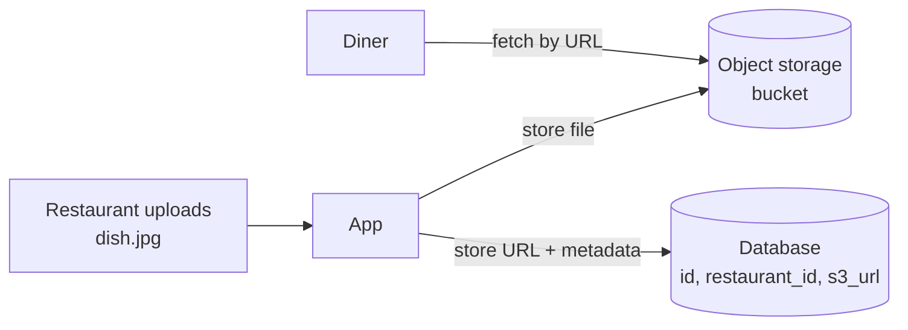
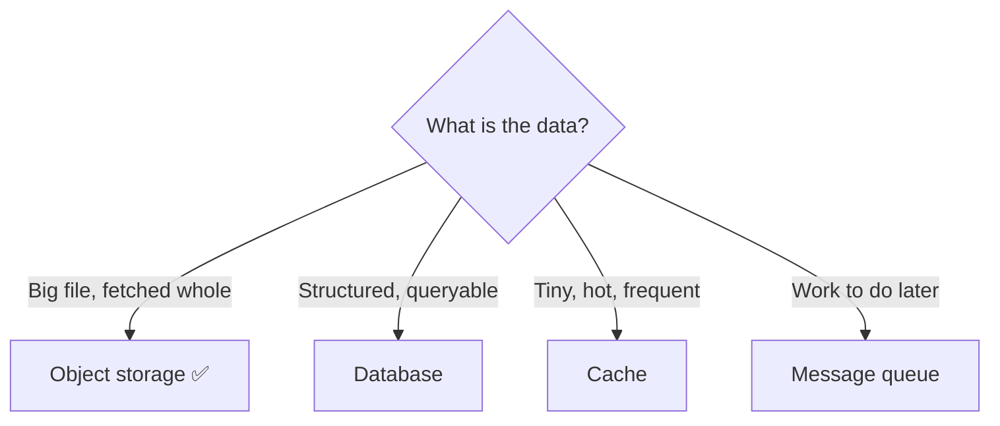
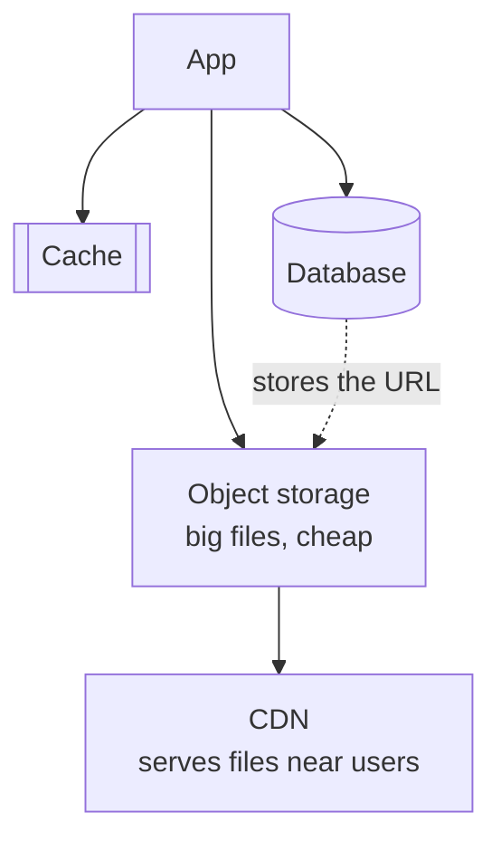

# Chapter 8 — Blob / Object Storage (S3 & friends)

> **One-line summary:** Object storage keeps **large, unstructured files** — images,
> video, PDFs, backups — cheaply and durably, addressed by a key (basically a URL). You
> store the *file* here and keep only its *URL + metadata* in your database. It's the
> "hard drive of the internet."
>
> **Interview bar by company:** *Startup* — "put it in S3, serve via CDN." Often enough.
> *Mid-size* — add presigned uploads and metadata-in-DB. *Big-tech* — expect probing on
> the full upload→process→deliver flow, storage tiers, and access control.
>
> **Running example:** FoodDash needs to store **dish photos, restaurant banners, and
> order receipts** — files that must not live in the database.

---

## §1 — Why the platform exists

**The scenario.** A FoodDash restaurant uploads twenty 3 MB dish photos. Where do they go?
You would never cram the raw image bytes into a database row — databases are built for many
small, structured, queryable records, not big opaque blobs. Before object storage, teams
ran their own file servers: a machine with big disks. It fills up, dies, needs backups, and
becomes a single point of failure.

Object storage (pioneered by **Amazon S3**, 2006) turned "storing files" into an API call
against effectively infinite, self-healing, pay-per-GB storage. Three concepts:

- **Bucket:** a top-level container (like a root folder), globally named.
- **Object:** one file + metadata, identified by a **key** (e.g.
  `restaurants/7/dishes/paneer.jpg`).
- **URL:** every object is reachable at a URL, so browsers, apps, and CDNs fetch it
  directly.



**Durability:** the provider auto-stores multiple copies across facilities. S3 advertises
*eleven nines* of durability (99.999999999%) — file loss is astronomically unlikely. You'd
spend years engineering that yourself.

> **Say this in the interview:** *"FoodDash's dish photos go in object storage, not the
> database — the DB just holds the URL and metadata. I get cheap, effectively infinite,
> highly durable storage without running a file server."*

---

## §2 — When to use it

**The scenario.** Any FoodDash data that's "a whole file you fetch by name" belongs here.
Reach for object storage when the data is **file-shaped**:

- **User uploads:** dish photos, restaurant banners, profile pictures, documents.
- **Media delivery:** images/video for the app (paired with a CDN — Chapter 12).
- **Static assets:** JS/CSS bundles, fonts.
- **Backups & archives:** database dumps, logs, snapshots.
- **Data lakes:** dumping raw analytics/ML data cheaply for later processing.

The tell: you fetch the *entire* file by key — you don't query *inside* it.

> **Say this in the interview:** *"The moment a design mentions images, video, uploads,
> documents, or backups, object storage goes in the diagram — and the database holds only
> the pointer to it."*

---

## §3 — When *not* to use it

**The scenario.** Should FoodDash store its order records or menu prices in S3? No — those
must be queried and filtered. Avoid object storage when:

- **You need to query, filter, or sort richly.** You can't say "find objects where
  price < 200." That's a database's job; object storage only fetches by key.
- **Small, frequently-updated records.** Objects are written whole — no "update field 3."
  For a counter or setting, use a DB.
- **Low-latency tiny reads at massive rate** — a cache/DB lookup is faster and cheaper.
- **Transactions across files** — no ACID here.
- **As a queue or message bus** — use a real queue (Chapter 9).



> **Say this in the interview:** *"I keep bytes in object storage and structured, queryable
> data in the database — FoodDash's dish photos in S3, the dish records in Postgres."*

---

## §4 — Popular products

| Product | What it is | Know it for |
|---|---|---|
| **Amazon S3** | The market-defining object store | The default. "Just put it in S3." Deep AWS integration, tiers, lifecycle rules. |
| **Google Cloud Storage** | Google's equivalent | Same model; strong data/ML ecosystem. |
| **Azure Blob Storage** | Microsoft's equivalent | Default in the Azure/enterprise world. |
| **Cloudflare R2** | S3-compatible | Pitch: **no egress fees** (free to read data out). |
| **Backblaze B2** | Low-cost object storage | Cheap, S3-compatible; popular for backups. |
| **MinIO** | Self-hosted, S3-compatible | Run your own S3 on your own hardware. |

**Key fact:** "S3-compatible" is an ecosystem — most tools speak the S3 API, so R2, B2, and
MinIO are near drop-in. Learn the S3 model once; it transfers.

> **Say this in the interview:** *"FoodDash is on AWS, so S3. If egress cost for serving
> images became the pain point, R2's free egress would be worth a look."*

---

## §5 — Quick product comparison

**S3 vs GCS vs R2:**

| Dimension | Amazon S3 | Google Cloud Storage | Cloudflare R2 |
|---|---|---|---|
| Ecosystem | Deepest (all of AWS) | Strong for data/ML | Tied to Cloudflare's edge/CDN |
| Egress cost | Charged (can be significant) | Charged | **Free egress** — the headline |
| Storage tiers | Many (Standard → Glacier archive) | Similar | Fewer, simpler |
| Best when | On AWS / want max features | On GCP / doing ML | Read-heavy delivery, egress-sensitive |

**Object storage vs a traditional file server:** a file server you manage (capacity,
backups, scaling, failover) can fill up and die; object storage is effectively infinite,
auto-replicated, and API-driven. For cloud apps, object storage wins for almost everything
except very low-latency local file access.

> **Say this in the interview:** *"Default to whichever cloud we're on — S3 on AWS, GCS on
> GCP. R2 if serving a lot of data and egress cost is the pain."*

---

## §6 — How it compares to other platforms

Object storage completes the storage picture from Chapter 7:

| Layer | Speed | Cost/GB | Durable? | Holds |
|---|---|---|---|---|
| Cache (Redis) | Fastest | Highest | Treated as no | Hot small data |
| Database | Medium | Medium | Yes | Structured records |
| **Object storage** | **Slower** | **Cheapest** | **Yes (very)** | **Big files** |



**vs CDN (Chapter 12):** object storage is the *origin* (one true location); the CDN is a
*distributed cache* of it near users. They pair constantly.

> **Say this in the interview:** *"The canonical pattern: file in object storage, URL +
> metadata in the database, CDN in front for fast delivery. That answers the storage half
> of any media-heavy design."*

---

## §7 — Factors to consider when designing with it

**The scenario.** FoodDash restaurants upload dish photos from their phones. Design it well:

1. **Presigned URLs — the pattern interviewers look for.** Don't route big uploads through
   your app servers. The app generates a short-lived signed URL; the **client uploads
   directly** to object storage.

   ```mermaid
   sequenceDiagram
       participant Restaurant
       participant App
       participant S3
       Restaurant->>App: I want to upload dish.jpg
       App-->>Restaurant: presigned PUT URL (expires 5 min)
       Restaurant->>S3: PUT file directly (bypasses app)
       Restaurant->>App: done — save this key
       App->>App: store key in DB
   ```

2. **Storage tiers / lifecycle rules.** Hot data in Standard; auto-move rarely-accessed
   objects (old receipts) to cheaper archive tiers after N days.
3. **CDN in front** for anything downloaded repeatedly (dish photos).
4. **Access control.** Private by default; presigned URLs or signed cookies for protected
   content. Never make a user-data bucket public by accident (a classic real breach).
5. **Metadata in the DB.** Store `owner_id`, `content_type`, `size`, `created_at` as a row
   so you *can* list/query files.
6. **Multipart upload** for very large files (chunks, resumable).
7. **Immutability mindset.** Treat objects as write-once; to "change" a file, upload a new
   version/key.

> **Say this in the interview:** *"Restaurants upload via presigned URLs straight to S3,
> the app stores the key + metadata in Postgres, a CDN serves the images, and old receipts
> age into a cheaper storage tier."*

---

## §8 — Avoiding overkill

**The scenario.** A candidate proposes storing FoodDash dish photos as base64 strings *in
the database* "to keep it simple," or building a custom file server "to save money." Both
are traps.

**Don't misuse it:**
- ❌ Thousands of tiny 1 KB blobs as separate objects, listed to "query" them → that's a
  database's job.
- ❌ Big binary files *in* the DB → bloats it, slows backups, blows up cost. Store the URL.
- ❌ Using it as a queue or real-time datastore.

**Don't reinvent it:**
- ❌ Building your own file server "to save money" → you'll spend far more on ops, backups,
  and failure handling than object storage costs.

**Red flags** 🚩: image bytes in the database; a hand-rolled file server for a normal app;
a public bucket holding user data.

> **Say this in the interview:** *"Files in object storage, metadata in the DB, delivery via
> CDN, uploads via presigned URLs. I won't put blobs in the database or build a file
> server."*

---

## §9 — Hands-on exercise (~30 min)

**Goal:** create a bucket, upload a file, fetch it via a presigned URL.

**Setup:** AWS (S3 free tier), or **MinIO** locally (S3-compatible, zero cloud cost):
`docker run -p 9000:9000 -p 9001:9001 minio/minio server /data --console-address ":9001"`.

```javascript
import { S3Client, PutObjectCommand, GetObjectCommand } from "@aws-sdk/client-s3";
import { getSignedUrl } from "@aws-sdk/s3-request-presigner";
import { readFileSync } from "fs";

const s3 = new S3Client({ region: "us-east-1" });   // + endpoint/creds for MinIO
const Bucket = "fooddash-media";

await s3.send(new PutObjectCommand({
  Bucket, Key: "restaurants/7/paneer.jpg",
  Body: readFileSync("paneer.jpg"), ContentType: "image/jpeg",
}));

const url = await getSignedUrl(
  s3, new GetObjectCommand({ Bucket, Key: "restaurants/7/paneer.jpg" }),
  { expiresIn: 300 });
console.log("open in browser:", url);
```

Or feel it with the CLI: `aws s3 mb s3://fooddash-media` → `aws s3 cp paneer.jpg
s3://fooddash-media/` → `aws s3 ls s3://fooddash-media/`.

**You understand object storage when you can:**
- [ ] Explain why the file goes in the bucket but its URL goes in the database.
- [ ] Explain what a presigned URL is and why direct-to-storage upload beats routing
  through your app.
- [ ] Name one reason to move an object to a cold storage tier.

**Stretch:** front the bucket with a CDN so the second fetch is served from an edge cache —
the bridge to Chapter 12.

---

## Real-world use cases

- **Instagram / any photo app:** originals live in object storage; the DB stores post
  metadata + the media URL; a CDN delivers the bytes.
- **Netflix:** master video files and encoded variants sit in S3 as the source of truth,
  then push out to their delivery network.
- **Dropbox (origin):** started on S3, later built its own storage at massive scale — a nice
  "build vs buy storage" talking point.

**Theme:** object storage is the **durable, cheap floor** under any system that touches
files — and it quietly backs the CDNs everyone already uses.

---

## Interview questions where object storage is the key decision

1. **Design Instagram / a photo-sharing app.** → Media in object storage, metadata in DB,
   CDN delivery, presigned uploads.
2. **Design a file upload / sharing service (Dropbox, Drive).** → Chunked uploads,
   presigned URLs, dedup via content hashing, metadata DB.
3. **Design YouTube / a video platform.** → Upload → object storage → queue triggers
   transcoding → variants back to storage → CDN (ties Ch. 8, 5, 8).
4. **"Where do you store user-uploaded images, and why not in the database?"** → §2/§8.
5. **"How do you let clients upload 2 GB files without overloading your servers?"** →
   Presigned URLs + multipart upload.

**How to answer well:** always split *bytes* (object storage) from *metadata* (database),
mention presigned URLs for uploads, and put a CDN in front for delivery. Name a cost lever
(storage tiers) if pushed on scale/budget.

---

## 60-second recap

- Object storage = **cheap, durable, effectively infinite** storage for **whole files**,
  fetched by key/URL.
- **File in object storage; URL + metadata in the database; CDN in front for delivery.**
- **Presigned URLs** let clients upload/download directly, bypassing your servers.
- Not for querying-inside, tiny frequent updates, transactions, or as a queue.
- Default: **S3** (GCS/Azure on their clouds; R2 for free egress).
- Never put **image bytes in the database** or build your own file server.
