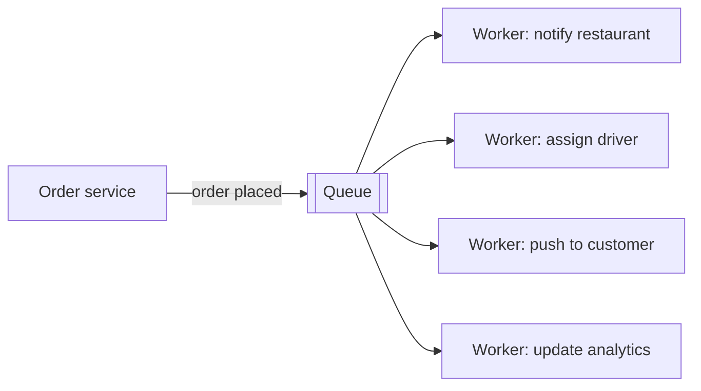
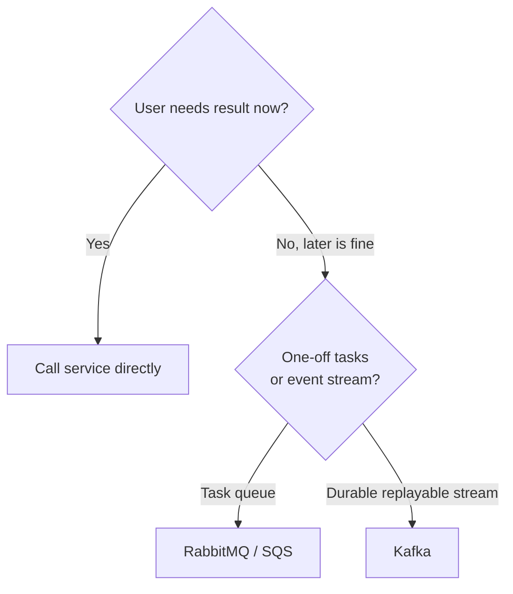
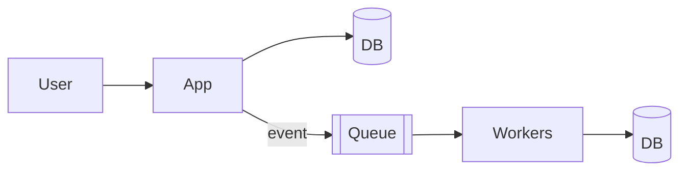
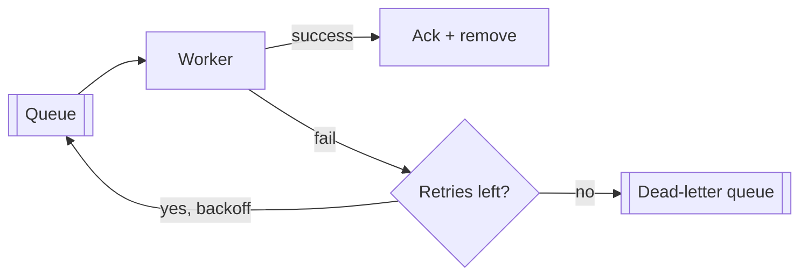

# Chapter 9 — Message Queues & Event Streaming

> **One-line summary:** A message queue lets one part of your system **hand off work to be
> done later** instead of making the user wait, and lets services **stop depending on each
> other directly** so one failure doesn't cascade. Event streaming (Kafka) is the same
> idea scaled into a durable, replayable *log*.
>
> **Interview bar by company:** *Startup* — know *when* to go async (and not over-engineer
> with Kafka). *Mid-size* — draw producer→queue→consumer and name at-least-once +
> idempotency. *Big-tech* — expect probing on delivery guarantees, ordering, and Kafka
> partitioning.
>
> **Running example:** when a FoodDash order is placed, several things must happen —
> **notify the restaurant, assign a driver, send the customer a push, update analytics** —
> and the user shouldn't wait for all of it.

---

## §1 — Why the platform exists

**The scenario.** A FoodDash user taps "Place order." If you do *everything* inside that
request — charge the card, notify the restaurant, find a driver, send a push, update
analytics — the user watches a spinner for 5 seconds, and if the notification service is
down, the whole order fails. Both problems vanish with a queue.

Two problems, one tool:

**Problem 1 — don't make the user wait for slow work.** Save the order, drop an
"order placed" message on a queue, return instantly. Background **workers** do the slow
parts afterward.

**Problem 2 — stop services from breaking each other.** If order-service calls
notification-service *directly* and it's down, ordering fails too. With a queue between
them, ordering just drops a message and moves on; the worker processes it when healthy.
That's **decoupling**.



**Vocabulary:** **producer** (puts messages in), **consumer/worker** (takes them out),
**message** (a small data packet), **broker** (the server holding/routing them).

> **Say this in the interview:** *"FoodDash's 'place order' returns as soon as the order is
> saved. Everything else — notifying the restaurant, finding a driver, pushing the
> customer — goes on a queue and runs in workers, so the user waits milliseconds, not
> seconds, and a downstream outage can't fail the order."*

---

## §2 — When to use it

**The scenario.** Anything in FoodDash that can happen *after* the response is a queue
candidate. Reach for a queue when:

- **Work can happen after the response** — emails, push, receipts, analytics, media
  processing.
- **You want to absorb traffic spikes.** The 8pm order surge? The queue buffers it; workers
  drain at a steady pace instead of melting the DB.
- **You want to decouple services** so they deploy, scale, and fail independently.
- **You're fanning out one event to many consumers** ("order placed" → four workers).
- **You're building an event pipeline / stream** (analytics, tracking) → Kafka's home turf.

> **Say this in the interview:** *"Signals like 'send a notification,' 'process later,'
> 'handle a spike,' 'decouple services,' or 'we'll email you when it's ready' all point at
> a queue."*

---

## §3 — When *not* to use it

**The scenario.** Should FoodDash fetch a restaurant's menu via a queue? No — the user needs
it *now*. Skip queues when:

- **The user needs the answer now** (loading a menu, searching, viewing an order). Call the
  service directly.
- **The operation is simple and fast** (5 ms) — inline is simpler than managing a queue,
  workers, and retries.
- **You need an immediate result** to return in the same request.
- **Tiny apps** where a background-job library or cron is enough — don't stand up Kafka for
  a to-do app.



> **Say this in the interview:** *"I keep the user-facing path synchronous and fast, and
> push only the deferrable work — notifications, analytics, media — onto a queue."*

---

## §4 — Popular products

| Product | Type | Know it for |
|---|---|---|
| **RabbitMQ** | Message broker (task queue) | Rich routing, per-message delivery. Message removed once consumed. |
| **Apache Kafka** | Event streaming / distributed log | Huge throughput, **ordered + replayable** log; consumers track their own position; messages persist. |
| **Amazon SQS** | Managed simple queue | Dead-simple, fully managed, no servers. Great AWS default. |
| **Google Pub/Sub** | Managed pub/sub | GCP's managed messaging, autoscaling. |
| **Redis Streams** | Lightweight stream in Redis | If you already run Redis and need a simple stream/queue. |

**The one distinction that matters most:**
- **Queue (RabbitMQ/SQS):** a message goes to *one* worker and is then **gone** — a to-do
  list, tasks crossed off.
- **Log/stream (Kafka):** messages are **kept** in an append-only log; many consumers read
  the same stream and can **replay** the past — an event history you can re-read.

> **Say this in the interview:** *"For FoodDash's order-processing tasks I'd start with a
> managed queue like SQS. I'd bring in Kafka only if we needed a high-throughput,
> replayable event stream feeding many consumers — like a full analytics pipeline."*

---

## §5 — Quick product comparison

**RabbitMQ vs Kafka vs SQS:**

| Dimension | RabbitMQ | Kafka | Amazon SQS |
|---|---|---|---|
| Model | Message broker (task queue) | Distributed event log | Managed queue |
| Message after consume | Removed | **Retained** (replayable) | Removed |
| Throughput | High | **Very high** (millions/sec) | High |
| Ordering | Per-queue | Per-partition (strong) | FIFO option |
| Best for | Task queues, complex routing | Streaming, analytics, many consumers | Simple async work on AWS |
| Ops burden | Medium / managed | Higher / managed | **Near-zero** |
| Replay history? | No | **Yes** | No |

> **Say this in the interview:** *"Queue to get work done once; stream to record events many
> systems read and can replay. RabbitMQ for routing-rich task queues, Kafka for replayable
> high-volume streams, SQS for simple managed async on AWS."*

---

## §6 — How it compares to other platforms

**Queue vs direct API call:**

| | Direct call (sync) | Queue (async) |
|---|---|---|
| User waits for result? | Yes | No |
| Producer coupled to consumer? | Yes — fails if consumer down | No — decoupled |
| Good for | "I need the answer now" | "Do this later / handle a spike" |

**Kafka vs a database:** a DB stores *current state* ("order 42 is 'out for delivery'");
Kafka stores the *stream of events* that led there ("placed," "accepted," "picked up").
Modern systems use both — events flow through Kafka and also land in a DB.



> **Say this in the interview:** *"I keep FoodDash's request path synchronous and fast, and
> push everything deferrable onto a queue so the request returns immediately and stays
> resilient to downstream failures."*

---

## §7 — Factors to consider when designing with it

**The scenario.** FoodDash's payment worker consumes "order placed" messages. Reason about
the details:

1. **Delivery guarantees:** *at-most-once* (may lose, never duplicate — rare),
   *at-least-once* (never lose, may duplicate — **the common default**), *exactly-once*
   (ideal, hard/expensive — usually *simulated* via idempotency).
2. **Idempotency — the key follow-up.** Since you usually get at-least-once, a message may
   be processed twice. Make consumers so that processing the same message twice is harmless
   ("charge order 42" first checks if 42 is already charged). Saying "I'd make the consumer
   idempotent" scores points.
3. **Ordering.** Need order? Kafka guarantees it *within a partition* — choose the partition
   key so related events land together (FoodDash: by `order_id`).
4. **Dead-letter queue (DLQ).** Messages that keep failing get shunted aside for inspection
   instead of blocking or looping forever.
5. **Backpressure & scaling.** Queue growing faster than workers drain it? Add workers.
   Queue depth is your signal.
6. **Retries with backoff.** Failed messages retry with increasing delays before hitting
   the DLQ.



> **Say this in the interview:** *"At-least-once delivery with idempotent consumers so a
> retried 'order placed' never double-charges, ordering per order_id via the partition key,
> and a dead-letter queue for messages that keep failing."*

---

## §8 — Avoiding overkill

**The scenario.** A candidate puts Kafka, a schema registry, and a stream-processing
framework into FoodDash's design — to send welcome emails to a few hundred users a day.
Restraint wins here.

**Don't over-use:**
- ❌ Kafka for a small app → huge operational weight for a problem you don't have; a
  background-job library or SQS is plenty.
- ❌ Making everything async "for scalability" → you add latency and eventual-consistency
  bugs to flows that were fine synchronous.
- ❌ Kafka when you just need a task queue → you don't need a replayable log to send a push.

**Don't under-use:**
- ❌ Doing slow work (transcoding, sending 10k pushes) *inside* the user's request → timeouts
  and one slow dependency taking down the endpoint.

**Red flags** 🚩: Kafka with no throughput/replay justification; everything async by
default; no idempotency story.

> **Say this in the interview:** *"Start synchronous. Introduce a queue the moment work is
> slow, spiky, or must survive a downstream outage — a managed queue like SQS first, Kafka
> only for a genuine high-throughput replayable stream."*

---

## §9 — Hello-world exercise (~30 min)

**Goal:** produce and consume messages, and feel the async hand-off.

**Setup:** RabbitMQ locally: `docker run -d -p 5672:5672 -p 15672:15672 rabbitmq:management`
(management UI at `localhost:15672`, guest/guest — watch messages flow).

```javascript
// producer.js
import amqp from "amqplib";
const ch = await (await amqp.connect("amqp://localhost")).createChannel();
await ch.assertQueue("order_placed", { durable: true });
ch.sendToQueue("order_placed", Buffer.from(JSON.stringify({ orderId: 42 })));
console.log("queued order 42");

// consumer.js (leave running in another terminal)
import amqp from "amqplib";
const ch = await (await amqp.connect("amqp://localhost")).createChannel();
await ch.assertQueue("order_placed", { durable: true });
ch.consume("order_placed", (msg) => {
  const job = JSON.parse(msg.content.toString());
  console.log("notifying restaurant for order", job.orderId); // slow work here
  ch.ack(msg);   // done → message removed
});
```

Run the consumer, then the producer a few times — the producer returns instantly; the
consumer works on its own schedule. **Stop the consumer, queue 5 messages, restart it** —
they were waiting safely in the queue. That durability is the whole point.

**You understand queues when you can:**
- [ ] Explain what "decoupling" buys you when a downstream service is down.
- [ ] Explain at-least-once delivery and why idempotent consumers matter.
- [ ] Say the difference between a queue (RabbitMQ) and a log (Kafka).
- [ ] Explain what a dead-letter queue is for.

**Stretch:** with Kafka, run two consumers in different groups on one topic — both see every
message, and you can replay from the start. That's the log-vs-queue distinction made real.

---

## Real-world use cases

- **LinkedIn built Kafka** to move activity/event data between systems at massive scale;
  now an industry-standard event backbone.
- **Uber:** trip events, driver locations, and pricing updates flow through streaming so
  many systems (ETA, fraud, analytics) react to the same events — exactly FoodDash's pattern
  at scale.
- **Any "we'll notify you when it's ready" flow:** report generation, exports, and media
  processing queue the work and notify on completion.

**Theme:** queues and streams keep large systems **fast for users, resilient to failure, and
able to absorb spikes** — by separating "accept the request" from "do the heavy work."

---

## Interview questions where a queue is the key decision

1. **Design a notification system.** → Producers drop events; workers fan out per channel;
   retries + DLQ; idempotency so users aren't double-notified.
2. **Design a video-processing pipeline.** → Upload → object storage → queue triggers
   transcoding → variants stored → notify (Ch. 8 + 5).
3. **Design an analytics / event pipeline.** → Kafka stream, many consumers, replay.
4. **"How do you handle a spike of 1M orders at launch?"** → Queue buffers; workers drain
   steadily; protects the DB.
5. **"Service A calls B directly and B keeps going down — make it resilient."** → Queue
   between them; A no longer coupled to B's uptime.
6. **"You're getting duplicate charges from your payment worker — why, and fix?"** →
   At-least-once delivery; make the consumer idempotent.

**How to answer well:** keep the user request synchronous and fast, move slow/spiky work to
a queue, and *proactively* mention delivery guarantees + idempotency + a DLQ. Choose the
simplest broker that fits (SQS/RabbitMQ before Kafka).

---

## 60-second recap

- A queue lets you **do work later** (fast responses) and **decouple services** (one outage
  doesn't cascade).
- **Queue** = work done once, then gone (RabbitMQ/SQS). **Log/stream** = retained,
  replayable, many readers (Kafka).
- Use for deferrable work, spikes, fan-out, decoupling; **not** for "user needs it now."
- Default: **at-least-once delivery → make consumers idempotent.** Add a **dead-letter
  queue** and **retries with backoff**.
- Simplest broker first (SQS/RabbitMQ); Kafka only for genuine high-throughput replayable
  streams.
