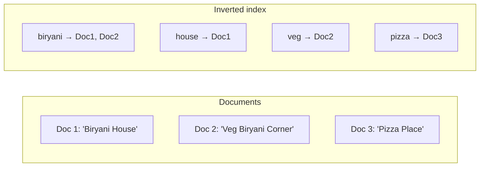
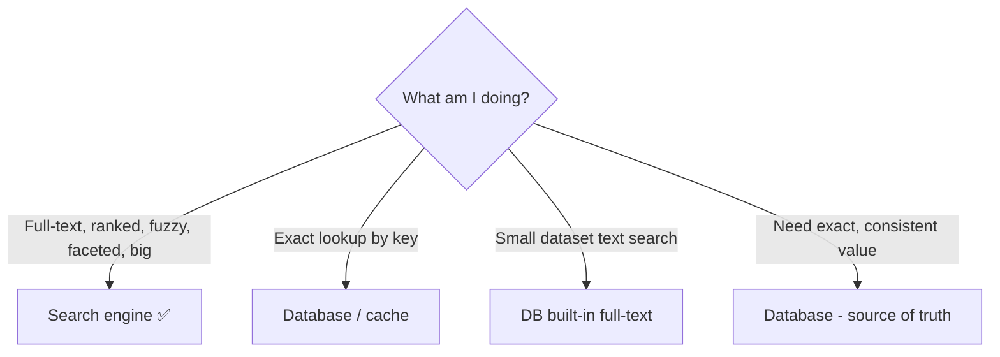
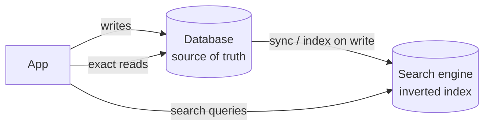
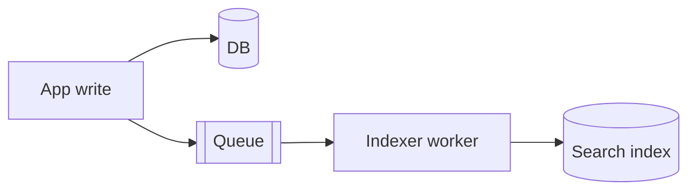

# Chapter 10 — Search Engines (Elasticsearch & friends)

> **One-line summary:** A search engine builds an **inverted index** so you can do fast,
> relevance-ranked, typo-tolerant **full-text search**, autocomplete, and filtering over
> huge amounts of data. It sits *alongside* your database (fed from it), never replacing
> it.
>
> **Interview bar by company:** *Startup* — often the database's built-in full-text search
> is the smart answer; know that. *Mid-size* — explain why `LIKE` doesn't scale and draw
> the DB→index sync. *Big-tech* — expect probing on the inverted index, ranking, and
> keeping the index consistent with the source of truth.
>
> **Running example:** FoodDash needs a search bar — users type "biryani near me,"
> "cheap veg," or a restaurant name — with ranking, filters, and typo tolerance.

---

## §1 — Why the platform exists

**The scenario.** FoodDash's search box runs a naive query:

```sql
SELECT * FROM restaurants WHERE name LIKE '%biryani%';
```

Over 2 million listings this has three fatal flaws:
1. **Slow.** `LIKE '%...%'` can't use a normal index — the database scans every row.
2. **Dumb.** No ranking (which result is *most* relevant?), no typo tolerance ("biriyani"
   finds nothing), no sense that "biryani" ≈ "biryanis."
3. **Rigid.** Combining text with filters (veg, price, rating, distance) and sorting gets
   ugly fast.

Search engines fix this with an **inverted index**. A normal (database) index maps
*row → data*; an inverted index maps *each word → the documents containing it* — like the
index at the back of a textbook.



Now "biryani" is instant: look up the word → {1,2}, rank them, done. Add analyzers for typo
tolerance, stemming, and synonyms, and you have real search.

> **Say this in the interview:** *"FoodDash search over millions of listings can't use SQL
> `LIKE` — it's a full table scan with no ranking. I'd use a search engine with an inverted
> index for fast, ranked, typo-tolerant results, kept in sync from the database."*

---

## §2 — When to use it

**The scenario.** FoodDash's search bar is a core feature with ranking, filters, and
autocomplete — squarely a search-engine job. Reach for one when:

- **Full-text search over lots of text/records** is a core feature.
- **You need relevance ranking** — best matches first, not just "contains the word."
- **Autocomplete / typeahead.**
- **Faceted filtering** — "veg, under ₹300, rating 4+, sorted by distance" combined with a
  text query, fast.
- **Typo tolerance / fuzzy matching** ("biriyani" → "biryani").
- **Log & metrics analytics at scale** — the "E" in the **ELK stack**.

> **Say this in the interview:** *"'Search bar,' 'autocomplete,' 'filter at scale,' 'find
> relevant results,' 'search our logs' — those put a dedicated search engine in the design,
> fed from the primary DB."*

---

## §3 — When *not* to use it

**The scenario.** Should FoodDash store its *authoritative* order records only in
Elasticsearch? Never. Avoid when:

- **As the source of truth.** A search engine is a *secondary index* — fed from your
  database. If wiped, rebuild from the DB. Never store data *only* there.
- **Simple exact lookups by key** — "get restaurant by id" is a DB/cache job.
- **Small datasets** — for a few thousand rows, Postgres/MySQL full-text (or even `LIKE`) is
  simpler and fine. Don't run a cluster for it (§8).
- **Strong transactional consistency** — the index updates *after* the DB (a small lag).
  Never use it where you need the exact latest value.



> **Say this in the interview:** *"The DB stays FoodDash's source of truth; the search engine
> is a derived index. It's for finding restaurants, not for storing the order that pays the
> restaurant."*

---

## §4 — Popular products

| Product | What it is | Know it for |
|---|---|---|
| **Elasticsearch** | Dominant full-text search & analytics engine | Powerful, flexible; core of the ELK stack (Elasticsearch + Logstash + Kibana). |
| **OpenSearch** | Open-source fork of Elasticsearch | AWS-led fork after Elastic's license change; API-compatible, Apache-licensed. |
| **Apache Solr** | Mature open-source search (on Lucene) | Long-standing, powerful; older enterprise deployments. |
| **Algolia** | Managed hosted search-as-a-service | Instant, developer-friendly typeahead; pay to skip the ops. |
| **Typesense / Meilisearch** | Lightweight open-source search | Easy to run, fast; great for instant-search at modest scale. |

**Under the hood:** Elasticsearch, OpenSearch, and Solr are all built on **Apache Lucene** —
learn the concepts once; they transfer.

> **Say this in the interview:** *"For FoodDash at scale, Elasticsearch/OpenSearch. If we
> wanted great instant search with zero ops, Algolia. Small–mid and cost-sensitive:
> Typesense/Meilisearch."*

---

## §5 — Quick product comparison

**Elasticsearch vs Algolia vs Typesense:**

| Dimension | Elasticsearch / OpenSearch | Algolia | Typesense / Meilisearch |
|---|---|---|---|
| Hosting | Self-managed (or managed cloud) | Fully managed SaaS | Self-host or managed; easy |
| Power / flexibility | Highest (also log analytics) | Focused on app search | Focused, simpler |
| Ops burden | Higher (run a cluster) | None | Low |
| Instant typeahead | Possible, more setup | **Excellent out of the box** | Excellent |
| Cost model | Infra/ops | Per-operation (can add up) | Cheap to self-host |

**Elasticsearch vs PostgreSQL full-text:** Postgres has decent built-in full-text search —
perfect for modest scale and one less system to run. Graduate to a dedicated engine when you
need ranking quality, typo tolerance, faceting, or scale. *Starting on Postgres FTS and
graduating to Elasticsearch is a mature answer.*

> **Say this in the interview:** *"For FoodDash's early days I'd use Postgres full-text
> search — no extra infra. I'd move to Elasticsearch when search quality or scale demanded
> it."*

---

## §6 — How it compares to other platforms

A search engine is a **companion index**, not a primary store:

| | Database (SQL/NoSQL) | Search engine |
|---|---|---|
| Role | Source of truth | Secondary, derived index |
| Optimized for | Correct reads/writes, transactions | Ranked text search, filtering |
| Consistency | Strong | Eventual (small lag behind DB) |
| If wiped | Data lost | Rebuild from the DB |
| Query style | Exact, structured | Fuzzy, ranked, full-text |



> **Say this in the interview:** *"The database is the source of truth; on every write I
> also update the search index — synchronously or via a queue / change-data-capture.
> Search queries hit the engine; exact reads hit the DB."* (Links Ch. 5, 5, and 6.)

---

## §7 — Factors to consider when designing with it

**The scenario.** FoodDash restaurants and menus change all day; the search index must keep
up. Reason about it:

1. **Keeping the index in sync (the #1 question).** How does data get from DB to index?
   - **Index on write:** app writes DB + engine together (simple; can drift if one fails).
   - **Via a queue:** writes emit an event; a worker updates the index (decoupled, resilient
     — ties to Chapter 9).
   - **Change-data-capture (CDC):** stream the DB's change log into the index (most robust at
     scale).
2. **Eventual consistency.** The index lags the DB slightly — fine for search results, never
   for the authoritative value.
3. **Analyzers & tokenization.** How text becomes terms — lowercasing, stemming, stop-words,
   synonyms, n-grams for autocomplete. This *is* search quality.
4. **Relevance tuning.** Boost fields (name > description), recency, popularity, distance.
5. **Sharding the index.** Big indexes split across nodes and replicate, like a distributed
   DB.
6. **Index vs store.** Index the searchable fields; often you index enough to find the ID,
   then fetch full data from the DB or cache.



> **Say this in the interview:** *"When a FoodDash restaurant updates its menu, the write
> emits an event; an indexer worker updates Elasticsearch. Search is eventually consistent
> with the DB, which is acceptable for a search bar."*

---

## §8 — Avoiding overkill

**The scenario.** A candidate stands up a 3-node Elasticsearch cluster to search FoodDash's
2,000-row *internal admin* table. Wrong scale.

**Don't over-use:**
- ❌ An Elasticsearch cluster for a tiny table → use the DB's built-in full-text search or
  even `LIKE`. One less system to run.
- ❌ Duplicating your *entire* database into the engine and treating it as primary storage →
  two sources of truth and sync nightmares.
- ❌ Reaching for search when you really need exact lookups or transactions.

**Don't under-use:**
- ❌ Powering real product/restaurant search over millions of items with `LIKE '%term%'` →
  slow, unrankable, no typo tolerance. Users bounce.

**Red flags** 🚩: a search cluster for a few thousand rows; search engine as source of
truth; no sync/consistency story.

> **Say this in the interview:** *"Small scale → Postgres full-text, no extra infra. Add
> Elasticsearch only for ranking quality, fuzzy matching, faceting, or real scale — and keep
> the DB as the source of truth, syncing the index via a queue."*

---

## §9 — Hands-on exercise (~30 min)

**Goal:** index documents and run a ranked, typo-tolerant search.

**Setup:** `docker run -p 9200:9200 -e discovery.type=single-node -e xpack.security.enabled=false docker.elastic.co/elasticsearch/elasticsearch:8.14.0`
Then use plain HTTP (curl).

```bash
# 1. Index FoodDash restaurants (schema inferred; no table needed)
curl -X POST localhost:9200/restaurants/_doc/1 -H 'Content-Type: application/json' \
  -d '{"name":"Biryani House","veg":false,"price":300,"rating":4.5}'
curl -X POST localhost:9200/restaurants/_doc/2 -H 'Content-Type: application/json' \
  -d '{"name":"Veg Biryani Corner","veg":true,"price":220,"rating":4.7}'
curl -X POST localhost:9200/restaurants/_doc/3 -H 'Content-Type: application/json' \
  -d '{"name":"Pizza Place","veg":false,"price":400,"rating":4.2}'

# 2. Full-text, ranked
curl localhost:9200/restaurants/_search -H 'Content-Type: application/json' \
  -d '{"query":{"match":{"name":"biryani"}}}'          # Docs 1 & 2, scored

# 3. Typo tolerance: "biriyani" still finds biryani
curl localhost:9200/restaurants/_search -H 'Content-Type: application/json' \
  -d '{"query":{"match":{"name":{"query":"biriyani","fuzziness":"AUTO"}}}}'

# 4. Text + filter: veg biryani under 250
curl localhost:9200/restaurants/_search -H 'Content-Type: application/json' \
  -d '{"query":{"bool":{
        "must":{"match":{"name":"biryani"}},
        "filter":[{"term":{"veg":true}},{"range":{"price":{"lt":250}}}]}}}'
```

Look at `_score` — that's relevance ranking, the thing SQL can't give you.

**You understand search engines when you can:**
- [ ] Explain an inverted index vs a normal database index.
- [ ] Explain why `LIKE '%x%'` doesn't scale and can't rank.
- [ ] Describe how you'd keep the search index in sync with the DB.
- [ ] Say why the engine is never the source of truth.

**Stretch:** add an `edge_ngram` analyzer for autocomplete — type "biry" and get "Biryani…"
suggestions.

---

## Real-world use cases

- **Wikipedia search** runs on Elasticsearch across millions of articles with ranking and
  language-aware analysis.
- **E-commerce / food-app search:** typo tolerance, facets, and relevance ranking are the
  difference between finding a dish and bouncing — exactly FoodDash's search bar.
- **The ELK stack everywhere:** teams ship logs into Elasticsearch and explore in Kibana —
  search over billions of log lines to debug incidents.

**Theme:** search engines turn "we store the data" into "users can actually *find* it" — a
specialized job that complements, never replaces, your database.

---

## Interview questions where a search engine is the key decision

1. **Design search for an e-commerce / food app.** → Inverted index, ranking, facets, typo
   tolerance; DB as source of truth, index synced via queue.
2. **Design autocomplete / typeahead.** → n-gram analyzers, prefix matching, cache hot
   prefixes; latency budget.
3. **Design a log analytics / observability system.** → Ship logs → Elasticsearch →
   dashboards; shard to scale (the ELK pattern).
4. **"Users search 50M rows — why is SQL `LIKE` slow, and what do you use?"** → §1.
5. **"How do you keep the search index consistent with the database?"** → Index-on-write vs
   queue vs CDC; eventual consistency (§7).

**How to answer well:** state the DB stays source of truth, describe the inverted index and
why it beats `LIKE`, and — crucially — explain the **sync pipeline** (usually a queue) and
its eventual consistency. For small scale, volunteer that DB built-in full-text is the
simpler right call.

---

## 60-second recap

- A search engine uses an **inverted index** for fast, **ranked**, **typo-tolerant**,
  **faceted** full-text search — things SQL `LIKE` can't do at scale.
- It's a **secondary, derived index**, fed from the DB; **never the source of truth**.
- Keep it in sync via **index-on-write → queue → CDC** (more robust as you scale); it's
  **eventually consistent**.
- Default: **Elasticsearch/OpenSearch** (Algolia for zero-ops instant search).
- Small scale? **Use the database's built-in full-text search first.**
