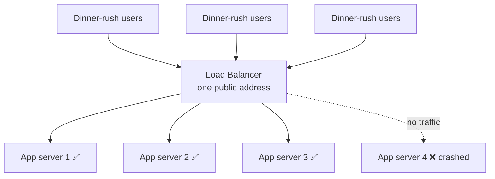
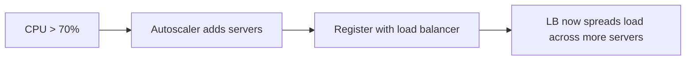
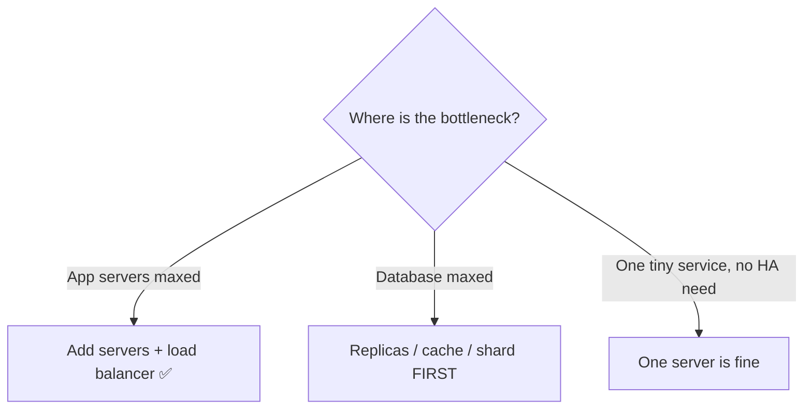
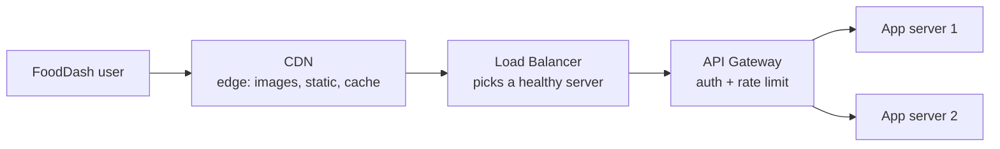
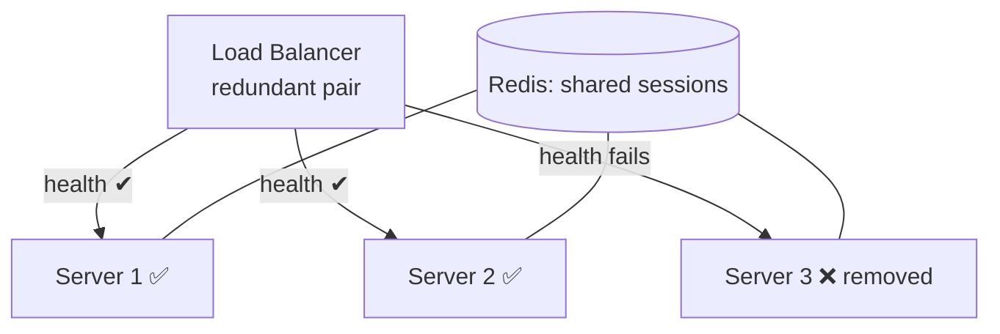

# Chapter 11 — Load Balancers

> **One-line summary:** A load balancer is the **traffic cop** in front of your servers.
> It spreads incoming requests across many identical machines so no single one is
> overwhelmed, and routes *around* servers that have failed — giving you both
> **horizontal scaling** and **high availability**.
>
> **Interview bar by company:** *Startup* — "put a load balancer in front of a few app
> servers, keep them stateless." That's often enough. *Mid-size* — add health checks,
> autoscaling, and where sessions live. *Big-tech* — expect probing on algorithms, L4 vs
> L7, sticky sessions, TLS termination, and how you stop the balancer itself from being a
> single point of failure.
>
> **Running example (used throughout this guide):** we're incrementally designing
> **FoodDash**, a food-delivery app. This chapter is where FoodDash survives the 7–9pm
> dinner rush without falling over.

---

## §1 — Why the platform exists

**The scenario.** FoodDash launches in one city on a single server. Fine at lunch — then
a TV feature airs and at 7:45pm ten thousand people open the app at once. CPU hits 100%,
requests queue, the machine falls over. Every user sees a spinner of death.

A load balancer is what creates the illusion that a service "just works" for millions of
people. One server, however big, has two hard limits: finite **capacity**, and it's a
**single point of failure** if it dies.

The fix for both is to run **several identical app servers** behind a **load balancer**.
Users hit one address; it forwards each request to a healthy server behind it. Need more
capacity? Add servers (**scale out**). A server dies? The balancer stops sending it
traffic — users never notice.

**Analogy.** A busy restaurant has one host seating guests across many waiters. Guests
don't choose a waiter; if one goes home sick, the host just stops seating that section.



This picture — **one entry point, many interchangeable servers** — is the foundation of
every "how do you scale?" answer in the entire interview.

> **Say this in the interview:** *"A single server is both a capacity ceiling and a single
> point of failure. I'd run multiple stateless app servers behind a load balancer, so I
> can scale out by adding servers and stay up when any one of them dies."*

---

## §2 — When to use it

**The scenario.** FoodDash is now three servers behind a balancer and stable. Keep it as
the product grows — it's a permanent part of any system that has to stay up and scale.
Signals FoodDash already hits:

- **More than one app server** — true of nearly every production system.
- **A high-availability requirement** — no single server's death should take you down.
- **Horizontal scaling** — 10× traffic via cheap identical servers, not one machine with
  a hard ceiling.
- **Zero-downtime deploys** — drain a server, ship the build, health-check it, re-add it.
- **Intelligent routing** — `/api/*` here, `/images/*` there (the L7 behavior in §5).

**Worked example.** An autoscaling rule watches CPU: above 70% it launches new app
servers and registers them with the balancer, then removes them after the rush — three
servers at 3pm, twelve at 8pm, automatically.



> **Say this in the interview:** *"Any system with more than one server and an uptime
> requirement needs a load balancer. It's my first scaling primitive — paired with
> autoscaling it gives elastic capacity, and paired with health checks it gives high
> availability."*

---

## §3 — When *not* to use it (or when it's trivial)

**The scenario.** You're prototyping a FoodDash internal dashboard that five ops staff
will use. A load-balanced fleet for it would be over-engineering — knowing when the
balancer doesn't earn its place is exactly what mid-level interviews test.

Skip it, or treat it as a non-decision, when:

- **It's a small, low-stakes service** — a prototype, internal tool, batch job. One
  server is fine; a balancer just adds a moving part that can itself fail.
- **Your platform already gives you one** — most managed platforms and Kubernetes
  provision it automatically. Acknowledge it and move on.
- **The bottleneck isn't the app tier.** If app servers are idle and the *database* is
  choking, more app servers behind a balancer do nothing. Fix the database first
  (replicas, caching — Chapters 5–7).

**Worked example.** FoodDash feels slow at dinner; an engineer adds six more app
servers. No improvement — every request runs the same slow query against one overloaded
database. Balancing more servers onto a saturated database is like adding cashiers when
the bottleneck is a single shared credit-card terminal.



> **Say this in the interview:** *"A load balancer only helps if the app tier is the
> bottleneck and my servers are stateless. If the database is the limit, more app servers
> do nothing — I'd profile first and scale the tier that's actually saturated."*

---

## §4 — Popular products

**The scenario.** "What would you actually use for FoodDash's load balancer?" Two camps:
**software balancers you run yourself** and **managed balancers the cloud runs for you**.

| Product | Type | Know it for |
|---|---|---|
| **NGINX** | Software LB / reverse proxy | Versatile — LB, reverse proxy, static files, TLS, caching in one process. |
| **HAProxy** | Software load balancer | Purpose-built, deep L4/L7 features, excellent metrics. |
| **AWS ELB family** | Managed cloud LB | **ALB** (L7, HTTP-aware), **NLB** (L4, ultra-low-latency). |
| **GCP Load Balancing** | Managed, global | One anycast IP that routes each user to the nearest healthy region. |
| **Azure Load Balancer / App Gateway** | Managed | The default in Azure (App Gateway is the L7 option). |
| **Envoy** | Modern L7 proxy | Data plane behind service meshes (Istio); microservice-to-microservice. |
| **Cloudflare Load Balancing** | Managed at the edge | Tied to Cloudflare's CDN and DNS network. |

**Choosing the camp.** Managed (ALB, GCP LB) means far less ops work at some lock-in
cost. Self-managed (NGINX, HAProxy, Envoy) trades that for control and portability.

**Worked example.** FoodDash is on AWS, so an **ALB** is the pragmatic default — nothing
to manage. Self-hosted later, **NGINX** or **HAProxy** would be the natural swap.

> **Say this in the interview:** *"On AWS I'd use an ALB for HTTP traffic — managed,
> integrates with autoscaling, nothing to run. Self-hosting, I'd reach for NGINX for
> versatility or HAProxy when load balancing is the sole job and I want tight control."*

---

## §5 — Quick product comparison

**The scenario.** "ALB or NLB? What's the difference?" This is really the **Layer 4 vs
Layer 7** question — the most-asked comparison in this chapter.

| | Layer 4 (transport) | Layer 7 (application) |
|---|---|---|
| Operates at | TCP/UDP connections | HTTP/HTTPS requests |
| Can see | IPs and ports only | URLs, headers, cookies, paths |
| Routes by | Connection only (fast) | Path, host, header, cookie (smart) |
| Example | AWS NLB, HAProxy (TCP) | AWS ALB, NGINX, Envoy |

L4 is a fast, blind pipe; L7 reads the request, so it can route by content and terminate
TLS. Most web apps want L7; L4 wins for raw throughput or non-HTTP traffic.

| Dimension | NGINX | HAProxy | AWS ALB |
|---|---|---|---|
| Ops burden | You run/patch/scale it | You run/patch/scale it | Fully managed |
| Extra powers | Static files, caching, TLS | Deep LB tuning, observability | Autoscaling hooks, WAF |
| Best when | You want one flexible tool | LB is the whole job | You're on AWS, want zero ops |

**Worked example.** FoodDash's ALB sends `/api/*` to the API pool and
`/restaurant-images/*` to object storage. A raw WebSocket firehose for live driver
locations would suit an **NLB (L4)** better.

> **Say this in the interview:** *"An L4 balancer forwards connections fast but blindly; an
> L7 balancer understands HTTP, so it can route by path, terminate TLS, and do
> cookie-based stickiness. For FoodDash's web/API traffic I'd use L7 (ALB/NGINX), and L4
> (NLB) only for raw-throughput or non-HTTP traffic."*

---

## §6 — How it compares to other platforms

**The scenario.** FoodDash's diagram now has several boxes "in front of" the servers — a
CDN, the load balancer, an API gateway — and juniors confuse them. Telling them apart
cleanly is a senior-sounding move.

| Platform | Its job | One-liner |
|---|---|---|
| **Load balancer** | Spread traffic across servers in a region | "Which server handles this?" |
| **CDN** (Ch. 12) | Serve cached content near users worldwide | "Serve this from the edge." |
| **API gateway** | Auth, rate-limiting, routing for APIs | Often just behind the LB. |
| **Reverse proxy** | Forward client requests to backends | An LB *is* a specialized one. |

A **CDN distributes geographically**; a **load balancer distributes across servers**.
They're *layers*, not alternatives — a request can pass through a CDN, a balancer, a
gateway, then land on an app server.



**Vs. DNS round-robin.** DNS can spread load across IPs, but responses stay cached by
clients for minutes, so a dead server keeps getting traffic. A real load balancer does
sub-second health checks instead; big systems use DNS to pick a region and a balancer to
pick a server within it.

> **Say this in the interview:** *"A CDN distributes content geographically; a load
> balancer distributes requests across servers in a region; an API gateway adds auth and
> rate-limiting. They're stacked layers. For global scale I'd combine DNS/global LB to
> pick the nearest region with a load balancer inside each region."*

---

## §7 — Factors to consider when designing with it

**The scenario.** FoodDash needs a load balancer — walk these factors out loud, in
priority order.

**1. Stateless servers.** The prerequisite: *any* server must handle *any* request, so no
user-specific state in local memory. Push sessions to Redis (Ch. 7) — otherwise a user
pinned to a dead server just gets logged out.

**2. Balancing algorithm.** **Round-robin** (each server in turn) for uniform load;
**least connections** when request durations vary; **IP hash** for stickiness; **weighted**
when servers differ in size.

**3. Health checks.** The balancer pings each server (e.g. `GET /health` every 5s),
pulling failures from rotation and re-adding them on recovery — the actual mechanism
behind "high availability."

**4. TLS termination.** The balancer decrypts HTTPS once at the edge and talks plain HTTP
to backends inside the private network, centralizing certificate management.

**5. The balancer as a single point of failure.** If it dies, everything behind it is
unreachable — run it **redundantly** (active-passive pair, or a managed balancer that's
redundant by design). Interviewers love it when you catch this yourself.



> **Say this in the interview:** *"First, stateless servers with sessions in Redis so any
> server serves any user. Then round-robin or least-connections balancing, health checks to
> pull dead servers automatically, TLS terminated at the LB, and — critically — the load
> balancer itself made redundant so it isn't a new single point of failure."*

---

## §8 — Avoiding overkill

**The scenario.** A candidate designing FoodDash draws a service mesh, three tiers of
load balancers, and sticky sessions — for an app with a few thousand users. The
interviewer's eyebrow goes up.

**Don't over-build:**
- ❌ A multi-tier mesh + per-service gateways for a small app. At FoodDash's early scale,
  **one managed load balancer in front of a small pool of stateless servers is the
  entire answer.**
- ❌ Sticky sessions when stateless servers + Redis are simpler and scale better.

**Don't misdiagnose (the most common real error):**
- ❌ Adding app servers when the *database* is the bottleneck. Profile first; scale the
  saturated tier.

**Don't forget the obvious:**
- ❌ A single, non-redundant load balancer — you removed the servers' single point of
  failure and created a new one at the balancer.

**Red flags that make interviewers wince** 🚩: Kubernetes + service mesh for a 5-user
tool; "we'll use sticky sessions" as a first instinct; adding capacity without knowing
which tier is slow; forgetting the LB needs its own redundancy.

> **Say this in the interview:** *"I'd start with one managed, redundant load balancer in
> front of a small pool of stateless app servers, sessions in Redis, health checks on, and
> autoscaling for the pool. I'd only add gateways or a service mesh when real complexity —
> many services, fine-grained routing — actually demands it."*

---

## §9 — Hands-on exercise (~30 min)

**Goal:** watch round-robin balancing *and* health-based failover with your own eyes,
using NGINX in front of two tiny servers.

**Step 1 — two servers that announce who they are.**

```javascript
// server.js — run twice:  PORT=3001 node server.js   and   PORT=3002 node server.js
import http from "http";
const port = process.env.PORT;
http.createServer((req, res) => {
  if (req.url === "/health") { res.writeHead(200); return res.end("ok"); }
  res.writeHead(200);
  res.end(`Hello from FoodDash server on port ${port}\n`);
}).listen(port, () => console.log(`up on ${port}`));
```

**Step 2 — NGINX config that balances between them (`nginx.conf`).**

```nginx
events {}
http {
  upstream fooddash_servers {
    # round-robin by default; swap in "least_conn;" here to change the algorithm
    server 127.0.0.1:3001 max_fails=1 fail_timeout=5s;
    server 127.0.0.1:3002 max_fails=1 fail_timeout=5s;
  }
  server {
    listen 8080;
    location / {
      proxy_pass http://fooddash_servers;
    }
  }
}
```

**Step 3 — run it and hammer it.**

```bash
nginx -c "$(pwd)/nginx.conf"          # or run the nginx docker image mounting this file
for i in $(seq 1 6); do curl -s localhost:8080; done
# → alternates "port 3001" / "port 3002" ...  that's round-robin balancing.
```

**Step 4 — simulate a crash.** Stop the server on 3001. Hit the balancer again: after one
failed attempt, NGINX routes everything to 3002 — failover, no client-side change.
Restart 3001 and watch it rejoin.

**Step 5 (stretch).** Add `server 127.0.0.1:3003 weight=2;` and watch it take twice the
traffic.

**You understand load balancers when you can:**
- [ ] Explain why the app servers must be stateless, and where sessions live instead.
- [ ] Describe round-robin vs least-connections and when you'd pick each.
- [ ] Explain how health checks deliver high availability.
- [ ] Explain why the load balancer itself must be redundant.

---

## Real-world use cases

- **Every large website** — Google, Amazon, Netflix, your bank — sits behind layers of
  load balancers, the invisible default behind "one URL, millions of users."
- **Black Friday / dinner-rush spikes:** autoscaling groups register new servers with the
  balancer as traffic surges and deregister them after — exactly FoodDash's 7pm problem.
- **Multi-region failover:** global load balancing routes users to the nearest healthy
  region and away from one having an outage.

**Theme:** the load balancer is the **first and most fundamental scaling primitive** — the
thing that turns "a server" into "a resilient, elastic fleet."

---

## Interview questions where a load balancer is the key decision

1. **"How do you scale your web tier to handle 10× the traffic?"** → Stateless servers +
   a load balancer + autoscaling; sessions in Redis. The canonical answer.
2. **"How do you eliminate single points of failure?"** → Multiple servers behind an LB
   with health checks — *and* make the LB itself redundant.
3. **Design any high-traffic system (Twitter, e-commerce, FoodDash).** → The LB is step
   one of the diagram, in front of the app servers.
4. **"How do you deploy with zero downtime?"** → Rolling deploy: drain → update →
   health-check → re-add, orchestrated through the balancer.
5. **"L4 vs L7 load balancer — what's the difference and when do you use each?"** → The
   §5 answer: route by connection vs by HTTP content.
6. **"You added more servers but the site is still slow — why?"** → The bottleneck is
   elsewhere, almost certainly the database. The §3/§8 misdiagnosis trap.

**How to answer well:** lead with *stateless servers + a load balancer + autoscaling*,
name health checks as the availability mechanism, and proactively flag that the balancer
must be redundant. Bonus points for L4/L7 and for catching a database bottleneck.

---

## 60-second recap

- A load balancer spreads requests across **many identical, stateless servers** and routes
  around dead ones → you get **horizontal scaling** + **high availability** from one idea.
- **Stateless servers are the prerequisite** — put sessions in Redis so any server serves
  any user.
- **Health checks** are how it delivers availability; **autoscaling** is how it delivers
  elasticity.
- **L4** = fast, blind, connection-level. **L7** = HTTP-aware, routes by path/header/cookie.
- Don't confuse it with a **CDN** (geographic) or an **API gateway** (auth/routing) — they
  stack.
- The two mistakes to avoid: **over-building** (meshes/gateways too early) and
  **misdiagnosing** (balancing the app tier when the database is the bottleneck).
- The catch that scores points: **the load balancer itself must be redundant.**
