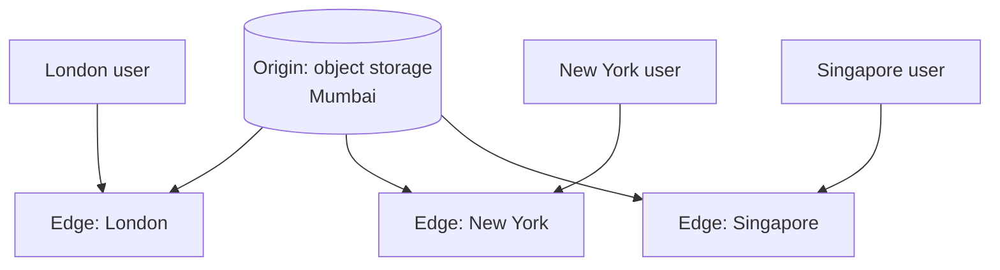
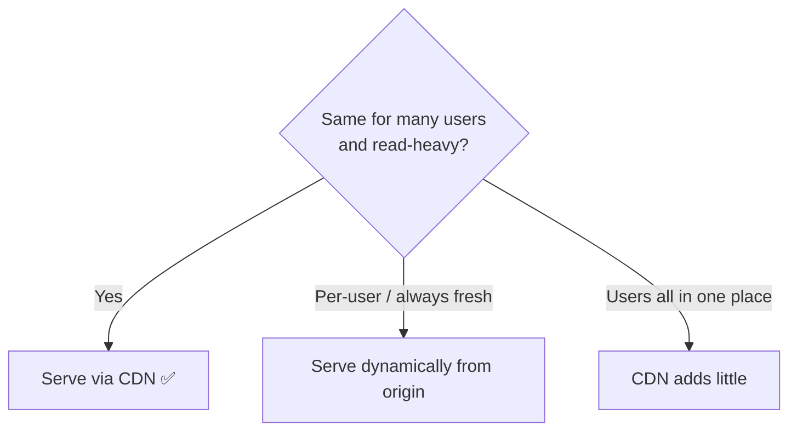
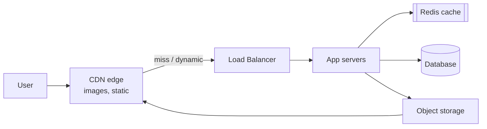

# Chapter 12 — CDN (Content Delivery Network)

> **One-line summary:** A CDN caches your content on servers **physically close to users
> around the world**, so bytes travel a short distance instead of crossing the planet.
> It's caching (Chapter 7) taken global — cutting latency and offloading your origin.
>
> **Interview bar by company:** *Startup* — "serve static assets and images via a CDN."
> Usually enough. *Mid-size* — add cache headers/TTLs and invalidation. *Big-tech* —
> expect probing on cache-hit ratio, edge vs origin, signed URLs, and edge compute.
>
> **Running example:** FoodDash expands to several countries. Dish photos that load fast in
> Bengaluru feel sluggish in London because every image still travels from the origin
> region. A CDN fixes that.

---

## §1 — Why the platform exists

**The scenario.** FoodDash's dish photos live in object storage in one region (say Mumbai).
A user in London opens a restaurant page; each image makes a round trip across the world —
hundreds of milliseconds per file, times twenty images. The page crawls, and every request
also hammers your origin. Distance is the enemy: data can't travel faster than light, so
physical closeness matters.

A CDN solves this by keeping copies of your content on **edge servers** in hundreds of
locations worldwide. The London user's request is served from a London edge, not Mumbai.

- **Origin:** where your content truly lives (your object storage / servers) — one place.
- **Edge / PoP (point of presence):** a CDN server near users that caches copies.
- **First request** to an edge is a **miss** — it fetches from origin and caches it.
  **Later requests** are **hits** — served instantly from the edge.



> **Say this in the interview:** *"FoodDash's dish photos would go through a CDN so a user in
> London is served from a nearby edge, not the Mumbai origin. That cuts image latency
> dramatically and takes read load off origin storage."*

---

## §2 — When to use it

**The scenario.** Any FoodDash content that's the same for many users and read repeatedly is
a CDN candidate. Use a CDN for:

- **Static assets** — JS/CSS bundles, fonts, icons (you already load these via CDNs).
- **Images and video** — dish photos, restaurant banners, promo videos.
- **Any global user base** — serve everyone fast regardless of where your origin is.
- **Large media delivery** — streaming, big downloads.
- **Offloading your origin** — the CDN absorbs the bulk of read traffic.
- **Increasingly, dynamic content and APIs at the edge** — edge caching and edge functions.

The tell: content is **the same for many users** and **read far more than it changes**.

> **Say this in the interview:** *"Anything static or read-heavy and shared — images, JS/CSS,
> video — goes through a CDN, especially with a global audience."*

---

## §3 — When *not* to use it

**The scenario.** Should FoodDash serve *live order tracking* ("driver is 3 min away")
through a normal CDN cache? No — it's per-user and changes every few seconds. Avoid (or be
careful) when:

- **Highly personalized, always-fresh content** — a user's live order status, personalized
  feed, account page. (Edge compute is narrowing this gap, but plain caching doesn't fit.)
- **Non-cacheable responses** — anything unique per request.
- **Internal tools with users in one place** — no geographic spread to optimize; a CDN adds
  little.
- **Rapidly changing data where staleness is unacceptable** without careful invalidation.



> **Say this in the interview:** *"FoodDash's dish images are perfect for a CDN; live order
> tracking is per-user and real-time, so that stays a dynamic call to the origin (or uses
> websockets), not a cached CDN response."*

---

## §4 — Popular products

| Product | What it is | Know it for |
|---|---|---|
| **Cloudflare** | CDN + edge platform | Broad, developer-friendly, edge compute (Workers), generous free tier. |
| **Amazon CloudFront** | AWS's CDN | Deep AWS/S3 integration. |
| **Akamai** | The largest, oldest CDN | Enterprise scale and reach. |
| **Fastly** | Real-time CDN | Instant cache purging, edge compute; popular with media/dev-heavy orgs. |
| **Google Cloud CDN** | Google's CDN | Tied to GCP + global network. |

> **Say this in the interview:** *"FoodDash on AWS → CloudFront in front of S3 for images.
> If we wanted a strong edge-compute story or a great free tier, Cloudflare."*

---

## §5 — Quick product comparison

**Cloudflare vs CloudFront vs Fastly vs Akamai:**

| Dimension | Cloudflare | CloudFront | Fastly | Akamai |
|---|---|---|---|---|
| Strength | Broad platform + edge Workers | AWS/S3 integration | Instant purge, real-time control | Largest reach, enterprise |
| Edge compute | Yes (Workers) | Yes (Lambda@Edge) | Yes (Compute@Edge) | Yes |
| Best when | Dev-friendly, cost-sensitive | Already on AWS | Media, frequent purges | Massive enterprise needs |

**CDN vs the object storage behind it:** object storage is the **origin** (one durable
location); the CDN is a **distributed cache** of that content near users. They pair — CDN in
front of S3 is the canonical media stack.

> **Say this in the interview:** *"Default to the CDN that fits our cloud — CloudFront on
> AWS. Fastly if we need instant, frequent cache purges; Cloudflare for edge compute and
> cost."*

---

## §6 — How it compares to other platforms

The three things "in front of" your system, kept distinct (recall Chapter 11):

| Platform | Distributes… | One-liner |
|---|---|---|
| **CDN** | Content **geographically** | "Serve this from an edge near the user." |
| **Load balancer** | Requests **across servers** in a region | "Pick a healthy server." |
| **Cache (Redis)** | Hot data **in memory** near the app | "Skip the DB for repeated reads." |

A CDN and an app cache are both caches — one at the **network edge** (geographic), one
**next to your app** (data). They stack.



> **Say this in the interview:** *"A CDN distributes content geographically; a load balancer
> distributes requests across servers; Redis caches hot data next to the app. They're
> layers — a FoodDash request can touch all three."*

---

## §7 — Factors to consider when designing with it

**The scenario.** FoodDash restaurants update dish photos, and you must serve them fast
worldwide *and* reflect updates. Reason about it:

1. **Cache-Control headers / TTLs.** You tell the CDN how long to cache each item. Long TTLs
   for immutable assets, shorter for things that change.
2. **Cache invalidation / purging.** When a photo changes, you either purge it from edges or
   use **versioned URLs** (`paneer.v2.jpg`) so the new file has a new key and edges fetch it
   fresh. Versioning is the clean trick — avoids purge lag.
3. **Cache-hit ratio.** The key metric — the % served from the edge. Higher = faster + less
   origin load. Design URLs and TTLs to maximize it.
4. **Edge vs origin.** Cacheable content is served at the edge; misses and dynamic requests
   fall back to the origin (through your load balancer).
5. **Signed URLs / tokens** for protected content (paid videos, private files) so edges only
   serve authorized users.
6. **Edge functions** (Workers/Lambda@Edge) for light logic at the edge — redirects, A/B
   tests, auth checks — without a round trip to origin.

> **Say this in the interview:** *"I'd put dish photos behind a CDN with long TTLs and
> versioned filenames, so updates get a new URL and there's no purge lag. I'd watch the
> cache-hit ratio and use signed URLs for any protected media."*

---

## §8 — Avoiding overkill

**The scenario.** A candidate designs a multi-CDN, edge-compute-everything setup for
FoodDash's internal admin dashboard used by staff in one office. Way too much.

**Don't over-build:**
- ❌ A CDN (let alone multi-CDN) for an internal tool with users in one location → little
  geographic benefit.
- ❌ Pushing dynamic, per-user responses through edge caching and fighting constant
  invalidation → serve those from origin.

**Don't under-use:**
- ❌ Serving images and JS/CSS to a global audience straight from a single-region origin →
  slow for distant users and needless origin load. For anything public and global, a CDN is
  expected.

**Red flags** 🚩: caching per-user/private data on a shared CDN by accident; no invalidation
strategy; ignoring cache-hit ratio.

> **Say this in the interview:** *"CDN for static and shared media with a global audience;
> dynamic per-user content from origin. For a single-location internal tool, a CDN isn't
> worth it."*

---

## §9 — Hello-world exercise (~30 min)

**Goal:** serve a file through a CDN and observe an edge cache hit.

**Setup (easiest): Cloudflare in front of any origin,** or CloudFront in front of an S3
bucket. Conceptually identical: point the CDN at your origin, request the file twice.

**Steps:**
1. Put an image in object storage (Chapter 8) or on any public origin URL.
2. Create a CDN distribution pointing at that origin (CloudFront → your S3 bucket, or a
   Cloudflare-proxied domain).
3. Request the CDN URL and inspect the response headers:

```bash
curl -I https://your-cdn-domain/paneer.jpg
# First request  → look for a header like:  x-cache: Miss from cloudfront
curl -I https://your-cdn-domain/paneer.jpg
# Second request → x-cache: Hit from cloudfront   ← served from the edge!
```

4. Note the `Cache-Control` and `Age` headers — `Age` shows how long the edge has held the
   cached copy.

**You understand CDNs when you can:**
- [ ] Explain origin vs edge, and a cache hit vs miss at the edge.
- [ ] Explain why versioned filenames beat purging for cache invalidation.
- [ ] Say what cache-hit ratio measures and why it matters.
- [ ] Name one thing you would *not* serve through a CDN cache (per-user live data).

**Stretch:** set a `Cache-Control: max-age=60` on the object, watch the `Age` header grow,
then see the edge re-fetch after 60 seconds.

---

## Real-world use cases

- **Netflix Open Connect:** Netflix places its own caching appliances inside ISPs so video
  streams from the closest possible point — a CDN taken to the extreme.
- **Every major site's static assets:** JS/CSS/images/fonts are served from CDNs, which is
  why global sites feel fast everywhere.
- **Live events & sports streaming:** CDNs fan out a single live feed to millions of viewers
  worldwide with low latency.
- **FoodDash-style apps:** dish photos and app assets via CDN; the database and order APIs
  stay dynamic at the origin.

**Theme:** a CDN is how you make content **fast for a global audience** while **shielding
your origin** — the geographic complement to the in-memory caching from Chapter 7.

---

## Interview questions where a CDN is the key decision

1. **Design a video streaming service (YouTube/Netflix).** → CDN for delivery, object
   storage origin, queue for transcoding (Ch. 8, 5, 8 together).
2. **Design an image hosting / photo app.** → Object storage + CDN + versioned URLs +
   signed URLs for private images.
3. **"How do you serve users globally with low latency?"** → CDN at the edge for static/
   media; regional infrastructure + global load balancing for dynamic.
4. **"How do you reduce load on your origin / object storage?"** → CDN caching with good
   TTLs and a high cache-hit ratio.
5. **"How do you invalidate cached content when a file changes?"** → Versioned filenames or
   explicit purge; the trade-offs (§7).

**How to answer well:** put static/shared media behind a CDN, keep dynamic per-user content
at the origin, and mention TTLs, versioned URLs for invalidation, and cache-hit ratio.
Connect it to object storage as the origin.

---

## 60-second recap

- A CDN caches content on **edge servers near users worldwide** → low latency globally +
  less origin load. It's **caching taken geographic**.
- **Origin** = the one true location; **edge/PoP** = nearby cache. First request misses, then
  hits.
- Use for **static assets and shared media** with a global audience; **not** for per-user,
  always-fresh data.
- Control it with **Cache-Control/TTLs**; invalidate with **versioned URLs** (cleaner) or
  **purging**; watch the **cache-hit ratio**.
- Canonical media stack: **object storage (origin) + CDN (delivery)**.
- Distinct from a **load balancer** (spreads across servers) and **Redis** (hot data near the
  app) — they stack.
