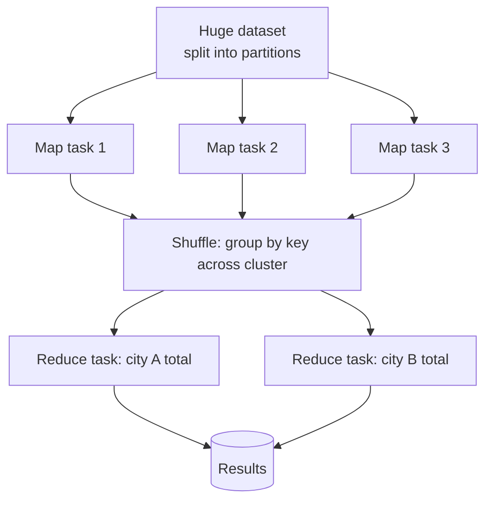
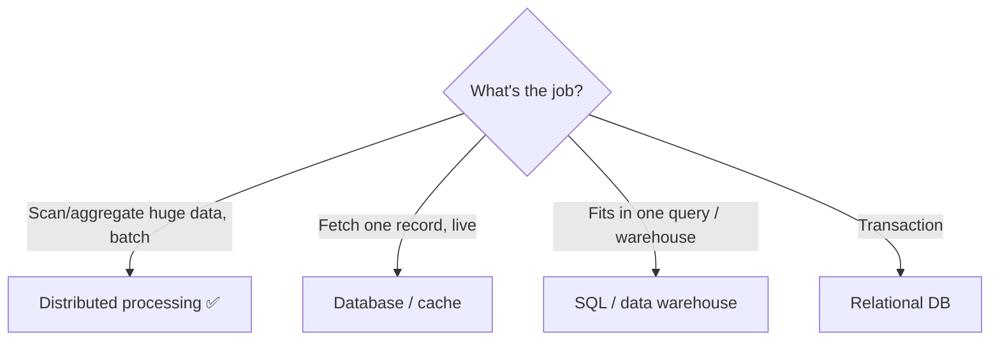
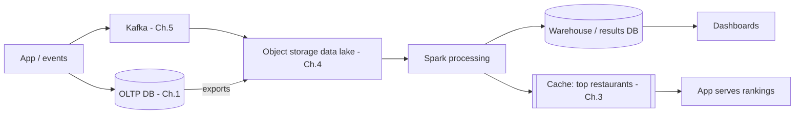

# Chapter 13 — Big Data Processing (MapReduce & Spark)

> **One-line summary:** When a dataset is too big to process on one machine, a distributed
> data-processing framework **splits the work across a cluster**, runs it in parallel, and
> combines the results. **MapReduce** pioneered the model; **Spark** is the faster, more
> general successor that dominates today.
>
> **Interview bar by company:** *Startup* — usually "we're not at that scale; a query on a
> replica or a warehouse is fine" (restraint is the right answer). *Mid-size* — know batch
> vs streaming, when data outgrows one machine, and Spark basics. *Big-tech* — expect
> probing on the compute model, the shuffle, data-lake architecture, and batch vs stream
> trade-offs.
>
> **Running example:** FoodDash now has three years of order and event history — terabytes.
> The business wants **nightly revenue per restaurant per city**, freshly recomputed
> **"top restaurants" rankings**, and **training data for recommendations**. No single
> database query can do this without falling over.

---

## §1 — Why the platform exists

**The scenario.** FoodDash's analysts want total revenue per restaurant per city per month,
across three years of orders plus billions of app events. Running that as one giant `SELECT`
on the production database would take hours *and* hammer the database that's busy taking live
orders. The data is also too big to fit in one machine's memory. You need a different tool:
one that spreads the work across *many* machines.

That's what distributed data processing does. **MapReduce** (Google, 2004) introduced a
simple, powerful model with two phases:

- **Map:** in parallel, transform/extract from each chunk of data ("from this order, emit
  `(city, amount)`").
- **Shuffle:** group all values by key across the cluster (all of city X's amounts together).
- **Reduce:** aggregate each group in parallel ("sum the amounts for city X").

**Hadoop** is the classic open-source stack: **HDFS** (a distributed file system) + a
**MapReduce** engine. **Spark** is the modern successor — it keeps intermediate data **in
memory** between steps instead of writing to disk after every phase (as MapReduce does), so
it's often **10–100× faster** for multi-step and iterative jobs, and it offers a much richer
API (SQL, streaming, machine learning, graphs) in one framework.

**Analogy.** Counting ballots in a national election: you don't have one person count every
vote. Thousands of volunteers each count their own stack (**map**), results are grouped by
candidate (**shuffle**), and per-candidate totals are summed (**reduce**). Parallelism turns
an impossible job into a fast one.



> **Say this in the interview:** *"For FoodDash's terabytes of history I wouldn't query the
> production database — I'd run a distributed Spark job over a data lake, which parallelizes
> the work across a cluster and keeps the live database free for orders."*

---

## §2 — When to use it

**The scenario.** The tell for FoodDash: you're *scanning and aggregating huge datasets*, not
looking up single records. Reach for distributed processing when:

- **Data is too big for one machine / one DB** to process in reasonable time.
- **Batch analytics over historical data** — daily/hourly aggregates, reports, dashboards.
- **ETL pipelines** (extract-transform-load) — cleaning and reshaping large raw data.
- **ML feature and training-data prep** at scale (FoodDash recommendations, ETA models).
- **Log / event processing** at scale (turning a firehose of events into summaries).
- **Full-dataset scans**, not per-record lookups.

> **Say this in the interview:** *"When the job is 'scan and aggregate terabytes' rather than
> 'fetch one record,' and it doesn't fit or finish on one machine, that's when I move to a
> distributed processing framework like Spark."*

---

## §3 — When *not* to use it

**The scenario.** Should FoodDash spin up a Spark cluster to compute *today's* order count?
No — that's a one-line SQL query. Avoid distributed processing when:

- **The data is small** — it fits on one machine or a single SQL query answers it. Spark/
  Hadoop then adds enormous overhead for nothing. (This is §8 — the big one.)
- **You need low-latency, per-request answers.** Batch jobs run for minutes to hours; they
  can't serve a live API call. Use a DB/cache for that.
- **You need transactions / OLTP** — placing an order is a database job, not a batch job.
- **A data warehouse query suffices.** Modern warehouses (BigQuery, Snowflake) run huge
  analytics with plain SQL — often no Spark code needed.



> **Say this in the interview:** *"I'd only reach for Spark once the data genuinely can't be
> handled by a query on a replica or a data warehouse. For live, per-request answers I use a
> database and cache, not a batch job."*

---

## §4 — Popular products

| Product | Category | Know it for |
|---|---|---|
| **Apache Spark** | Distributed processing engine | The modern default — batch, streaming, SQL, and ML in one framework; in-memory speed. |
| **Apache Hadoop (HDFS + MapReduce)** | Original big-data stack | The pioneer; now largely legacy, superseded by Spark for compute. |
| **Databricks** | Managed Spark platform | Commercial platform from Spark's creators; popular for data + ML teams. |
| **AWS EMR / Google Dataproc** | Managed Hadoop/Spark clusters | Run Spark/Hadoop without managing the cluster yourself. |
| **Apache Flink** | Stream processing | True low-latency streaming (vs Spark's micro-batch). |
| **BigQuery / Snowflake / Redshift** | Cloud data warehouses | SQL over massive analytical data — often the simpler alternative to writing Spark. |
| **Trino / Presto / Athena** | Distributed SQL query engines | Run SQL directly over a data lake in object storage. |

**One clarification interviewers value:** a **data warehouse** (BigQuery, Snowflake) is SQL
over huge *structured* analytical data — great for BI and analysts. **Spark** is flexible
*code* (Python/Scala) over *any* data — great for complex transforms and ML. They're often
used together, not either/or.

> **Say this in the interview:** *"For FoodDash I'd default to Spark (via Databricks or EMR)
> for heavy transforms and ML prep, and a data warehouse like BigQuery/Snowflake for SQL
> analytics the business team runs themselves."*

---

## §5 — Quick product comparison

**MapReduce (Hadoop) vs Spark:**

| Dimension | MapReduce (Hadoop) | Spark |
|---|---|---|
| Intermediate data | Written to disk between phases | Kept **in memory** |
| Speed | Slower | **10–100× faster** for multi-step/iterative |
| API | Low-level map/reduce | Rich: SQL, DataFrames, streaming, ML, graph |
| Status | Largely legacy | The modern default |

**Spark vs Flink:** Spark processes in **micro-batches** (excellent batch, good streaming);
**Flink** is **true streaming** (lower-latency, event-at-a-time). Pick Flink when
sub-second streaming latency is the priority; Spark when you want one tool for batch + stream
+ ML.

**Spark vs a data warehouse (BigQuery/Snowflake):** warehouse = managed **SQL** over
structured data, ideal for analysts and BI. Spark = **code** for complex/custom transforms
and ML over any data. Use the warehouse when SQL suffices; Spark when it doesn't.

> **Say this in the interview:** *"Spark beat MapReduce by keeping data in memory and adding
> a rich API. Between Spark and a warehouse, I use the warehouse when plain SQL answers the
> question and Spark when I need custom code or ML."*

---

## §6 — How it compares to other platforms

The key distinction: **OLTP vs OLAP.**

| | OLTP (Chapters 5–6) | OLAP / big-data processing (this chapter) |
|---|---|---|
| Job | Many small, fast transactions | Scan/aggregate huge datasets |
| Example | "Place order 42" | "Revenue per city over 3 years" |
| Latency | Milliseconds, live | Minutes to hours, batch |
| Run it on | Production database | A separate cluster / warehouse over a data lake |

Never run heavy analytics on the production transactional database — you'll slow live orders.
Instead, data flows through a **pipeline**, connecting several chapters:



**vs stream processing (Chapter 9):** Kafka *moves* events; Spark/Flink *process* them into
aggregates. Complementary — Kafka is the pipe, Spark is the factory.

> **Say this in the interview:** *"FoodDash is polyglot: the OLTP database serves live orders,
> while events land in a data lake and Spark computes analytics and ML features offline. The
> results — like recomputed top-restaurant rankings — get written back to a cache the app
> reads."*

---

## §7 — Factors to consider when designing with it

**The scenario.** You're building FoodDash's nightly analytics + rankings pipeline. Reason
about it:

1. **Batch vs streaming.** Nightly reports → **batch** (Spark). "Live orders-per-minute
   dashboard" → **streaming** (Spark Structured Streaming / Flink). Match to the latency
   need.
2. **The shuffle is the expensive step.** Moving data between nodes to group by key is the
   main cost/bottleneck. Good jobs minimize shuffling (e.g. partition data smartly).
3. **The data lake as source.** Raw data sits cheaply in **object storage** (Chapter 8),
   usually in a **columnar format like Parquet** (compressed, fast to scan the columns you
   need).
4. **Cluster sizing & cost.** These jobs are resource-hungry; managed platforms autoscale the
   cluster and shut it down when idle to control cost.
5. **Idempotent, re-runnable jobs.** A failed nightly job must be safe to re-run and produce
   the same result — critical for reliability.
6. **Orchestration.** Pipelines are scheduled and chained with a tool like **Apache Airflow**
   (run job A, then B, retry on failure).
7. **Serving the results.** A batch job's output is useless until the app can read it — write
   results back to a **database, cache, or warehouse** the app/BI queries.

> **Say this in the interview:** *"FoodDash's rankings run as a nightly batch Spark job over a
> Parquet data lake, orchestrated by Airflow, idempotent so it's safe to re-run, and it
> writes results into Redis so the app serves fresh rankings instantly the next day."*

---

## §8 — Avoiding overkill (the most important section here)

**The scenario.** A candidate proposes a Hadoop cluster and Spark pipeline to compute
FoodDash's daily order count — a few gigabytes that a single SQL query answers in a second.
This "big data tools for small data" reflex is one of the most common over-engineering tells
in interviews.

Ask before reaching for Spark/Hadoop:
- **Does the data actually not fit or not finish on one machine or a warehouse query?**
  Usually the honest answer is *no*.
- **Would a query on a read replica or a data warehouse do it?** Very often, yes — and it's
  far simpler.
- **Do I need custom code or ML that SQL can't express?** If not, skip Spark.

**Overkill traps:**
- ❌ A Hadoop/Spark cluster for gigabytes → a SQL query or warehouse handles it.
- ❌ Writing Spark code when a warehouse SQL query is enough.
- ❌ Running heavy analytics on the production OLTP database → slows live traffic; use a
  replica, lake, or warehouse.

**Red flags** 🚩: "big data" tooling with no data-volume justification; a cluster for
gigabytes; resume-driven Hadoop.

> **Say this in the interview:** *"I'd first try a query on a read replica or a data
> warehouse. I'd bring in Spark only when data volume, transformation complexity, or ML needs
> genuinely exceed what SQL can do — not by default."*

---

## §9 — Hands-on exercise (~30 min)

**Goal:** run a real distributed-style aggregation with Spark — the map/shuffle/reduce model
on FoodDash-shaped data — on your own machine.

**Setup:** `pip install pyspark` (Spark runs locally in one process, but the API is
identical to a cluster). Create `orders.csv`:

```
order_id,city,restaurant,amount
1,Bengaluru,Spice Villa,250
2,Bengaluru,Curry House,300
3,London,Biryani House,400
4,London,Curry House,150
5,Bengaluru,Spice Villa,200
```

```python
from pyspark.sql import SparkSession
from pyspark.sql import functions as F

spark = SparkSession.builder.appName("fooddash-analytics").getOrCreate()
orders = spark.read.csv("orders.csv", header=True, inferSchema=True)

# Revenue per city (the group-by / reduce)
orders.groupBy("city").agg(F.sum("amount").alias("revenue")).show()
# +---------+-------+
# |     city|revenue|
# |Bengaluru|    750|
# |   London|    550|

# Top restaurant per city by revenue
orders.groupBy("city", "restaurant").agg(F.sum("amount").alias("rev")) \
      .orderBy("city", F.desc("rev")).show()
```

The `groupBy` triggers a **shuffle** (grouping rows by key) and the `agg` is the **reduce**.
On a cluster this exact code runs across hundreds of machines over terabytes — that's the
whole point: the *code stays the same*, the *scale changes*.

**Conceptual bonus (classic MapReduce):** word count — map each line to `(word, 1)` pairs,
shuffle by word, reduce by summing the 1s. Every big-data framework's "hello world."

**You understand data processing when you can:**
- [ ] Explain map, shuffle, and reduce in your own words.
- [ ] Say why Spark is faster than MapReduce (in-memory vs disk).
- [ ] Explain why this belongs off the production database (OLTP vs OLAP).
- [ ] Give one reason *not* to use Spark (small data / a SQL query suffices).

---

## Real-world use cases

- **Google (MapReduce's origin):** built to process and index the entire web across
  thousands of machines — the problem that created the whole field.
- **Netflix / Uber / most large product companies:** Spark pipelines compute analytics,
  build recommendation and forecasting features, and process event logs at massive scale.
- **Data lake ETL everywhere:** raw events land in object storage; Spark cleans, joins, and
  aggregates them into warehouse tables for analysts.
- **FoodDash:** nightly revenue and trend reports, recomputed restaurant rankings, and ML
  training data for recommendations and ETA prediction — all off the live database.

**Theme:** distributed processing is how you turn **huge historical/event data into insight
and ML** — a separate, offline world from the live request path, connected to it through a
data pipeline.

---

## Interview questions where data processing is the key decision

1. **Design an analytics pipeline / dashboard.** → Events → Kafka → data lake → Spark
   aggregates → warehouse/cache → dashboards (ties Ch. 8, 5, 9).
2. **Design a recommendation system.** → Batch Spark job builds features/training data;
   results served from a fast store. Discuss batch vs near-real-time.
3. **"How would you compute daily aggregates over billions of events?"** → Batch job over a
   data lake; partitioning; write results to a serving store.
4. **Design a log-processing system.** → Ingest → lake → Spark/streaming → searchable/
   aggregated output.
5. **"Batch vs stream — when do you use each?"** → Latency need: batch for periodic reports,
   streaming for live dashboards/alerts.
6. **Design something like a web-indexing system.** → The classic MapReduce framing.

**How to answer well:** separate the **live serving path** (OLTP DB + cache) from the
**analytics path** (data lake + Spark/warehouse). Justify Spark only when scale/complexity/ML
demands it, name batch vs streaming explicitly, and remember to **write results back** to a
store the app or analysts can query.

---

## 60-second recap

- Distributed processing (**MapReduce → Spark**) splits huge jobs across a **cluster**:
  **map → shuffle → reduce**.
- **Spark** beat **MapReduce** with **in-memory** speed and a rich API (SQL, streaming, ML);
  MapReduce/Hadoop is now largely legacy.
- Use for **batch analytics, ETL, ML prep, and log processing over data too big for one
  machine** — **not** for live per-request answers or transactions (OLTP vs OLAP).
- It lives on the **analytics path**: events → **Kafka** → **object-storage data lake** →
  **Spark** → **warehouse/cache** → dashboards/app. Never on the production DB.
- Often a **data warehouse (BigQuery/Snowflake)** with plain SQL is the simpler right answer.
- Biggest interview win: **don't use big-data tools for small data** — reach for Spark only
  when the volume, complexity, or ML genuinely require it.
