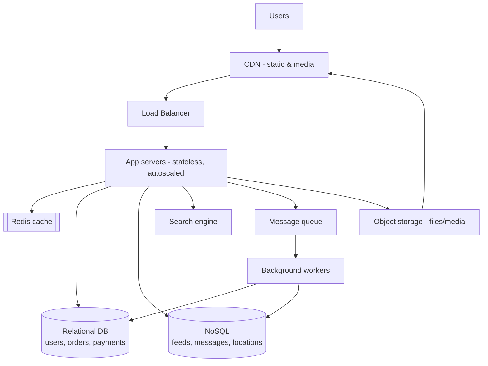
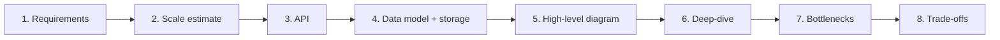
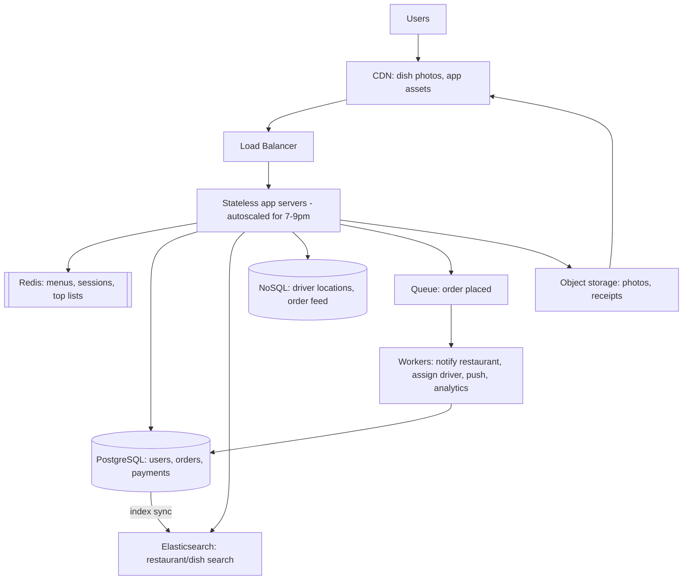

# Chapter 14 — Capstone: Putting It All Together

> **This chapter is different.** There's no single new platform — instead we combine
> everything from Chapters 1–13 into a repeatable **method** for the interview and walk it
> end-to-end on **FoodDash**, then apply it to two more classic problems. By the end you
> should be able to face almost any "design X" prompt calmly.
>
> **The meta-skill interviewers actually score:** not memorizing architectures, but
> **starting simple, justifying every addition with a real requirement, and naming
> trade-offs.** The most common failure — for developers of every background — is adding
> components no requirement justifies. Restraint reads as seniority.

---

## §1 — The universal architecture template

Almost every large system is a variation on this picture. Learn it once; trim it to fit
each question.

You will not use every box in every design. The skill is choosing which boxes the *specific*
requirements justify — and being able to say why each one is there.

---

## §2 — The interview method (say these steps out loud)

Follow this order every time. Narrating it is half the score.

1. **Clarify requirements.** Functional ("users place orders, track delivery") and
   non-functional (scale, latency, consistency, availability). Ask before you design.
2. **Estimate scale.** Rough numbers: users, reads/sec, writes/sec, data size. Back-of-
   envelope, not precise. This *justifies* your later choices.
3. **Define the API.** A few key endpoints (`POST /orders`, `GET /restaurants?q=`).
4. **Design the data model & pick storage.** Where Chapters 5–6 pay off — SQL for the
   transactional core, NoSQL for high-scale/flexible data.
5. **Draw the high-level diagram.** The §1 template, trimmed to what's needed.
6. **Deep-dive one component.** Usually the data store or the current bottleneck; let the
   interviewer steer.
7. **Address bottlenecks.** Caching, replicas, sharding, queues, CDN — added *because* your
   scale estimate demands them.
8. **Discuss trade-offs.** Consistency vs availability, cost vs speed, simplicity vs scale.
   Show you know nothing is free.

> **Say this at the start:** *"Let me clarify requirements and rough scale first, then
> sketch the API and data model, draw the architecture, and go deep where you'd like."*
> That single sentence signals structured thinking before you've drawn anything.

---

## §3 — Worked example: design FoodDash end-to-end

**Step 1 — Requirements.** Functional: browse/search restaurants, view menus, place an
order, pay, track the driver live, get notified. Non-functional: low latency for browsing;
**strong consistency for orders/payments**; high availability at dinner peak; global-ish (a
few countries).

**Step 2 — Scale (illustrative).** 10M users, ~1M orders/day (peaks 7–9pm), browsing reads
≫ order writes (say 100:1), millions of driver-location pings/hour, lots of dish images.
*Read-heavy, spiky, media-heavy, with a small critical transactional core.*

**Step 3 — API (sample).** `GET /restaurants?q=&filters=` · `GET /restaurants/{id}/menu` ·
`POST /orders` · `GET /orders/{id}/status` · `POST /restaurants/{id}/photos`.

**Step 4 — Data model & storage (the key decisions):**

| Data | Platform | Why |
|---|---|---|
| Users, restaurants, orders, payments | **Relational (PostgreSQL)** | Relationships + ACID; money must be atomic (Ch. 5) |
| Driver GPS pings | **NoSQL key-value/wide-column (DynamoDB/Cassandra)** | Millions of writes, one-key access, staleness OK (Ch. 6) |
| Live order-status feed | **NoSQL wide-column** | High write volume, time-ordered (Ch. 6) |
| Menus, "top restaurants," sessions | **Redis cache** | Read-often, change-rarely, low latency (Ch. 7) |
| Dish photos, receipts | **Object storage (S3)** | Big files; URL in DB (Ch. 8) |
| Restaurant/dish search | **Search engine (Elasticsearch)** | Ranked, faceted, typo-tolerant (Ch. 10) |

**Step 5 — Architecture:**

**Step 6 — Deep-dive: placing an order.**
1. `POST /orders` → app server writes the order + payment in **one PostgreSQL transaction**
   (all-or-nothing — no unpaid orders).
2. On success, drop an **"order placed"** message on the **queue** and return immediately —
   the user waits milliseconds.
3. **Workers** consume it: notify the restaurant, assign a driver, push the customer, update
   analytics. They're **idempotent** (at-least-once delivery could redeliver).
4. Live tracking: driver pings write to **NoSQL**; the app reads the latest for
   `GET /orders/{id}/status`.

**Step 7 — Bottlenecks.** Dinner peak → **autoscale** app servers behind the **load
balancer**; **read replicas + Redis** absorb browsing reads; the **queue** buffers the order
surge so PostgreSQL isn't hammered; the **CDN** offloads all image traffic.

**Step 8 — Trade-offs.** Orders/payments = **strong consistency** (SQL, a CP choice).
Driver location & counts = **eventual consistency** (NoSQL, an AP choice) — a location
stale by a second is fine (the CAP trade-off, Ch. 3, made explicit per dataset). We spend on
a CDN and cache to buy latency. We keep the transactional core simple and only distribute
the parts that must scale.

> **Say this to close:** *"The through-line is: SQL for the money, NoSQL for the high-scale
> streams, cache and CDN for read latency, a queue for spiky async work — each added because
> a specific requirement demanded it."*

---

## §4 — Worked example: design a URL shortener (restraint)

**Requirements:** shorten a long URL to a short code; redirect fast; scale reads ≫ writes.
**Scale:** billions of redirects, far fewer creations — extremely read-heavy.

**Design:**
- **Storage:** a **relational DB** (or key-value) mapping `short_code → long_url`. Index the
  short code. Reads dominate, data is simple — SQL is fine; DynamoDB works too.
- **Create:** generate a unique short code (base-62 of an ID, or a hash) and store it.
- **Redirect:** look up the code and 301/302 to the long URL. **Cache hot codes in Redis** —
  a tiny set of links gets most traffic.
- **Scale reads:** cache + read replicas; a CDN/edge for the redirect if global.

**The point:** this is a *deliberately simple* problem. Reaching for Kafka, sharding, or
microservices here is the over-engineering trap. The strong answer is "SQL + a cache," plus
the code-generation detail.

> **Say this:** *"Reads dominate and the data is trivial, so a relational DB with an index
> and a Redis cache for hot links handles enormous scale. I wouldn't add anything heavier
> without a reason."*

---

## §5 — Worked example: design a news feed (fan-out)

**Requirements:** users post; followers see posts in their feed; feed loads fast.
**Scale:** huge reads, celebrity accounts with millions of followers.

**Design:**
- **Posts:** stored in a DB (SQL or NoSQL). Media → **object storage + CDN**.
- **Feed generation — the core trade-off:**
  - **Fan-out on write:** when you post, push the post ID into each follower's precomputed
    feed (in **Redis**/NoSQL). Feeds load instantly; expensive for celebrities.
  - **Fan-out on read:** build the feed when the user opens the app. Cheap writes; slower
    reads. Often a **hybrid** — precompute for most, compute-on-read for celebrities.
- **Delivery:** a **queue** drives the fan-out work asynchronously; a **cache** holds hot
  feeds; counts (likes) are **eventually consistent** NoSQL.

**The point:** the interesting decision is *fan-out on write vs read*, and naming the
celebrity edge case. That's what separates a strong answer.

> **Say this:** *"I'd precompute feeds via fan-out-on-write into a cache for fast reads, but
> switch to compute-on-read for very high-follower accounts to avoid write amplification — a
> hybrid."*

---

## §6 — Platform selection cheat table

When you hear a signal in a prompt, reach for the platform. This is the whole guide on one
screen:

| Signal in the prompt | Platform / decision | Chapter |
|---|---|---|
| Traffic outgrew one machine | Scale up first, then out (behind a load balancer) | 1 |
| One codebase vs. many independent teams | Start monolith; split only when a real signal demands it | 2 |
| A network partition — what happens to reads/writes? | Pick CP or AP, per dataset | 3 |
| The exact/obvious approach (full set, exact count, mod-N hash) is too slow or too big | Bloom filter / HyperLogLog / Roaring Bitmap / consistent hashing | 4 |
| Relationships + correctness + transactions | Relational DB (SQL) | 5 |
| Extreme write scale / flexible schema / one-key access | NoSQL | 6 |
| Reads slow / DB hot / read-often data | Cache (Redis) | 7 |
| Images, video, files, backups | Object storage | 8 |
| "Do it later," notifications, spikes, decoupling | Message queue | 9 |
| Search, autocomplete, ranked/faceted filtering | Search engine | 10 |
| Scale the web tier / high availability | Load balancer | 11 |
| Global low-latency content delivery | CDN | 12 |
| Crunch huge datasets / analytics / ETL / ML prep | Data processing (Spark) | 13 |

---

## §7 — Common pitfalls (across every design) 🚩

- **Over-engineering.** Kafka, microservices, and sharding for a small app. Start simple.
- **No scale estimate.** Choosing "big" tools without numbers to justify them.
- **Wrong consistency call.** Eventual consistency for money; strong consistency (and its
  cost) where staleness was fine.
- **Ignoring the read/write ratio.** Most systems are read-heavy → cache + replicas early.
- **Stateful app servers.** Breaks load balancing; put sessions in Redis.
- **Blobs in the database.** Files go in object storage; the URL goes in the DB.
- **Single points of failure.** The load balancer, a single DB primary — add redundancy.
- **Silence.** Not narrating your reasoning. The interviewer scores your *thinking*, so
  think out loud.

---

## §8 — How to practice (for the coach)

1. **Drill the method (§2) until it's automatic.** The 8 steps are the scaffold under every
   answer.
2. **Whiteboard the universal template (§1) from memory.** If a client can't draw it, they
   don't own it yet.
3. **Run timed mocks** on the questions listed in each chapter. Enforce the method: clarify →
   estimate → API → data → diagram → deep-dive → bottlenecks → trade-offs.
4. **After each mock, ask: "what did you add that no requirement justified?"** Training out
   over-engineering is the single biggest score-mover.
5. **For every platform, the client should be able to say its one-line "when to use / when
   not"** — that's the cheat table in §6, internalized.

---

## §9 — Final recap: the whole guide on one page

- **Scaling:** vertical first (free of code changes), horizontal once you hit a ceiling,
  need availability, or the load is bursty — and horizontal requires stateless servers.
- **Monolith vs. microservices** is an organizational decision, not a traffic one — start
  monolith, split only when a real team or scaling signal demands it.
- **CAP theorem:** decide consistency vs. availability **per dataset**, not per system,
  and say exactly what happens during a partition.
- **Algorithms for scale** (Bloom filters, HyperLogLog, Roaring Bitmaps, consistent
  hashing): reach for these only once the exact, obvious approach actually breaks down.
- **SQL** for related data that must be correct (the money). Start here.
- **NoSQL** for extreme scale, flexible schemas, or one-key access — name the *family*.
- **Cache** hot, read-often, staleness-OK data; cache-aside + TTL; never the source of truth.
- **Object storage** for files; URL + metadata in the DB; presigned uploads.
- **Queues** to defer work and decouple services; at-least-once → idempotent consumers.
- **Search engines** for ranked, typo-tolerant, faceted search; a derived index, kept in sync.
- **Load balancers** to scale the stateless web tier and stay available; make the LB redundant.
- **CDNs** to serve shared/static content fast worldwide; caching taken geographic.
- **Data processing** (Spark) to crunch huge datasets offline; keep analytics off the OLTP DB.
- **The method:** requirements → scale → API → data → diagram → deep-dive → bottlenecks →
  trade-offs.
- **The mindset:** start simple, justify every addition, name the trade-offs. Restraint wins.

---

*You've reached the end of the chapters. The companion materials — per-chapter cheat sheets
and a mock interview Q&A bank — turn this knowledge into interview-ready recall and practice.*
