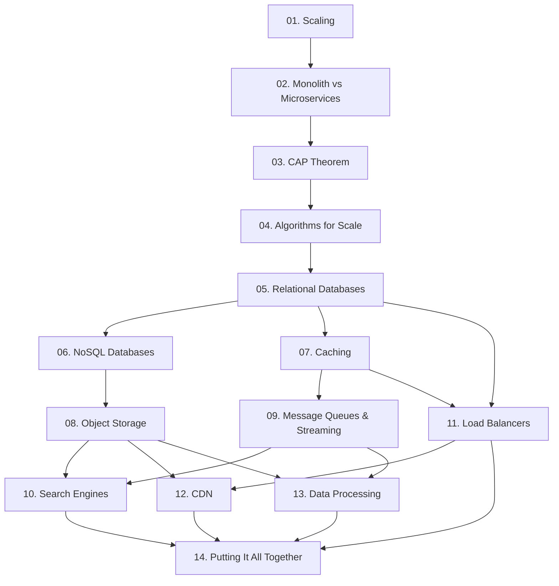

# System Design Study Guide — Curriculum & How to Use It

> **Who this is for:** Developers of *all* backgrounds preparing for system-design
> interviews at product companies — front-end, back-end-but-new-to-scale, full-stack,
> mobile, data. You know how to code (variables, APIs, HTTP, JSON), but you've never had
> to reason about what happens when a system outgrows one machine. We build from there.

> **A note on how this was made:** This guide was created by AI and steered by a human
> throughout — drafted, reviewed, and edited for accuracy.

> **Draft:** This guide is a work in progress and hasn't been fully reviewed for
> accuracy yet. Content may change; double-check anything you rely on for an interview.

---

## 1. The mental model (read this first)

You already reason about **state, data flow, and latency** every time you write code —
system design is the same set of ideas at a bigger scale, with more than one machine
involved.

| A concept you already use | Its systems-design equivalent |
|---|---|
| A variable holding a value | A database row / cache entry |
| Calling a function or another service's API | One service calling another service |
| Memoizing a value so you don't recompute it | Caching |
| A slow step blocking the rest of your program | A slow query blocking a request |
| Saving something to disk so it survives a restart | A persistent database |
| Retrying a failed step and reconciling later | Eventual consistency |
| Serving a file efficiently instead of regenerating it each time | A CDN serving data close to users |

**The core question of every system design interview is the same:**
*"Where does the data live, how does it get there, and what happens when there's a lot of it?"*

Everything in this guide is an answer to some version of that question.

**The running example: FoodDash.** Every chapter builds the same fictional app —
FoodDash, a food-delivery service with restaurants, dishes, orders, drivers, and diners
in cities like Bengaluru and London. Each chapter adds a piece to FoodDash's
architecture, so by Chapter 14 (Putting It All Together) you've assembled a full system out of
every piece you learned along the way.

---

## 2. How the guide is structured

- **Chapters 1–4 are foundational concepts** (scaling, architecture, CAP theorem, and a
  toolkit of scale-focused algorithms) that later chapters assume you know.
- **Chapters 5–13 are one chapter per platform** (relational databases, NoSQL, caches,
  and so on), and **chapter 14 puts it all together.**
- **No chapter is longer than ~12 pages.**
- Chapters 1–3 and 5–13 are broken into **the same 9 sections**, each up to ~1 page:

| # | Section | The question it answers |
|---|---|---|
| 1 | Why the platform exists | What problem was so painful someone built this? |
| 2 | When to use it | What signals in a problem point to this tool? |
| 3 | When *not* to use it | Where does it fall on its face? |
| 4 | Popular products | What are the real names you'll say in an interview? |
| 5 | Quick product comparison | e.g. Oracle vs MySQL vs PostgreSQL |
| 6 | How it compares to other platforms | e.g. SQL vs NoSQL — which and when |
| 7 | Factors to consider in a design | What to reason about out loud in the interview |
| 8 | Avoiding overkill | Not reaching for a jackhammer to hang a picture |
| 9 | Hands-on exercise | Get your hands dirty in ~30 minutes |

**Chapter 4 is the one exception** — it groups four specific algorithms and data
structures (Bloom filters, HyperLogLog, Roaring Bitmaps, consistent hashing) rather than
one platform, so it uses a shorter, lettered format instead of the nine sections. It's
called out at the top of that chapter.

Plus, in every chapter:
- **Diagrams** to anchor each concept.
- **Real-world use cases** — how a real company used this to solve a real problem.
- **Interview questions** where this chapter's topic is the key decision.

---

## 3. The study schedule

**Pace: one chapter per week, one section per day.** There are 9 sections plus extras,
so here is a proven 6-day week + 1 rest/review day layout (chapter 4's lettered format
maps loosely onto the same week — one technique every day or two):

| Day | What to cover | Why grouped this way |
|---|---|---|
| **Mon** | §1 Why it exists + §2 When to use | Build intuition for the problem first |
| **Tue** | §3 When not to use + §8 Avoiding overkill | The "no" cases are where interviews are won |
| **Wed** | §4 Popular products + §5 Product comparison | Learn the vocabulary |
| **Thu** | §6 Compare to other platforms + §7 Design factors | The heart of the interview |
| **Fri** | §9 Hands-on exercise | Cement it with your hands |
| **Sat** | Real-world use cases + interview questions | Apply it |
| **Sun** | Rest / re-read your weakest section | Spaced repetition |

> **Tip for teaching:** Have each client keep a one-page "cheat sheet" per chapter with
> only the *when to use / when not to use* table. By interview time that stack of
> cheat sheets *is* their system design toolbox.

---

## 4. The full curriculum (chapter map)

Chapters are ordered so each one builds on the last, and every one adds a piece to
FoodDash's architecture. All fourteen chapters below are complete.

| Ch | Topic | Status | Core interview trigger |
|---|---|---|---|
| 01 | Horizontal vs. vertical scaling | ✅ Full chapter | "Traffic outgrew one machine — now what?" |
| 02 | Monolith vs. microservices | ✅ Full chapter | "One codebase, or many independently deployable services?" |
| 03 | The CAP theorem | ✅ Full chapter | "A network partition just happened — consistency or availability?" |
| 04 | Algorithms for scale (Bloom filters, HyperLogLog, Roaring Bitmaps, consistent hashing) | ✅ Full chapter | "The exact/obvious approach is too slow or too big — what's cheaper?" |
| 05 | Relational databases (SQL) | ✅ Full chapter | "We need to store structured data with relationships" |
| 06 | NoSQL databases | ✅ Full chapter | "Huge scale, flexible schema, or key-value access" |
| 07 | Caching | ✅ Full chapter | "Reads are slow / the DB is overloaded" |
| 08 | Blob / object storage (S3) | ✅ Full chapter | "Store images, videos, files, backups" |
| 09 | Message queues & streaming (Kafka, RabbitMQ) | ✅ Full chapter | "Decouple services / process later / event pipeline" |
| 10 | Search engines (Elasticsearch) | ✅ Full chapter | "Full-text search, autocomplete, filtering at scale" |
| 11 | Load balancers | ✅ Full chapter | "Spread traffic across many servers" |
| 12 | CDN | ✅ Full chapter | "Serve content fast to users worldwide" |
| 13 | Data processing (MapReduce & Spark) | ✅ Full chapter | "Crunch huge datasets / analytics / ETL / ML prep" |
| 14 | Putting It All Together: design a full system | ✅ Full chapter | Combines everything |

*Companion materials still being built — per-chapter cheat sheets and a mock interview
Q&A bank — will layer on top of these fourteen chapters without changing them.*

---

## 5. How to run a study session (for the coach)

1. **Read the section** (10–15 min).
2. **Draw the diagram from memory** on a whiteboard. If they can't, they didn't get it.
3. **Answer one interview question aloud** using that section's idea.
4. **Say the "when NOT to use" case out loud.** Interviewers probe for over-engineering.

The single most common failure in system design interviews is **reaching for the most
powerful/trendy tool instead of the simplest one that works.** Every platform chapter's
§8 (*Avoiding overkill*) directly trains against that — and chapters 1–4 each have their
own version of the same lesson. Drill it.

---

## 6. A glossary you'll need before Chapter 1

| Term | Plain-English meaning |
|---|---|
| **Latency** | How long one request takes. Lower is better. |
| **Throughput** | How many requests per second the system handles. |
| **Persistence** | Data survives a restart / power loss (written to disk). |
| **Schema** | The agreed-upon shape of your data (columns, types). |
| **Scaling up (vertical)** | Buy a bigger machine. Simple, but has a ceiling. |
| **Scaling out (horizontal)** | Add more machines. Harder, but nearly unlimited. |
| **Replication** | Keeping copies of data on multiple machines. |
| **Sharding / partitioning** | Splitting data across machines so no one holds it all. |
| **Consistency** | Everyone reads the same, latest value. |
| **Availability** | The system answers even when parts are broken. |

Keep this table open while you read Chapter 1. Now go to
`01-horizontal-vs-vertical-scaling.md`.
